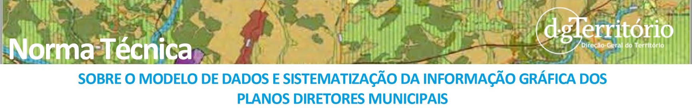

# Plano Diretor Municipal

## Norma Técnica sobre o Modelo de Dados e Sistematização da Informação Gráfica dos Planos Diretores Municipais

### Versão 18.02.2021

# Índice

[**VOLUME I**](#volume-i)

[Introdução](#introdução)

1.  [Objeto](#1-objeto)

    1.1 [Objeto](#1_1-objeto)

    1.2 [Requisitos de elaboração das plantas](#1_2-requisitos-de-elaboração-das-plantas)

    1. [Carta Base](#121-carta-base)

    2.  [Limites administrativos e georreferenciação](#1_2_2-limites-administrativos-e-georreferenciação)

    3.  [Validação topológica](#1_2_3-validação-topológica)

2.  [Estruturação da Informação Geográfica](#2-estruturação-da-informação-geográfica)

    2.1 [Catálogo de objetos do PDM - ANEXO I](#2_1-catálogo-de-objetos-do-pdm---anexo-i)
        
    1. [Organização dos objetos na Planta de Ordenamento](#2_1_1-organização-dos-objetos-na-planta-de-ordenamento)

    2.  [Organização dos objetos na Planta de Condicionantes](#2_1_2-organização-dos-objetos-na-planta-de-condicionantes)

    3. [Objetos: Designação, código e simbologia](#2_1_3-objetos-designação-código-e-simbologia)

    4. [Criação de novos objetos por desagregação](#2_1_4-criação-de-novos-objetos-por-desagregação)

    2.2 [Estrutura da Bases de Dados Geográfica - Anexo II](#2_2-estrutura-da-bases-de-dados-geográfica---anexo-ii)

    1. [Tabela auxiliar "OBJETO_TIPO"](#2_2_1-tabela-auxiliar-objeto_tipo)

    2. [Tabelas principais ou gráficas: "OBJETOS_PONTO", "OBJETOS_LINHA" e "OBJETOS_POLIGONO"](#2_2_2-tabelas-principais-ou-gráficas-objetos_ponto-objetos_linha-e-objetos_poligono)

    3. [Tabela secundária "ATO_ESPECIFICO"](#2_2_3-tabela-secundária-ato_especifico)

3. [Composição Gráfica](#3-composição-gráfica)

    3.1 [Catálogo de simbologia e características gráficas dos objetos - Anexo III](#3_1-catálogo-de-simbologia-e-características-gráficas-dos-objetos---anexo-iii)

    1.  [Geometria do Objeto](#3_1_1-geometria-do-objeto)

    2.  [Características gráficas e simbologia](#3_1_2-características-gráficas-e-simbologia)

    3.2 [Reprodução das plantas em formato de imagem](#3_2-reprodução-das-plantas-em-formato-de-imagem)

    1. [Legenda](#3_2_1-legenda)

    2. [Secionamento em folhas e desdobramento das plantas](#3_2_2-secionamento-em-folhas-e-desdobramento-das-plantas)

    3. [Preparação do layout](#323-preparação-do-layout--preparação-do-layout)

[ANEXOS](#anexos)

[Anexo I - Catálogo de Objetos do PDM](#anexo-i-catálogo-de-objetos-do-pdm)

1. [I.PO - Organização dos Objetos na Planta de Ordenamento](#i_po-organização-dos-objetos-na-planta-de-ordenamento)

2. [I.PO - Organização dos Objetos na Planta de Condicionantes](#i_pc-organização-dos-objetos-na-planta-de-condicionantes)

[Anexo II - Estrutura da base de dados geográfica para as plantas do PDM](#anexo-ii-estrutura-da-base-de-dados-geográfica-para-as-plantas-do-pdm)

[VOLUME II](#volume-ii)

[Anexo III - Catálogo de simbologia e características gráficas dos objetos](#anexo-iii-catálogo-de-simbologia-e-características-gráficas-dos-objetos)

*************************************

# **VOLUME I**

# Introdução

A presente norma técnica tem como objetivo harmonizar a estrutura e
organização da informação das plantas que constituem os planos diretores
municipais (PDM) e intermunicipais (PDIM), segundo um modelo de dados
comum para permitir a sua integração imediata em bases de dados
geográficos de âmbito regional e nacional, bem como contribuir para a
melhoria da disponibilização de informação territorial, nomeadamente
através do Sistema Nacional de Informação Territorial (SNIT), e para a
disponibilização rigorosa e atempada da informação ao cidadão.

A organização e sistematização da informação constante das plantas dos
PDM e PDIM em bases de dados geográficos facilitam também ao município a
divulgação, a implementação, a monitorização e a avaliação desse plano,
com reforço da participação pública e da cultura territorial.

A simbologia perdeu relevância no contexto dos sistemas de informação
geográfica mas é importante para a reprodução das plantas em formato de
imagem. Assim, a título de orientação, a presente norma técnica integra
um modelo de simbologia, pretendendo contribuir para aumentar a
qualidade da representação e da legibilidade dos modelos de organização
espacial e dos regimes de uso de solo.

Embora centrado no instrumento PDM, a estruturação e organização da
informação e as orientações de sistematização gráfica apresentadas podem
ser, com as devidas adaptações, aplicadas aos planos de urbanização (PU)
e planos de pormenor (PP), incluindo às respetivas modalidades
intermunicipais. Igualmente, os programas setoriais e especiais e
regionais que integrem peças gráficas com rigor cartográfico similar ao
do PDM podem adotar, com as devidas adaptações, as regras e orientações
estabelecidas neste documento.

A presente norma técnica sobre o modelo de dados e sistematização da
informação gráfica dos planos diretores municipais enquadra-se na missão
e atribuições estabelecidas na orgânica da Direção-Geral do Território e
atualiza, substituindo, a Norma técnica 01/2011 da ex-DGOTDU sobre o
mesmo tema.

# 1 Objeto

## 1_1 Objeto

1. A presente norma técnica estabelece o modelo de dados para a estruturação da informação que integra a planta de ordenamento e a planta de condicionantes do plano diretor municipal (PDM) ou intermunicipal (PDIM), bem como a organização dos objetos a representar nas referidas plantas e a sua sistematização gráfica, sendo aplicável, com as necessárias adaptações, aos demais planos territoriais, de âmbito municipal e intermunicipal.

2. Com vista à reprodução em suporte analógico ou em suporte digital com formato de imagem das plantas que constituem o plano, a título de mera orientação, é ainda estabelecida a simbologia e convenções gráficas a utilizar.

3. A presente norma técnica integra os seguintes anexos que dele fazem parte integrante:

- **Anexo I** - Catálogo de objetos do plano, com a organização dos objetos na planta de ordenamento (Anexo I-PO) e na planta de condicionantes (Anexo I-PC);

- **Anexo II** - Estrutura da base de dados geográfica das plantas que constituem o PDM;

- **Anexo III** -Catálogo de simbologia, com as características gráficas dos objetos, a utilizar na elaboração das plantas.

4. Tendo em conta o artigo 110º do Regime Jurídico dos Instrumentosde Gestão Territorial (RJIGT) aprovado pelo Decreto-Lei n.º 80/2015, de 14 de maio, todas as referências efetuadas nesta norma técnica ao PDM consideram-se também efetuadas ao PDIM.

5. Para efeitos da presente norma técnica consideram-se os conceitos estabelecidos na Decreto Regulamentar nº 5/2019, de 27de setembro.

6. A presente norma destina-se à planta de ordenamento e a planta de condicionantes que, de acordo com o RJIGT, são as plantas que constituem o PDM.

## 1_2 Requisitos de elaboração das plantas

A aplicação deste modelo de dados tem em conta que:

- As plantas que constituem o PDM são elaboradas em formato vetorial, sobre a carta base do plano;

- Para a apresentação e publicação do plano é preparada a correspondente imagem gerada a partir da composição final de cada planta.

A aplicação deste modelo de dados tem ainda em conta outros aspetos relacionados com a elaboração das plantas, em especial com a carta base, os limites administrativo, a georreferenciação e a validação topológica, que se descrevem em seguida:

### 1_2_1 Carta Base

1. A carta base do PDM é obtida a partir da cartografia topográfica vetorial ou de imagem, oficial ou homologada, nos termos da legislação aplicável e tendo em consideração o conteúdo material do plano.

2. Quando é utilizada cartografia topográfica de imagem para a preparação da carta base do PDM a cartografia topográfica de imagem é sempre completada por informação vetorial orohidrográfica tridimensional, redes viária e ferroviária e informação toponímica consistente com a imagem do ponto de vista espacial e temporal

3. A carta base serve de suporte ao conteúdo das plantas que constituem o PDM, pelo que, por questões de legibilidade das plantas na sua reprodução em suporte analógico ou em suporte digital com formato de imagem, os objetos da carta base que o plano não pretende destacar devem ser representados numa tonalidade que não prejudique a leitura das plantas.

### 1_2_2 Limites administrativos e georreferenciação

1. As plantas que constituem o PDM devem conter os limites administrativos de acordo com a edição mais recente da Carta Administrativa Oficial de Portugal (CAOP), disponível à data que determina a elaboração, revisão ou alteração do PDM, publicada pela DGT e disponível no seu sítio da internet.

2. Sempre que no decurso dos trabalhos venham a ficar disponíveis edições mais atualizadas da CAOP e que tal se justifique, será utilizada a edição mais atualizada.

3. A data de edição da CAOP utilizada é indicada na legenda da respetiva planta.

4. As peças gráficas que constituem o PDM devem ser georreferenciadas no sistema de referência PT-TM06/ ETRS89.

### 1_2_3 Validação topológica

A camara municipal deve efetuar a validação topológica de todos os objetos constantes das plantas que constituem o PDM, destacando-se as seguintes regras topológicas para os objetos da planta de ordenamento do PDM:

- Os objetos do catálogo de objetos (anexo I) incluídos no tema "Classificação e Qualificação do Solo" são representados por polígonos fechados que devem cobrir toda a área de intervenção do plano.

- Entre os polígonos que representam os objetos do tema "Classificação e Qualificação do Solo" não deve haver sobreposições nem lacunas.

# 2 Estruturação da informação geográfica

A informação gráfica e alfanumérica integrada nas plantas que constituem o PDM é estruturada em base de dados geográfica.

## 2_1 Catálogo de objetos do PDM - Anexo I

O catálogo de objetos do PDM, apresentado no Anexo I, define a organização dos objetos constantes das plantas que constituem o PDM, indicando o tema, o subtema e a designação dos objetos da planta de ordenamento e da planta de condicionantes.

### 2_1_1 Organização dos objetos na Planta de Ordenamento

1. Os objetos a apresentar na planta de ordenamento obedecem ao conteúdo material do PDM, de acordo com o estabelecido no RJIGT, respetivamente nos artigos 95º e 96º e estão organizados no catálogo de objetos nos seguintes seis temas*,* com os respetivos subtemas, como indicado no Anexo I-PO da presente norma técnica.

2. O tema "*Área de Intervenção do Plano"* contém apenas um objeto com a mesma designação em todas as plantas que constituem o PDM, correspondente aos limites administrativos do município fixados na Carta Administrativa Oficial de Portugal (CAOP), publicada pela DGT e disponível no seu sítio da internet.

3. O tema "*Classificação e Qualificação do Solo*" integra os objetos que correspondem às categorias do solo urbano e do solo rústico, definidas no Decreto Regulamentar n.º 15/2015, de 19 de agosto, não obstante em cada PDM se poder proceder à desagregação das categorias nas subcategorias consideradas mais adequadas à estratégia de desenvolvimento local e ao modelo de organização espacial do território municipal. 
Neste modelo de dados as categorias são objetos apresentados no catálogo, sendo as subcategorias objetos dependentes da respetiva categoria, cujo registo na base de dados é efetuado pelos atributos do objeto que representa a categoria, acrescido do preenchimento do campo "ESPECIFICA" conforme indicado no título 2.2.2 do presente documento.

4. O tema "*Áreas com Funções específicas*" abrange os objetos a seguir indicados:

- Estrutura Ecológica Municipal e Espaço-Canal -- que correspondem aos conceitos definidos nos artigos 13º e 14º do Decreto Regulamentar n.º 15/2015, de 19 de agosto;

- Área de Perigosidade e Área de Risco -- que correspondem a áreas de perigosidade e de risco, que não constituam servidões ou restrições de utilidade pública, mas que se pretendam delimitar de acordo com os
  estudos efetuados e conhecimentos adquiridos, nomeadamente, entre outros, os que decorrem dos trabalhos da Comissão Nacional da Gestão dos Riscos de Inundações, criada ao abrigo do Decreto-Lei n.º 115/2010, de 22 de outubro;

- Zona Sensível ao Ruído e Zona Mista ao Ruído -- que decorrem do Regulamento Geral do Ruído;

- Zona de Proteção e Salvaguarda dos Recursos e Valores Naturais - referida no conteúdo documental do PDM expresso no artigo 97º, nº1, alínea b) do Decreto-Lei n.º 80/2015, de 14 de maio.

    Qualquer objeto do tema "*Áreas com Funções específicas"*, pode ser desagregado e especificado preenchendo o respetivo atributo no campo "ESPECIFICA" da base de dados, conforme indicado no título 2.2.2 do presente documento.

5. O tema "*Programação da Execução do Plano*" integra os objetos que representam as porções do território delimitadas no PDM para efeitos de programação da sua execução, designadamente as unidades operativas de planeamento e gestão (UOPG) e as unidades de execução (UE).

No âmbito do modelo de dados considera-se obrigatória a especificação das UOPG e das unidades de execução através da atribuição de uma designação a preencher no campo "ESPECIFICA" da base de dados, conforme indicado no título 2.2.2 do presente documento.

6. O tema "*Áreas de Intervenção de Outros Planos ou Entidades"* integra os objetos de três subtemas que representam:

- As áreas de intervenção de programas territoriais especiais (PE), sectoriais (PS) e intermunicipais (PI), em vigor no município;

- As áreas de intervenção dos planos territoriais intermunicipais (PTI) e municipais (PTM), que se encontrem vigentes;

- As áreas de reabilitação urbana (ARU) aprovadas, e as áreas que a camara municipal delimitou como área urbana de génese ilegal (AUGI);

- As áreas de jurisdição dos portos.

    No âmbito do modelo de dados considera-se obrigatória a especificação de cada um dos programas territoriais, dos planos territoriais, das ARU e das AUGI cujas áreas de intervenção estão representadas na planta de ordenamento, preenchendo este atributo no campo "ESPECIFICA" da base de dados conforme indicado no título 2.2.2 do presente documento.

7. O tema "***Sistemas Estruturantes***" inclui os objetos que representam os equipamentos de utilização coletiva e as infraestruturas territoriais.

    Neste tema, os objetos propostos pelo plano mas que ainda não correspondem a elementos existentes são identificados como "previstos".

    Qualquer objeto do tema "*Sistemas Estruturantes"*, em especial os do subtema "equipamentos de utilização coletiva", pode ser desagregado consoante o sector a que se refere (educação, saúde, cultura, etc.) ou consoante a especificação de cada uma das unidades representadas (Escola EPCG, Hospital do Oeste, etc.), preenchendo este atributo no campo "ESPECIFICA" da base de dados conforme indicado no título 2.2.2 do presente documento.

    De forma idêntica, é possível especificar se uma infraestrutura é territorial ou urbana preenchendo este atributo no campo "ESPECIFICA" da base de dados conforme indicado no título 2.2.2 do presente documento.

### 2_1_2 Organização dos objetos na Planta de Condicionantes

1. Os objetos que pertencem à planta de condicionantes estão organizados em oito temas: constando os respetivos subtemas do Anexo I-PC, cuja tipificação obedece à tipologia legal de servidões e restrições de utilidade pública e segue a organização utilizada na publicação "*Servidões e Restrições de Utilidade* Pública *-- SRUP",* disponível no sítio da internet da DGT.

- Recursos Hídricos;

- Recursos Geológicos;

- Recursos Agrícolas e Florestais;

- Recursos Ecológicos;

- Património Edificado;

- Equipamentos;

- Infraestruturas;

- Atividades Perigosas.

2. Na planta de condicionantes é possível a desagregação e especificação dos objetos, como é o caso das tipologias das áreas integradas em REN, das classificações associadas ao risco e de outros relevantes, através da sua inscrição na base de dados, preenchendo o campo "ESPECIFICA" conforme indicado no título 2.2.2 do presente documento.

3. Quando a servidão ou restrição de utilidade pública é constituída por ato específico, para facilitar a associação entre o território abrangido e as condicionantes específicas aplicáveis, os elementos necessários à consulta da sua publicação em Diário da República são registados nos campos da tabela "ATO_ESPECIFICO" conforme
indicado no título 2.2.3 do presente documento.

### 2_1_3 Objetos: Designação, código e simbologia

1. Para efeitos de articulação entre o catálogo de objetos (Anexo I) e o catálogo de simbologia (Anexo III), a cada objeto está associado um código que individualiza o objeto e ordena o catálogo de simbologia do Anexo III.

2. As realidades que, tendo a mesma posição geográfica, assumem a mesma definição e designação na planta de ordenamento e na planta de condicionantes do PDM, são representadas nas duas plantas pelo mesmo objeto com um único código do objeto e, consequentemente com a mesma simbologia.

3. As realidades que, tendo a mesma posição geográfica, podem assumir contextos diferentes na planta de ordenamento e na planta de condicionantes do PDM e, consequentemente, designações diferentes, são representadas em cada planta por objetos distintos, com diferentes simbologias e características gráficas, sendo cada um deles identificado por um código do objeto próprio. Por exemplo, a rede viária representada na planta de ordenamento corresponde à hierarquia funcional da rede municipal e a representada planta de condicionantes corresponde à hierarquia nacional da rede rodoviária definida no Plano Rodoviário Nacional.

### 2_1_4 Criação de novos objetos por desagregação

1. Na elaboração do PDM são escolhidos do catálogo apenas os objetos necessários à representação do modelo de organização espacial do seu território, bem como das servidões e restrições de utilidade pública que o abrangem.

2. Quando for necessário representar um objeto que não existe no catálogo de objetos, dever-se-á verificar se aquele não pode corresponder à desagregação de algum dos objetos já constantes do catálogo.

3. Quando se conclua pela impossibilidade de utilizar a desagregação de algum dos objetos já constantes do catálogo pode acrescentar-se um novo objeto, atribuindo-lhe um código de objeto na sequência dos do Anexo III, uma designação e caracterizando-o, tal como no Anexo I, com a indicação da planta, tema e subtema em que o objeto
melhor se enquadra.

4. Os objetos do tema "Classificação e Qualificação do Solo" correspondem às categorias do solo urbano e do solo rústico, definidas no Decreto Regulamentar n.º 15/2015, de 19 de agosto, não podendo, por isso, ser acrescentadas novas categorias, mas podendo estas ser desagregadas nas subcategorias que em cada PDM se considere serem as mais adequadas.

5. Na eventualidade de a qualificação do solo pretendida para uma porção de território corresponder à agregação dos usos dominantes de várias das categorias, definidas no Decreto Regulamentar n.º 15/2015, de 19 de agosto, deve ser escolhida a categoria cujo uso dominante melhor se adequa ao pretendido, desagregando-a em subcategorias que melhor traduzam a conjugação de usos pretendida.

6. O catálogo de objetos é registado na base de dados preenchendo os campos "PLANTA", "TEMA", "SUBTEMA", "DESIGNAÇÃO" e "CODIGO", na tabela "OBJETO_TIPO", conforme indicado no título 2.2.1 do presente documento.

## 2_2 Estrutura da Bases de Dados Geográfica - Anexo II

A estruturação da informação que integra as plantas do PDM contém a estrutura mínima de tabelas exigíveis para a publicação em Diário da República e depósito na Direção-Geral do Território (DGT).

A base de dados, de tipo relacional, está estruturada em cinco tabelas (três principais, uma auxiliar e uma secundária), indicadas na Estrutura da Bases de Dados apresentada no Anexo II, sendo:

- Uma tabela auxiliar, alfanumérica, designada "OBJETO_TIPO" que contém todos os tipos de objetos utilizados e a sua organização na respetiva planta do plano de acordo com o catálogo de objetos do Anexo I, cuja composição se encontra descrita título 2.2.1;

- Três tabelas principais, gráficas, designadas "OBJETOS_PONTO", "OBJETOS_LINHA" e "OBJETOS_POLIGONO", que contêm o registo de cada elemento representado nas plantas do plano, registado apenas numa das tabelas consoante o seu tipo de geometria (ponto, linha ou polígono), cuja composição se encontra descrita no título 2.2.2;

- Uma tabela secundária, alfanumérica, designada "ATO_ESPECIFICO", ou "DIPLOMA_LEGAL" que se destina ao registo dos elementos necessários à consulta dos atos específicos que constituem as servidões ou restrições de utilidade pública, representadas na planta de condicionantes, cuja composição se encontra descrita no título 2.2.3.

### 2_2_1 Tabela auxiliar "OBJETO_TIPO"

1. A tabela auxiliar "OBJETO_TIPO" identifica de forma unívoca todos os tipos de objetos referidos no catálogo de objetos do PDM (Anexo I), facilitando a associação de cada registo das tabelas gráficas à planta, tema, subtema e designação do objeto a que respeita.

2. Os atributos da tabela a que se refere o número anterior são os seguintes:

- **ID** - campo de numeração automática, do tipo número inteiro, único e irrepetível que identifica de forma unívoca cada par constituído por objeto do catálogo e planta em que este pode ser representado. É chave  primária da tabela auxiliar e funciona como chave estrangeira para as tabelas gráficas;

- **PLANTA** - campo do tipo texto que identifica a planta em que o objeto pode ser representado, podendo ter como domínio do atributo as seguintes opções: "Ordenamento" para planta de ordenamento; "Condicionantes" para planta de condicionantes;

- Os campos "**TEMA**", "**SUBTEMA**" e "**DESIGNACAO**", do tipo texto, devem ser preenchidos conforme o exposto no Anexo I;

- **CODIGO** - campo do tipo número inteiro que correspondendo ao código utilizado no catálogo de objetos (Anexo I) para permitir a sua articulação com o catálogo de simbologia (Anexo III).

3. Nesta tabela podem constar todos os objetos do Anexo I ou apenas os objetos utilizados nas tabelas gráficas.

### 2_2_2 Tabelas principais ou gráficas: "OBJETOS_PONTO", "OBJETOS_LINHA" e "OBJETOS_POLIGONO"

1. As tabelas principais, gráficas, "OBJETOS_PONTO", "OBJETOS_LINHA" e "OBJETOS_POLIGONO", são compostas pelos seguintes 7 atributos que permitem a caracterização de cada registo:

- **IDENTIFICA** - campo do tipo texto que identifica inequivocamente cada registo em qualquer tabela gráfica, devendo ser único e não podendo ser nulo. É chave primária das tabelas gráficas e chave estrangeira para a tabela secundária "ATO_ESPECIFICO". Deve ser utilizado preferencialmente um Identificador Global Exclusivo (GUID - *Globally Unique Identifier*) para cada registo. A geração de GUID é possível obter, por exemplo, no seguinte endereço: [https://www.guidgenerator.com/](https://www.guidgenerator.com/)

- **ID** - campo do tipo número inteiro que é chave primária da tabela auxiliar e funciona como chave estrangeira para as tabelas gráficas. Este ID permite identificar de forma unívoca cada par constituído por objeto do catálogo e planta em que este é representado;

- **ESPECIFICA** - campo do tipo texto, utilizável quando se desagrega ou especifica o objeto.

    Aplica-se às seguintes situações:

    1. Aos objetos cuja desagregação é opcional, que podem ser:

        1. Objetos do tema "Classificação e Qualificação do Solo", de modo a desagregar as categorias de solo em subcategorias; 
        
        2. Objetos do tema "Sistemas Estruturantes", de modo a identificar a sua especificidade; 
        
        3. Objetos da planta de condicionantes que se pretendam especificar individualmente, como por exemplo, os imóveis classificados, as áreas protegidas ou as captações de água.

    2. Aos objetos da planta de ordenamento cuja especificação é obrigatória, que são:

        1. Objetos do tema "Programação da Execução do Plano" em que é obrigatória a identificação das UOPG e UE estabelecidas no plano; 

        2. Objetos dos temas "Programas territoriais" e "Planos territoriais" em que é obrigatória a identificação das áreas do PDM abrangidas por programas setoriais, especiais ou intermunicipais e por planos territoriais de âmbito intermunicipal ou municipal, em vigor;

        3. Objetos do tema "Áreas de Intervenção de outros Instrumentos ou Entidades" bem como, AUGI e ARU representadas na planta de ordenamento.

- **ETIQUETA** - campo do tipo texto, permite introduzir na simbologia uma etiqueta com uma sigla que identifique na planta o objeto em questão, indicando-se no título 3.1.2 (parágrafos 3.1.2.6 e 3.1.2.7) um exemplo da utilização deste campo.

- **FONTE_INF** - campo do tipo texto, para indicação da fonte/entidade de origem da informação representada (Por exemplo na planta de condicionantes, o objeto pode ter sido fornecido pela entidade que tutela a respetiva servidão).

- **DATA_INF** - campo do tipo data, para indicação da data a que se reporta o objeto ou a data em que a câmara municipal obteve o objeto da fonte referida no campo FONTE_INF.

- **GEOM** - campo do tipo geométrico que se destina ao registo da informação da geometria do objeto, variando o tipo de campo consoante a tabela gráfica respetiva, nomeadamente, ponto, linha ou polígono. A designação deste campo pode ser diferente de "GEOM", dependendo do *software* utilizado.

- **MEDIDA** - campo de tipo número decimal que se destina a registar a área dos polígonos em hectares (ha) ou o comprimento das linhas em quilómetros (km).

2. Quando a mesma realidade é representada na planta de ordenamento e na planta de condicionantes, como referido no título 2.1.3 (parágrafos 2.1.3.2 e 2.1.3.3), devem sempre ser criados dois registos na respetiva tabela gráfica, correspondendo cada um aos atributos do objeto em cada planta.

### 2_2_3 Tabela secundária "ATO_ESPECIFICO"

1. A tabela secundária é de preenchimento indispensável para determinados objetos da planta de condicionantes, conforme referido no título 2.1.2 (parágrafo 2.1.2.3) e tem os seguintes campos:

- **IDENTIFICA** - campo do tipo texto que é chave primária das tabelas gráficas e chave estrangeira para a tabela secundária. Este campo identifica inequivocamente cada registo em qualquer tabela gráfica;

- **SERIE** - campo do tipo texto que indica a série do Diário da República onde foi publicado o ato específico que constitui a servidão ou restrição de utilidade pública. Este campo tem como domínio do atributo as seguintes opções: "SERIE I" ou "SERIE II";

- **TIPO_ATO** -- campo do tipo texto que indica o tipo de ato que constitui a servidão ou restrição de utilidade pública. Este campo tem como domínio do atributo as seguintes opções: "Lei"; "Decreto-Lei"; "Dec-Reg" caso se trate de Decreto-Regulamentar; "Decreto"; "RCM" caso se trate de Resolução do Conselho de Ministros"; "Portaria"; "Aviso"; "Decisao" caso se trate de Decisão; "Declaracao" caso se trate de Declaração; "Deliberacao" caso se trate de Deliberação; "Despacho"; "Desp-Conj" caso se trate de Despacho-Conjunto; e "Regulamento";

- **NUM_ATO** -- campo do tipo texto que indica o número do ato específico que constitui a servidão ou restrição de utilidade pública;

- **DATA** -- campo do tipo data que indica a data do ato específico que constitui a servidão ou restrição de utilidade pública;

- **NUM_DR** -- campo do tipo texto que indica o número do Diário da República onde foi publicado o ato específico que constitui a servidão ou restrição de utilidade pública;

- **OBSERV** -- campo do tipo texto, de preenchimento não obrigatório, destinado à indicação de outras observações.

# 3 Composição gráfica

## 3_1 Catálogo de simbologia e características gráficas dos objetos - Anexo III

A simbologia e as características gráficas de todos os objetos constantes do catálogo de objetos do PDM são apresentadas no Anexo III, indicando para cada objeto:

- **Código do objeto**: número que individualiza o objeto no catálogo de simbologia (Anexo III) e o relaciona com o catálogo de objetos (Anexo I);

- **Designação**: nome do objeto;

- **Geometria**: forma de representação gráfica do objeto que pode ser polígono, linha ou ponto;

- **Características gráficas do objeto**: estilo, espessura e cor do contorno, cor do preenchimento e especificações do padrão, do símbolo ou do texto;

- **Simbologia**: representação gráfica do objeto;

- **Planta**: planta ou plantas a que pertence o objeto.

### 3_1_1 Geometria do Objeto

1. A geometria dos objetos pode ser polígono, linha ou ponto.

2. A geometria polígono é adotada nos objetos que representam porções de território delimitadas em planta por uma linha poligonal fechada. Têm geometria polígono, designadamente, todos os objetos que representam categorias de solo, zonas de servidão ou áreas de intervenção de programas ou planos territoriais.

3. A geometria linha é adotada nos objetos que correspondem a registos de configuração linear, nomeadamente estradas e linhas de água, desde que não seja relevante a representação da área de solo que ocupam ou caso esta área não tenha dimensão suficiente para a sua representação gráfica.

4. A geometria ponto é adotada nos objetos em que não é necessário ou possível a representação da área de solo que ocupam, sendo representados apenas por um símbolo. Têm geometria ponto, designadamente, os equipamentos de utilização coletiva de reduzidas dimensões, várias infraestruturas, elementos do património edificado e algumas servidões.

### 3_1_2 Características gráficas e simbologia

1. Para cada objeto são definidas as seguintes características gráficas:

- **Estilo de Contorno**: Descrição do estilo da linha poligonal fechada que delimita os objetos de geometria polígono, da linha que representa os objetos com esta geometria e da linha que delimita a moldura do símbolo dos objetos de geometria ponto;

- **Espessura de Contorno**: A unidade usada na descrição desta característica é o milímetro (mm);

- **Cor de Contorno**: Descrição da cor RGB da linha que delimita os objetos de geometria polígono, da linha que representa os objetos com esta geometria e da linha que delimita a moldura do símbolo dos objetos de geometria ponto;

- **Cor de Preenchimento**: Descrição da cor RGB a colocar no interior dos polígonos, das linhas compostas e dos símbolos. Nalguns objetos a cor de preenchimento não é opaca, apresentando alguma transparência, para permitir sobreposições com outros objetos. A de transparência varia de 0 a 100 %, correspondendo 0 % a opaco e 100% a transparente;

- **Especificações do Padrão, Símbolo ou Texto**: Descrição do padrão utilizado no preenchimento do interior de alguns polígonos, descrição dos elementos que compõem o símbolo de alguns objetos com a geometria ponto e descrição dos textos utilizados na composição da simbologia de alguns objetos.

2. No catálogo de simbologia é apresentada uma imagem, sem escala, da simbologia utilizada em cada objeto, servindo apenas para exemplificar e servir de apoio à execução da representação gráfica.

3. A simbologia dos objetos que integram o tema "*Classificação e Qualificação do Solo*" contempla duas opções: Uma simbologia para o objeto principal não desagregado - a categoria de uso do solo - e outra para os objetos desagregados e devidamente especificados - as subcategorias. A especificação da subcategoria é dada associando à sigla do objeto (categoria) um numerador "n" no qual se inscreve o número respeitante ao objeto desagregado para o individualizar do objeto principal. Caso não haja desagregação, utiliza-se o padrão e a sigla da categoria sem acrescentar o número.

4. Para os objetos do tema "Áreas de Intervenção de outros
Instrumentos ou Entidades", cuja especificação é obrigatória (UOPG, PE, PS, PI, PTI, PTM e ARU), foi prevista apenas uma solução de simbologia na qual a sigla tem sempre associada um numerador "n", na qual se inscreve o número respeitante ao objeto específico, para o individualizar e distinguir.

5. Para os restantes objetos, a simbologia contempla apenas o objeto agregado, podendo a especificação do objeto que se pretende individualizar ser efetuada adicionando à simbologia proposta uma etiqueta com um número.

6. Em qualquer dos casos referidos nos números anteriores, a desagregação de objetos e sua especificação é realizada preenchendo os campos "ESPECIFICA" e "ETIQUETA" da base de dados, conforme o título 2.2.2. Na base de dados, os objetos desagregados e especificados constituem objetos dependentes do objeto principal que consta do catálogo. Por exemplo: No preenchimento dos atributos, DESIGNAÇÃO = Espaço habitacional ESPECIFICA =de moradias; ETIQUETA = EH1. Para efeitos de legenda, os três campos estão associados, ficando: EH1 - Espaço habitacional de moradias.

7. Na legenda da planta, através do número inscrito na etiqueta do objeto, é possível fazer a correspondência com a designação concreta de cada subcategoria ou de cada área de intervenção de programa ou plano ou de outros objetos que se pretendam especificar.

8. A simbologia constante do presente catálogo de simbologia pressupõe as seguintes convenções gráficas para a elaboração das plantas:

- A simbologia foi desenvolvida para ser adequada à escala de representação 1:10 000. Para outras escalas aconselham-se ajustes nas dimensões dos objetos;

- A simbologia foi concebida tanto para a impressão a cores como para a impressão a preto e branco. Para este efeito, toda a simbologia com uma cor de preenchimento uniforme que dificulte a sua identificação tem também associada uma sigla identificadora do objeto em causa;

- O objeto "*Área de Intervenção do Plano*", comum a todas as plantas, tem a geometria polígono com preenchimento transparente, ficando visível apenas o contorno, para que sejam visíveis os objetos da carta base e os objetos da respetiva planta que se lhe sobrepõem;

- Os objetos do tema "*Classificação e Qualificação do Solo*" são representados por polígonos preenchidos com tonalidades de cor pouco fortes e de pouca saturação para que os objetos com eles subpostos ou sobrepostos fiquem legíveis.

- Os objetos do tema "*Áreas com Funções Específicas*" são representados por polígonos preenchidos apenas por trama, sem cor de fundo, para os objetos sobrepostos serem visíveis; 

- Os objetos do tema "*Áreas de Intervenção de outros Instrumentos ou Entidades*" são representados por polígonos sem preenchimento, sendo visível apenas o contorno, permitindo visualizar os objetos dos restantes temas. Para os objetos que se prevê poderem ultrapassar o limite do plano, foram escolhidos grafismos que indicam o lado interior da sua área de intervenção;

- A simbologia adotada para os objetos do tema "*Sistemas Estruturantes*" permite distinguir os objetos previstos dos objetos existentes:

    1. Nos objetos representados por geometria ponto ou por geometria polígono, o fundo do símbolo de objetos existentes é preenchido por qualquer cor exceto branco e o dos objetos previstos é total ou parcialmente branco;

    2. Nos objetos representados pela geometria linha, adotam-se linhas contínuas para os objetos existentes e linhas descontínuas para os objetos propostos. Exceptua-se a representação das linhas
      ferroviárias, em que a linha é sempre descontínua, mas com maior espaçamento para as linhas propostas.

- Para alguns objetos foram definidas duas opções de simbologia:

    1. Uma com geometria polígono;

    2. Outra com geometria ponto ou linha, a utilizar quando a entidade a representar possui dimensões demasiado reduzidas para a sua representação como polígono à escala adotada para a reprodução e imagem.

## 3_2 Reprodução das plantas em formato de imagem

Tendo por base as plantas elaboradas em formato digital é preparada a correspondente imagem, gerada a partir da composição de cada planta.

A composição final de cada planta deve ter em conta os elementos que no formato de imagem são imprescindíveis à sua leitura e compreensão, em especial a legenda (rótulo e de simbologia), o desdobramento da planta por temas ou o seu secionamento em folhas, quando necessário, e a arrumação dos vários elementos da planta (layout), que a seguir se descrevem.

### 3_2_1 Legenda

1. As plantas que constituem PDM contêm uma legenda que é formada por duas partes:

- A «*legenda rótulo*» com as indicações necessárias à identificação da planta;

- A «*legenda da simbologia*» com as indicações de descodificação dos símbolos utilizados na planta.

2. Na «*legenda rótulo*» do PDM deve constar a seguinte informação:

    1. Indicação do tipo de plano e respetiva designação, de acordo com a tipologia de planos territoriais estabelecida na lei;

    2. Designação da planta, tendo por referência o conteúdo documental estabelecido na lei para a figura de plano em causa;

    3. Data de edição e número de ordem da planta no conjunto das peças que integram o plano;

    4. Indicação da escala de representação para a reprodução em suporte digital no formato de imagem;

    5. Identificação da entidade pública responsável pelo plano;

    6. Identificação da cartografia topográfica vetorial ou de imagem utilizada na elaboração da carta base, designadamente:

        1. Se cartografia oficial: série cartográfica oficial, entidade proprietária e data de edição;

        2. Se cartografia homologada: entidade proprietária, data e número de processo de homologação e entidade responsável pela homologação;

        3. Data e número de processo de homologação da atualização de cartografia topográfica e entidade responsável pela homologação, se aplicável;

        4. Sistema de georreferência;

        5. Exatidão posicional planimétrica e altimétrica e a exatidão temática, se aplicável, de acordo com as especificações técnicas da cartografia utilizada.

3. Na «legenda da simbologia» devem constar todos os símbolos utilizados na planta, organizados e designados de acordo com o catálogo de objetos (apresentado no título 2.1 e no Anexo I), sendo esta legenda
imprescindível para sua leitura.

4. Quando a planta do PDM se encontra em formato vetorial e estruturada base de dados geográfica, a informação relativa à «*legenda rótulo*» é registada na ficha de metadados da peça gráfica e a informação relativa à «*legenda simbologia*» é registada na tabela de atributos.

### 3_2_2 Secionamento em folhas e desdobramento das plantas

1. As plantas que constituem o PDM devem possibilitar a sua reprodução em suporte analógico ou em suporte digital com formato de imagem a escalas que permitam uma visão de conjunto do modelo de organização territorial e apresentarem o detalhe adequado ao objeto e conteúdo material do plano.

- As peças gráficas podem ser **seccionadas em folhas**, na medida do necessário para a sua reprodução, à escala pretendida. Todas as folhas de uma mesma planta apresentam a mesma legenda, sem prejuízo de se evidenciar que formam um conjunto, nomeadamente juntando uma letra diferente para cada folha na respetiva numeração e apresentando o esquema da visualização do conjunto.

- As peças gráficas podem ser **desdobradas** quando tal se revele imprescindível à legibilidade da planta, desde que tal operação não prejudique a visão e a compreensão das relações de interdependência entre os diversos temas. As plantas que correspondem a desdobramentos apresentam na legenda o título que identifica a planta e um subtítulo identificador dos temas representados neste desdobramento.

### 3_2_3 Preparação do *layout*  {#preparação-do-layout}

1. Para a preparação do *layout* destinado à reprodução das plantas em suporte digital e formato de imagem ou em suporte analógico aplicam-se as seguintes regras de hierarquia estabelecida entre a geometria dos objetos pertencentes à mesma planta:

- Os pontos sobrepõem-se às linhas e aos polígonos;

- As linhas sobrepõem-se aos polígonos.

2. A legenda (rótulo) deve ficar encostada à margem no canto inferior direito do desenho.

3. A legenda referente à simbologia deve ocupar a zona encostada à margem do lado direito, acima da legenda (rótulo), ou encostada à margem de baixo, à esquerda da legenda (rótulo).

4. Caso se revele necessário proceder ao seccionamento da planta, para possibilitar a sua reprodução à escala pretendida, todas as folhas da mesma planta devem apresentam a mesma legenda rótulo e de simbologia, sem prejuízo de se juntar uma letra diferente para cada folha ao número identificador da planta.

5. A legenda referente à simbologia utilizada na planta deve respeitar a organização do tema, subtema e designação dos objetos conforme indicado no Anexo I e indicar apenas os objetos que efetivamente constam da planta em causa, devendo ser a mesma em todas as folhas de seccionamento da planta.

6. A planta de ordenamento e a planta de condicionantes podem ser desdobradas exclusivamente quando tal se revele imprescindível à legibilidade da planta, desde que tal operação não prejudique a visão e a compreensão das relações de interdependência entre os diversos temas.

7. As plantas que constituem o PDM devem permitir a sua fácil reprodução, em suporte digital com formato de imagem e em suporte analógico, a escalas que permitam uma visão de conjunto do modelo de organização territorial e com o detalhe adequado ao objeto e conteúdo material do tipo de plano, nomeadamente a escala 1:25 000 ou superior.

**********************

# **ANEXOS**

# Anexo I Catálogo de Objetos do PDM

## **I_PO Organização dos Objetos na Planta de Ordenamento**

|**TEMA**|**SUBTEMA**|**OBJETOS**||
|----------------------------|----------------------------|--------------|----------|
|||**Designação**|**Código**|
|Área de Intervenção do Plano|Área de Intervenção do Plano|**Área de Intervenção do Plano**|1|
|Classificação e Qualificação do Solo|Solo Urbano|**Espaço Central**|2|
|Classificação e Qualificação do Solo|Solo Urbano|**Espaço Habitacional**|3|
|Classificação e Qualificação do Solo|Solo Urbano|**Espaço Urbano de Baixa Densidade**|4|
|Classificação e Qualificação do Solo|Solo Urbano|**Espaço de Atividades Económicas**|5|
|Classificação e Qualificação do Solo|Solo Urbano|**Espaço de uso especial – equipamento**|152|
|Classificação e Qualificação do Solo|Solo Urbano|**Espaço de uso especial – infraestrutura estruturante**|151|
|Classificação e Qualificação do Solo|Solo Urbano|**Espaço de uso especial – turístico**|6|
|Classificação e Qualificação do Solo|Solo Urbano|**Espaço Verde**|7|
|Classificação e Qualificação do Solo|Solo Rústico|**Espaço Agrícola**|8|
|Classificação e Qualificação do Solo|Solo Rústico|**Espaço Florestal**|9|
|Classificação e Qualificação do Solo|Solo Rústico|**Espaço de Exploração de Recursos Energéticos e Geológicos**|10|
|Classificação e Qualificação do Solo|Solo Rústico|**Espaço Natural e Paisagístico**|11|
|Classificação e Qualificação do Solo|Solo Rústico|**Espaço de Atividades Industriais**|12|
|Classificação e Qualificação do Solo|Solo Rústico|**Aglomerado Rural**|13|
|Classificação e Qualificação do Solo|Solo Rústico|**Área de Edificação Dispersa**|14|
|Classificação e Qualificação do Solo|Solo Rústico|**Espaço Cultural**|15|
|Classificação e Qualificação do Solo|Solo Rústico|**Espaço de Ocupação Turística**|16|
|Classificação e Qualificação do Solo|Solo Rústico|**Espaço de Equipamentos e Infraestruturas**|17|
|Áreas com Funções Específicas|Estrutura Ecológica Municipal|**Estrutura Ecológica Municipal**|18|
|Áreas com Funções Específicas|Espaço Canal|**Espaço Canal**|19|
|Áreas com Funções Específicas|Risco|**Área de Perigosidade**|134|
|Áreas com Funções Específicas|Risco|**Área de Risco**|133|
|Áreas com Funções Específicas|Ruído|**Zona Sensível ao Ruído**|139|
|Áreas com Funções Específicas|Ruído|**Zona Mista ao Ruído**|140|
|Áreas com Funções Específicas|Zona de proteção e de salvaguarda dos recursos e valores naturais|**Zona de proteção e de salvaguarda dos recursos e valores naturais**|145|
|Áreas com Funções Específicas|Património geológico|**Geossítio**|149|
|Áreas com Funções Específicas|Inventário de bens culturais|**Imóvel inventariado**|150|
|Programação da Execução do Plano|Programação da Execução do Plano|**Unidade Operativa de Planeamento e Gestão (U.O.P.G.)**|20|
|Programação da Execução do Plano|Programação da Execução do Plano|**Unidade de execução**|138|
|Áreas de Intervenção de Outros Instrumentos ou Entidades|Programas Territoriais|**Área de Intervenção de Programa Especial**|21|
|Áreas de Intervenção de Outros Instrumentos ou Entidades|Programas Territoriais|**Área de Intervenção de Programa Setorial**|130|
|Áreas de Intervenção de Outros Instrumentos ou Entidades|Programas Territoriais|**Área de Intervenção de Programa Intermunicipal**|131|
|Áreas de Intervenção de Outros Instrumentos ou Entidades|Planos Territoriais|**Área de Intervenção de Plano Intermunicipal (PUI, PPI)**|132|
|Áreas de Intervenção de Outros Instrumentos ou Entidades|Planos Territoriais|**Área de Intervenção de Plano Municipal (PU, PP)**|22|
|Áreas de Intervenção de Outros Instrumentos ou Entidades|Reabilitação ou Revitalização|**Área Urbana de Génese Ilegal (AUGI)**|135|
|Áreas de Intervenção de Outros Instrumentos ou Entidades|Reabilitação ou Revitalização|**Área de Reabilitação Urbana (ARU)**|136|
|Áreas de Intervenção de Outros Instrumentos ou Entidades|Área de Jurisdição dos Portos|**Área de Jurisdição do Porto**|129|
|Sistemas Estruturantes|Equipamentos de Utilização Coletiva|**Equipamento de Utilização Coletiva**|23|
|Sistemas Estruturantes|Equipamentos de Utilização Coletiva|**Equipamento de Utilização Coletiva Previsto**|24|
|Sistemas Estruturantes|Infraestruturas de Circulação e Transporte|**Rodovia Principal**|25|
|Sistemas Estruturantes|Infraestruturas de Circulação e Transporte|**Rodovia Principal Prevista**|26|
|Sistemas Estruturantes|Infraestruturas de Circulação e Transporte|**Rodovia Distribuidora**|27|
|Sistemas Estruturantes|Infraestruturas de Circulação e Transporte|**Rodovia Distribuidora Prevista**|28|
|Sistemas Estruturantes|Infraestruturas de Circulação e Transporte|**Rodovia de Acesso Local**|29|
|Sistemas Estruturantes|Infraestruturas de Circulação e Transporte|**Rodovia de Acesso Local Prevista**|30|
|Sistemas Estruturantes|Infraestruturas de Circulação e Transporte|**Nó Rodoviário**|31|
|Sistemas Estruturantes|Infraestruturas de Circulação e Transporte|**Nó Rodoviário Previsto**|32|
|Sistemas Estruturantes|Infraestruturas de Circulação e Transporte|**Via-Férrea**|35|
|Sistemas Estruturantes|Infraestruturas de Circulação e Transporte|**Via-Férrea Prevista**|36|
|Sistemas Estruturantes|Infraestruturas de Circulação e Transporte|**Estação ou Interface de Transporte**|33|
|Sistemas Estruturantes|Infraestruturas de Circulação e Transporte|**Estação ou Interface de Transporte Prevista**|34|
|Sistemas Estruturantes|Infraestruturas de Circulação e Transporte|**Estacionamento**|146|
|Sistemas Estruturantes|Infraestruturas de Circulação e Transporte|**Estacionamento Previsto**|147|
|Sistemas Estruturantes|Infraestruturas de Circulação e Transporte|**Infraestrutura de Transporte Aéreo**|37|
|Sistemas Estruturantes|Infraestruturas de Circulação e Transporte|**Infraestrutura de Transporte Aéreo Prevista**|38|
|Sistemas Estruturantes|Infraestruturas de Circulação e Transporte|**Porto**|39|
|Sistemas Estruturantes|Infraestruturas de Circulação e Transporte|**Porto Previsto**|40|
|Sistemas Estruturantes|Infraestruturas de Abastecimento de Água|**Captação, Tratamento ou Armazenamento de Água**|41|
|Sistemas Estruturantes|Infraestruturas de Abastecimento de Água|**Captação, Tratamento ou Armazenamento de Água Prevista**|42|
|Sistemas Estruturantes|Infraestruturas de Drenagem de Águas Residuais|**Bombagem ou Tratamento de Águas Residuais**|45|
|Sistemas Estruturantes|Infraestruturas de Drenagem de Águas Residuais|**Bombagem ou Tratamento de Águas Residuais Prevista**|46|
|Sistemas Estruturantes|Infraestruturasde Recolha e Tratamento de Resíduos Sólidos|**Estação de Tratamento de Resíduos Sólidos**|47|
|Sistemas Estruturantes|Infraestruturasde Recolha e Tratamento de Resíduos Sólidos|**Estação de Tratamento de Resíduos Sólidos Prevista**|48|
|Sistemas Estruturantes|Infraestruturas de Abastecimento de Energia Elétrica|**Infraestrutura de Produção ou Transformação de Energia Elétrica**|49|
|Sistemas Estruturantes|Infraestruturas de Abastecimento de Energia Elétrica|**Infraestrutura de Produção ou Transformação de Energia Elétrica Prevista**|50|

## **I_PC Organização dos Objetos na Planta de Condicionantes**

|**TEMA**|**SUBTEMA**|**OBJETOS**||
|----------------------------|----------------------------|--------------|----------|
|||**Designação**|**Código**|
|Área de Intervenção do Plano|Área de Intervenção do Plano|**Área de Intervenção do Plano**|1|
|Recursos Hídricos|Domínio Público Hídrico|**Leito e Margem das Águas do Mar**|53|
|Recursos Hídricos|Domínio Público Hídrico|**Leito e Margem das Águas Fluviais**|54|
|Recursos Hídricos|Domínio Público Hídrico|**Zona Contígua à Margem**|55|
|Recursos Hídricos|Domínio Público Hídrico|**Zona Adjacente**|56|
|Recursos Hídricos|Albufeiras, Lagos ou Lagoas de Águas Públicas|**Albufeira Classificada**|57|
|Recursos Hídricos|Albufeiras, Lagos ou Lagoas de Águas Públicas|**Lago ou Lagoa classificada**|58|
|Recursos Hídricos|Albufeiras, Lagos ou Lagoas de Águas Públicas|**Zona Terrestre de Proteção**|59|
|Recursos Hídricos|Albufeiras, Lagos ou Lagoas de Águas Públicas|**Zona Reservada da Zona Terrestre de Proteção**|60|
|Recursos Hídricos|Albufeiras, Lagos ou Lagoas de Águas Públicas|**Zona de Proteção da Barragem**|61|
|Recursos Hídricos|Albufeiras, Lagos ou Lagoas de Águas Públicas|**Zona de Respeito da Barragem**|62|
|Recursos Geológicos|Captações de Águas Subterrâneas para Abastecimento Público|**Perímetro de Proteção de Captação de Água Subterrânea**|63|
|Recursos Geológicos|Águas de Nascente|**Perímetro de Proteção de Águas da Nascente**|64|
|Recursos Geológicos|Águas Minerais Naturais|**Perímetro de Proteção de Águas Minerais Naturais**|65|
|Recursos Geológicos|Pedreiras|**Zona de Defesa / Zona Especial de Defesa**|66|
|Recursos Geológicos|Pedreiras|**Área Cativa / Área de Reserva**|67|
|Recursos Geológicos|Recursos Geológicos|**Área de Servidão de Recurso Geológico**|142|
|Recursos Agrícolas e Florestais|Reserva Agrícola Nacional|**Reserva Agrícola Nacional**|68|
|Recursos Agrícolas e Florestais|Reserva Agrícola Nacional|**Área Excluida da Reserva Agrícola Nacional**|69|
|Recursos Agrícolas e Florestais|Obras de Aproveitamento Hidroagrícola|**Perímetro Hidroagrícola**|70|
|Recursos Agrícolas e Florestais|Oliveiras|**Povoamento de Oliveiras**|71|
|Recursos Agrícolas e Florestais|Sobreiros ou Azinheiras|**Povoamento de Sobreiros ou Azinheiras**|72|
|Recursos Agrícolas e Florestais|Sobreiros ou Azinheiras|**Área onde tenham ocorrido Incêndios,Depreciação do Arvoredo ou Abates Ilegais**|73|
|Recursos Agrícolas e Florestais|Azevinho|**Povoamento de Azevinho**|74|
|Recursos Agrícolas e Florestais|Regime Florestal|**Regime Florestal Total**|75|
|Recursos Agrícolas e Florestais|Regime Florestal|**Regime Florestal Parcial**|76|
|Recursos Agrícolas e Florestais|Povoamentos Florestais Percorridos por Incêndio|**Povoamento Florestal Percorrido por Incêndio**|77|
|Recursos Agrícolas e Florestais|Protecção ao Risco de Incêndio|**Classe de Risco de Incêndio (alta ou muito alta)**|78|
|Recursos Agrícolas e Florestais|Protecção ao Risco de Incêndio|**Zona critica**|79|
|Recursos Agrícolas e Florestais|Protecção ao Risco de Incêndio|**Redes de Faixas de Gestão de Combustível (rede primária e secundária)**|80|
|Recursos Agrícolas e Florestais|Árvores e Arvoredo de Interesse Público|**Árvore ou Arvoredo de Interesse Público**|81|
|Recursos Ecológicos|Reserva Ecológica Nacional|**Reserva Ecológica Nacional**|148|
|Recursos Ecológicos|Reserva Ecológica Nacional|**Área Excluida da Reserva Ecológica Nacional**|82|
|Recursos Ecológicos|Áreas Protegidas|**Parque Nacional**|83|
|Recursos Ecológicos|Áreas Protegidas|**Parque Natural**|84|
|Recursos Ecológicos|Áreas Protegidas|**Reserva Natural**|85|
|Recursos Ecológicos|Áreas Protegidas|**Monumento Natural**|86|
|Recursos Ecológicos|Áreas Protegidas|**Paisagem Protegida (de interesse regional ou local)**|87|
|Recursos Ecológicos|Rede Natura 2000|**Sítio da Lista Nacional**|88|
|Recursos Ecológicos|Rede Natura 2000|**Zona Especial de Conservação**|89|
|Recursos Ecológicos|Rede Natura 2000|**Zona de Proteção Especial**|90|
|Património Cultural|Patrimínio Arqueológico|**Parque Arqueológico**|141|
|Património Cultural|Imóveis Classificados|**Monumento Nacional**|91|
|Património Cultural|Imóveis Classificados|**Imóvel de Interesse Público**|92|
|Património Cultural|Imóveis Classificados|**Imóvel de Interesse Municipal**|93|
|Património Cultural|Imóveis Classificados|**Imóvel em Vias De Classificação**|94|
|Património Cultural|Imóveis Classificados|**Zona Geral de Proteção**|95|
|Património Cultural|Imóveis Classificados|**Zona Especial de Proteção Provisória**|96|
|Património Cultural|Imóveis Classificados|**Zona Especial de Proteção**|97|
|Património Cultural|Edifícios Públicos e Outras Construções|**Zona de Proteção de Edifício Público ou de Outra Construção**|98|
|Equipamentos|Estabelecimentos Prisionais e Tutelares de Menores|**Zona de Proteção de Estabelecimento Prisional ou Tutelar de Menores**|99|
|Equipamentos|Instalações Aduaneiras|**Área de Jurisdição de Alfândega**|100|
|Equipamentos|Defesa Nacional|**Zona de Servidão Militar**|101|
|Infraestruturas|Abastecimento de Água|**Captação, Tratamento ou Armazenamento de Água**|41|
|Infraestruturas|Abastecimento de Água|**Conduta Adutora**|43|
|Infraestruturas|Abastecimento de Água|**Zona de Servidão de Abastecimento de Água**|102|
|Infraestruturas|Drenagem de Águas Residuais|**Colector de Águas Residuais**|44|
|Infraestruturas|Drenagem de Águas Residuais|**Bombagem ou Tratamento de Águas Residuais**|45|
|Infraestruturas|Drenagem de Águas Residuais|**Zona de Servidão de Drenagem de Águas Residuais**|103|
|Infraestruturas|Drenagem de Águas Residuais|**Estação de Tratamento de Resíduos Sólidos**|47|
|Infraestruturas|Rede Elétrica|**Infraestrutura de Produção ou Transformação de Energia Elétrica**|49|
|Infraestruturas|Rede Elétrica|**Infraestrutura de Transporte de Energia Eletrica**|51|
|Infraestruturas|Rede Elétrica|**Zona de Servidão de Rede Elétrica**|104|
|Infraestruturas|Gasodutos e Oleodutos|**Gasoduto ou Oleoduto**|52|
|Infraestruturas|Gasodutos e Oleodutos|**Infraestrutura Associada a Gasoduto ou Oleoduto**|137|
|Infraestruturas|Gasodutos e Oleodutos|**Zona de Servidão de Gasoduto ou Oleoduto**|105|
|Infraestruturas|Rede Rodoviária Nacional e Regional|**Itinerário Principal**|106|
|Infraestruturas|Rede Rodoviária Nacional e Regional|**Itinerário Principal Autoestrada**|107|
|Infraestruturas|Rede Rodoviária Nacional e Regional|**Itinerário Complementar**|108|
|Infraestruturas|Rede Rodoviária Nacional e Regional|**Itinerário Complementar Autoestrada**|109|
|Infraestruturas|Rede Rodoviária Nacional e Regional|**Estrada Nacional**|110|
|Infraestruturas|Rede Rodoviária Nacional e Regional|**Estrada Regional**|111|
|Infraestruturas|Rede Rodoviária Nacional e Regional|**Estrada em Projeto**|143|
|Infraestruturas|Rede Rodoviária Nacional e Regional|**Zona de Servidão de Estrada do Plano Rodoviário Nacional**|112|
|Infraestruturas|Rede Rodoviária Nacional e Regional|**Zona de Respeito de Estrada do Plano Rodoviário Nacional**|144|
|Infraestruturas|Estradas Nacionais Desclassificadas|**Estradas Nacionais Desclassificadas**|113|
|Infraestruturas|Estradas Nacionais Desclassificadas|**Zona de Servidão de Estrada Nacional Desclassificada**|114|
|Infraestruturas|Estradas e Caminhos Municipais|**Estrada Municipal**|115|
|Infraestruturas|Estradas e Caminhos Municipais|**Caminho Municipal**|116|
|Infraestruturas|Estradas e Caminhos Municipais|**Zona de Servidão de Estrada ou Caminho Municipal**|117|
|Infraestruturas|Rede Ferroviária|**Via-Férrea**|35|
|Infraestruturas|Rede Ferroviária|**Zona de Servidão de Via-Férrea**|118|
|Infraestruturas|Aeroportos e Aeródromos|**Zona de Servidão Aeronaútica**|119|
|Infraestruturas|Telecomunicações|**Zona de Servidão Radioeléctrica**|120|
|Infraestruturas|Faróis e Outros Sinais Marítimos|**Farol ou Outro Sinal Marítimo**|121|
|Infraestruturas|Faróis e Outros Sinais Marítimos|**Zona de Servidão de Sinalização Maritima**|122|
|Infraestruturas|Rede Geodésica|**Zona de Proteção da Rede Geodésica**|123|
|Infraestruturas|Rede Geodésica|**Marco Geodésico**|124|
|Atividades Perigosas|Substâncias Perigosas|**Estabelecimento com Produtos Explosivos**|125|
|Atividades Perigosas|Substâncias Perigosas|**Zona de Segurança de Estabelecimento com Produtos Explosivos**|126|
|Atividades Perigosas|Substâncias Perigosas|**Estabelecimento com Substâncias Perigosas**|127|
|Atividades Perigosas|Substâncias Perigosas|**Zona de Segurança de Estabelecimento com Substâncias Perigosas**|128|

*************************

# Anexo II Estrutura da base de dados geográfica para as plantas do PDM

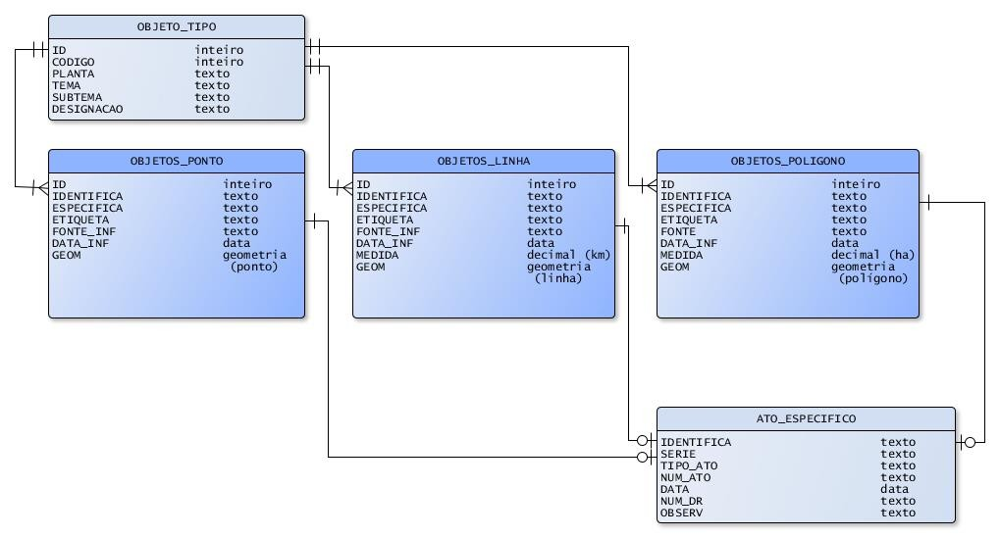

*************************

# **VOLUME II**

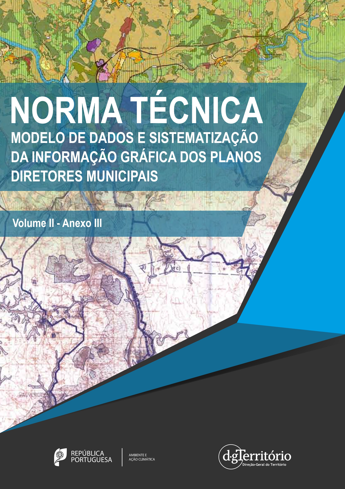

# Anexo III Catálogo de simbologia e características gráficas dos objetos

|**Código do Objeto**|**Designação**|**Geometria**|**CARACTERÍSTICAS GRÁFICAS**|||||**SIMBOLOGIA**|**Planta**|
|-|-|-|-|-|-|-|-|-|-|
||||Estilo de Contorno|Espessura de Contorno / Traço [mm]|Cor de Contorno [RGB]|Cor de Preenchimento [RGB]|Especificações do Padrão / Símbolo / Texto/ Linha|NOTA: A simbologia apresentada é meramente ilustrativa, podendo, nalguns objetos, não corresponder exatamente à descrição||
|1|**Área de Intervenção do Plano**|Polígono|Traço contínuo|0.35|0;0;0|100% transparente|─|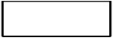|Ordenamento Condicionantes|
|2|**Espaço Central**|Polígono|Traço contínuo|0.10|83;21;0|127;31;0 (com transparência a 30%)|Fonte: Arial a negrito Tamanho letra: 3,5 mm Cor: 0;0;0|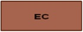 |- Ordenamento|
|3|**Espaço Habitacional**|Polígono|Traço contínuo|0.10|83;21;0|184;99;4 (com transparência a 30%)|Fonte: Arial a negrito Tamanho letra: 3,5 mm Cor: 0;0;0| |- Ordenamento|
|4|**Espaço Urbano de Baixa Densidade**|Polígono|Traço contínuo|0.10|83;21;0|171;127;20 (com transparência a 30%)|Fonte: Arial a negrito Tamanho letra: 3,5 mm Cor: 0;0;0| |- Ordenamento|
|5|**Espaço de Atividades Económicas**|Polígono|Traço contínuo|0.10|83;21;0|252;172;152 (com transparência a 30%)|Fonte: Arial a negrito Tamanho letra: 3,5 mm Cor: 0;0;0|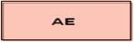 |- Ordenamento|
|6|**Espaço de uso especial – turístico**|Polígono|Traço contínuo|0.10|83;21;0|229;222;161 (com transparência a 30%)|Fonte: Arial a negrito Tamanho letra: 3,5 mm Cor: 0;0;0| |- Ordenamento|
|7|**Espaço Verde**|Polígono|Traço contínuo|0.10|83;21;0|116;116;58 (com transparência a 30%)|Fonte: Arial a negrito Tamanho letra: 3,5 mm Cor: 0;0;0| |- Ordenamento|
|8|**Espaço Agrícola**|Polígono|Traço contínuo|0.10|83;21;0|97;190;97 (com transparência a 30%)|Fonte: Arial a negrito Tamanho letra: 3,5 mm Cor: 0;0;0| |- Ordenamento|
|9|**Espaço Florestal**|Polígono|Traço contínuo|0.10|83;21;0|0;149;0 (com transparência a 30%)|Fonte: Arial a negrito Tamanho letra: 3,5 mm Cor: 0;0;0|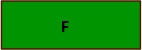 |- Ordenamento|
|10|**Espaço de Exploração de Recursos Energéticos e Geológicos**|Polígono|Traço contínuo|0.10|83;21;0|77;77;77 (com transparência a 30%)|Fonte: Arial a negrito Tamanho letra: 3,5 mm Cor: 0;0;0| |- Ordenamento|
|11|**Espaço Natural e Paisagístico**|Polígono|Traço contínuo|0.10|83;21;0|198;255;198 (com transparência a 30%)|Fonte: Arial a negrito Tamanho letra: 3,5 mm Cor: 0;0;0| |- Ordenamento|
|12|**Espaço de Atividades Industriais**|Polígono|Traço contínuo|0.10|83;21;0|136;71;170 (com transparência a 30%)|Fonte: Arial a negrito Tamanho letra: 3,5 mm Cor: 0;0;0| |- Ordenamento|
|13|**Aglomerado Rural**|Polígono|Traço contínuo|0.10|83;21;0|0;63;125 (com transparência a 30%)|Fonte: Arial a negrito Tamanho letra: 3,5 mm Cor: 0;0;0| |- Ordenamento|
|14|**Área de Edificação Dispersa**|Polígono|Traço contínuo|0.10|83;21;0|36;111;166 (com transparência a 30%)|Fonte: Arial a negrito Tamanho letra: 3,5 mm Cor: 0;0;0|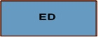 |- Ordenamento|
|15|**Espaço Cultural**|Polígono|Traço contínuo|0.10|83;21;0|53;143;210 (com transparência a 30%)|Fonte: Arial a negrito Tamanho letra: 3,5 mm Cor: 0;0;0| |- Ordenamento|
|16|**Espaço de Ocupação Turística**|Polígono|Traço contínuo|0.10|83;21;0|130;186;227 (com transparência a 30%)|Fonte: Arial a negrito Tamanho letra: 3,5 mm Cor: 0;0;0| |- Ordenamento|
|17|**Espaço de Equipamentos e Infraestruturas**|Polígono|Traço contínuo|0.10|83;21;0|203;226;243 (com transparência a 30%)|Fonte: Arial a negrito Tamanho letra: 3,5 mm Cor: 0;0;0| |- Ordenamento|
|18|**Estrutura Ecológica Municipal**|Polígono|Traço contínuo|0.20|0;0;0|-|Espessura do traço vertical : 0,17mm Espaçamento: 1,250 mm Cor: 0;0;0||- Ordenamento|
|19|**Espaço Canal**|Polígono|Traço contínuo|0.20|165;165;165|-|Dimensão do ponto: 0,35 mm Espaçamento em x : 1,0 mm Espaçamento em y: 1,0 mm Cor: 0;0;0|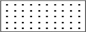|- Ordenamento|
|20|**Unidade Operativa de Planeamento e Gestão (U.O.P.G.)**|Polígono|Traço descontínuo|0.53|118;118;118|100% transparente|Fonte: Arial a negrito Tamanho letra: 3,5 mm Cor: 118;118;118 Traço descontinuo: Traço: 5,0 mm; Espaçamento: 6,0 mm||- Ordenamento|
|21|**Área de Intervenção de Programa Especial**|Polígono|Linha composta com base em traço continuo|-|210;210;0|100% transparente|Composição da linha: Traço contínuo e conjunto de círculos com preenchimento, descentrados para dentro da linha. - Espessura do traço: 0,44 - Dimensão ponto: 1,75 mm; Espaçamento entre pontos: 4,0 mm; Ponto tangente ao traço (para dentro)  Fonte: Arial a negrito Tamanho letra: 3,5 mm Cor: 210;210;0||- Ordenamento|
|22|**Área de Intervenção de Plano Municipal (PU,PP)**|Polígono|Traço descontinuo|0.70|210;210;0|100% transparente|Composição da linha: Traço contínuo e conjunto de círculos com preenchimento, descentrados para dentro da linha.  Dimensão ponto: 1,75 mm; Espaçamento entre pontos: 20,0 mm; Ponto tangente ao traço (para dentro) Traço descontinuo: - Espessura do traço: 0,70 Traço: 5,00 mm; Espaçamento: 6,0 mm  Fonte: Arial a negrito Tamanho letra: 3,5 mm Cor: 0;0;0|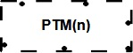|- Ordenamento|
|23|**Equipamento de Utilização Coletiva**|Polígono|Traço contínuo|0.10|0;0;0|160;160;160|Fonte: Arial a negrito Tamanho letra: 3,5 mm Cor: 0;0;0||- Ordenamento|
|23|**Equipamento de Utilização Coletiva**|Ponto|Traço contínuo|0.53|0;0;0|160;160;160|Retângulo Fonte: Arial a negrito centrado Cor: 0;0;0 Tamanho letra: 3,5 mm Espaçamento da letra ao contorno: 1,5 mm||- Ordenamento|
|24|**Equipamento de Utilização Coletiva Previsto**|Polígono|Traço contínuo|0.10|0;0;0|255;255;255|Fonte: Arial a negrito Tamanho letra: 3,5 mm Cor: 0;0;0|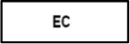|- Ordenamento|
|24|**Equipamento de Utilização Coletiva Previsto**|Ponto|Traço contínuo|0.53|0;0;0|255;255;255|Retângulo Fonte: Arial a negrito centrado Cor: 0;0;0 Tamanho letra: 3,5 mm Espaçamento da letra ao contorno: 1,5 mm||- Ordenamento|
|25|**Rodovia Principal**|Linha|Traço contínuo|0.90|255;0;0|-|-||- Ordenamento|
|26|**Rodovia Principal Prevista**|Linha|Traço contínuo|0.90|255;0;0|-|Traço curto: 4,0 mm; Espaçamento: 2,0 mm Traço longo: 10,0 mm; Espaçamento: 2,0 mm||- Ordenamento|
|27|**Rodovia Distribuidora**|Linha|Traço contínuo|0.70|255;0;0|-|-|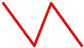|- Ordenamento|
|28|**Rodovia Principal Prevista**|Linha|Traço contínuo|0.70|255;0;0|-|Traço curto: 4,0 mm; Espaçamento: 2,0 mm Traço longo: 10,0 mm; Espaçamento: 2,0 mm|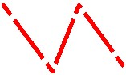|- Ordenamento|
|29|**Rodovia de Acesso Local**|Linha|Traço contínuo|0.50|255;0;0|-|-|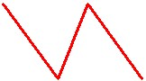|- Ordenamento|
|30|**Rodovia de Acesso Local Prevista**|Linha|Traço contínuo|0.50|255;0;0|-|Traço: 2,0 mm; Espaçamento: 1,0 mm|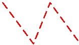|- Ordenamento|
|31|**Nó Rodoviário**|Ponto|Traço contínuo|-|255;0;0|255;0;0|Circulo - Dimensão: 5,0 mm|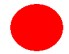|- Ordenamento|
|32|**Nó Rodoviário Previsto**|Ponto|Traço contínuo|0.53|255;0;0|255;255;255 / 255;0;0|Circulo com preenchimento de 50% em cima em Cor: 255;255;255 e 50% em baixo em Cor: 255;0;0; Dimensão: 5,0 mm|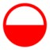|- Ordenamento|
|33|**Estação ou Interface de Transporte**|Ponto|Traço contínuo|-|0;0;0|0;0;0|Quadrado - Dimensão: 3,5 mm||- Ordenamento|
|34|**Estação ou Interface de Transporte Previsto**|Ponto|Traço contínuo|0.53|0;0;0|255;255;255|Quadrado - Dimensão: 3,5 mm||- Ordenamento|
|35|**Via-Férrea**|Linha|Linha composta|-|0;0;0|0;0;0 / 255;255;255|Composição da linha: Traço contínuo - Cor: 0;0;0, Espessura: 1,0 mm Traço descontínuo sobreposto - Cor: 255;255;255, Espessura: 0,53 mm; Traço: 3.0 mm; Espaçamento: 5.0 mm|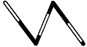|- Ordenamento - Condicionantes|
|36|**Via-Férrea Prevista**|Linha|Linha composta|-|0;0;0|255;255;255 / 0;0;0|Composição da linha: Traço contínuo - Cor: 0;0;0, Espessura: 1,0 mm Traço descontínuo sobreposto - Cor: 255;255;255, Espessura: 0,53 mm; Traço: 12.0 mm; Espaçamento: 4.0 mm|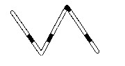|- Ordenamento|
|37|**Infraestrutura de Transporte Aéreo**|Ponto|Traço contínuo|0.53|0;0;0|253;249;126|Composição de símbolos: Quadrado - Dimensão: 6,3 mm Avião centrado no quadrado - Cor: 0;0;0||- Ordenamento|
|38|**Infraestrutura de Transporte Aéreo Previsto**|Ponto|Traço contínuo|0.53|0;0;0|255;255;255|Composição de símbolos: Quadrado - Dimensão: 6,3 mm Avião centrado no quadrado - Cor: 0;0;0||- Ordenamento|
|39|**Porto**|Ponto|Traço contínuo|0.53|0;0;0|34;191;241|Composição de símbolos: Quadrado - Dimensão: 6,3 mm Âncora - Centrada no quadrado - Cor: 0;0;0||- Ordenamento|
|40|**Porto Previsto**|Ponto|Traço contínuo|0.53|0;0;0|255;255;255|Composição de símbolos: Quadrado - Dimensão: 6,3 mm Âncora - Centrada no quadrado - Cor: 0;0;0||- Ordenamento|
|41|**Captação, Tratamento ou Armazenamento de Água**|Ponto|Traço contínuo|─|113;244;244|113;244;244|Retângulo Dimensão: 10,0mm x 5,0 mm||- Ordenamento - Condicionantes|
|42|**Captação, Tratamento ou Armazenamento de Água Prevista**|Ponto|Traço contínuo|0.53|113;244;244|255;255;255|Retângulo Dimensão: 10,0mm x 5,0 mm||- Ordenamento|
|43|**Conduta Adutora**|Linha|Linha composta com base em traço contínuo|─|113;244;244|─|Composição da linha: Traço contínuo com sobreposição de Pontos com preenchimento, centrados. - Espessura do traço: 0,44 mm. - Dimensão ponto: 1.75 mm; Espaçamento entre pontos: 9.0 mm||- Condicionantes|
|44|**Coletor de Águas Residuais**|Linha|Linha composta com base em traço contínuo|─|131;6;255|─|Composição da linha: Traço contínuo com sobreposição de Retângulos com preenchimento, perpendiculares à linha, descentrados. - Espessura do traço: 0,44 mm. - Dimensão do retângulo: 1,5 x 3,0 mm; Espaçamento entre retângulos: 9.0 mm|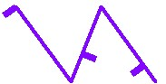|- Condicionantes|
|45|**Bombagem ou Tratamento de Águas Residuais**|Ponto|Traço contínuo|─|131;6;255|131;6;255|Retângulo. Dimensão: 10,0 mm x 5,0 mm||- Ordenamento - Condicionantes|
|46|**Bombagem ou Tratamento de Águas Residuais Prevista**|Ponto|Traço contínuo|0.53|131;6;255|255;255;255|Retângulo. Dimensão: 10,0 mm x 5,0 mm||- Ordenamento|
|47|**Estação de Tratamento de Resíduos Sólidos**|Ponto|Traço contínuo|0.53|168;64;64|168;64;64|Retângulo. Dimensão: 10,0 mm x 5,0 mm||- Ordenamento - Condicionantes|
|48|**Estação de Tratamento de Resíduos Sólidos Prevista**|Ponto|Traço contínuo|0.53|168;64;64|255;255;255|Retângulo. Dimensão: 10,0 mm x 5,0 mm||- Ordenamento|
|49|**Infraestrutura de Produção ou Transformação de Energia Elétrica**|Ponto|Traço contínuo|0.53|0;0;0|191;0;0|Composição de símbolos: Quadrado com rotação 45º - Dimensão: 6,3 mm. Raio - Centrado no quadrado - Cor: 0;0;0|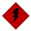|- Ordenamento - Condicionantes|
|50|**Infraestrutura de Produção ou Transformação de Energia Elétrica Prevista**|Ponto|Traço contínuo|0.53|0;0;0|255;255;255|Composição de símbolos: Quadrado com rotação 45º - Dimensão: 6,3 mm. Raio - Centrado no quadrado - Cor: 0;0;0|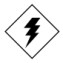|- Ordenamento|
|51|**Infraestrutura de Transporte Energia Elétrica**|Linha|Linha composta com base em traço contínuo|─|191;0;0|─|Composição da linha: Traço contínuo com sobreposição de letras Z, centradas. - Espessura do traço: 0,44 mm; - Dimensão da letra Z: 3,15 mm; Espaçamento entre letras Z: 10,0 mm|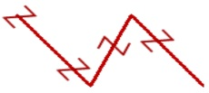|- Condicionantes|
|52|**Gasoduto ou Oleoduto**|Linha|Linha composta com base em traço contínuo|─|0;0;0|─|Composição da linha: Traço contínuo com sobreposição de Quadrados com X (diagonais), centrados. - Espessura do traço: 0,44 mm; - Dimensão dos quadrados: 2,45 mm; Espessura do traço do quadrado: 0,20 mm; Espaçamento entre quadrados: 18,0 mm|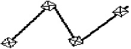|- Condicionantes|
|53|**Leito e Margem das Águas do Mar**|Polígono|Traço contínuo|─|202;236;251|202;236;251 (com transparência a 40%)|─||- Condicionantes|
|54|**Leito e Margem das Águas Fluviais**|Polígono|Traço contínuo|─|34;191;241|34;191;241 (com transparência a 50%)|─||- Condicionantes|
|54|**Leito e Margem das Águas Fluviais**|Linha|Traço contínuo|0.53|34;191;241|─|─||- Condicionantes|
|55|**Zona Contígua à Margem**|Polígono|Traço contínuo|0.20|0;0;109|─|Preenchimento com linha ponteada inclinada a 135 graus. Dimensão dos pontos: 0,27 mm; Espaçamento entre pontos: 0,882 mm; Espaçamento entre linhas: 0;35 mm, Cor: 0;0;109|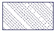|- Condicionantes|
|56|**Zona Adjacente**|Polígono|Traço contínuo|0.20|109;0;0|─|Preenchimento com linha ponteada inclinada a 45 graus. Dimensão dos pontos: 0,27 mm; Espaçamento entre pontos: 0,882 mm; Espaçamento entre linhas: 0;35 mm, Cor: 109;0;0|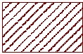|- Condicionantes|
|57|**Albufeira Classificada**|Polígono|Traço descontínuo|0.53|70;82;148|34;191;241|Traço descontínuo: Traço Longo: 6.0 mm, Traço curto: 2,0 mm, Espessura: 0,53 mm, Espaçamento: 3,0 mm.   Caixa de texto: Espessura: 0,53 mm; Fonte: Arial a negrito; Tamanho letra: 3,15 mm; Letra ao centro da célula; Espaçamento da letra ao contorno: 0,3 mm||- Condicionantes|
|58|**Lago ou Lagoa classificada**|Polígono|Traço descontínuo|0.53|70;82;148|34;191;241|Traço descontínuo: Longo: 6.0 mm; Curto: 2.0 mm; Espessura: 0.53 mm; Espaçamento: 3.0 mm; Texto: Arial negrito, 3.15 mm  Caixa de texto Espessura: 0,53 mm, Fonte: Arial a negrito; Tamanho letra: 3,15 mm; Letra ao centro da célula Espaçamento da letra ao contorno: 0,3 mm||- Condicionantes|
|59|**Zona Terrestre de Proteção**|Polígono|Traço contínuo|0.20|0;0;109|-|Preenchimento com linhas inclinadas a 135 graus; Fonte: Arial; Dimensão: 2.8 mm; Espaçamento: X: 1.0 mm, Y: 1.0 mm; Cor: 0;0;109|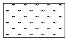|- Condicionantes|
|60|**Zona Reservada da Zona Terrestre de Proteção**|Polígono|Traço contínuo|-|249;244;0|249;244;0 (40% transparente)|-||- Condicionantes|
|61|**Zona de Proteção da Barragem**|Polígono|Traço contínuo|0.20|205;86;66|-|Preenchimento com hífen a 90 graus, inclinado a 75 graus; Fonte: Arial; Dimensão: 2.45 mm; Espaçamento: X: 1.0 mm, Y: 1.0 mm; Cor: 205;86;66|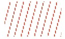|- Condicionantes|
|62|**Zona de Respeito da Barragem**|Polígono|Traço contínuo|0.20|232;48;150|-|Preenchimento com hífen a 0 graus, inclinado a 75 graus; Fonte: Arial; Dimensão: 2.45 mm; Espaçamento: X: 1.0 mm, Y: 1.0 mm; Cor: 232;48;150||- Condicionantes|
|63|**Perímetro de Proteção de Captação de Água Subterrânea**|Polígono|Traço contínuo|0.20|0;0;109|0;0;109|Preenchimento com linhas horizontais espaçadas de 0.40 mm; Espessura do traço: 0.10 mm; Cor: 0;0;109|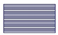|- Condicionantes|
|64|**Perímetro de Proteção de Águas da Nascente**|Polígono|Traço contínuo|0.20|34;191;241|34;191;241|Preenchimento com linhas verticais espaçadas de 0.50 mm; Espessura do traço: 0.10 mm; Cor: 34;191;241|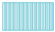|- Condicionantes|
|65|**Perímetro de Proteção de Águas Minerais Naturais**|Polígono|Traço contínuo|0.20|121;134;203|121;134;203|Preenchimento com linhas a 45 graus espaçadas de 0.40 mm; Espessura do traço: 0.10 mm; Cor: 121;134;203|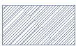|- Condicionantes|
|66|**Zona de Defesa/ Zona Especial de Defesa**|Polígono|Traço contínuo|0.20|173;123;16|173;123;16|Preenchimento com quadrados de 1,0 mm de lado alternados.|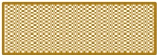|- Condicionantes|
|67|**Área Cativa / Área de Reserva**|Polígono|Traço descontínuo|0.70|128;90;13|100 % transparente|Traço longo: 4.0 mm Traço curto: 1.0 mm Espaçamento: 0.9 mm||- Condicionantes|
|68|**Reserva Agrícola Nacional**|Polígono|Traço contínuo|0.20|0;94;0|─|Preenchimento com linhas verticais espaçadas de 2,0 mm; Espessura do traço: 0,20 mm, Cor: 0;94;0|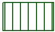|- Condicionantes|
|69|**Área Excluída da Reserva Agrícola Nacional**|Polígono|Traço contínuo|0.20|109;0;0|─|Preenchimento com linhas descontínuas verticais espaçadas de 2,0 mm; Espessura do traço: 0,35 mm; Cor: 109;0;0 Traço longo: 1,76 mm; Traço curto: 0,882 mm; Espaçamento: 0,882 mm|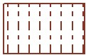|- Condicionantes|
|70|**Perímetro Hidroagrícola**|Polígono|Traço contínuo|0.53|193;190;0|100 % transparente|─||- Condicionantes|
|71|**Povoamento de Oliveiras**|Polígono|Traço contínuo|0.20|115;169;73|─|Preenchimento com linhas constituídas por árvores, inclinadas a 75 graus; Dimensão das árvores de 2,8 mm; Espaçamento em x: 4,00 mm, Espaçamento em y: 4,00 mm, Cor: 115;169;73|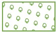|- Condicionantes|
|72|**Povoamento de Sobreiros ou Azinheiras**|Polígono|Traço contínuo|0.20|43;88;62|191;255;191 (com transparência a 70%)|Preenchimento com linhas constituídas por árvores, inclinadas a 75 graus; Dimensão das árvores de 2,8 mm; Espaçamento em x: 4,00 mm; Espaçamento em y: 4,00 mm; Cor: 43;88;62|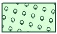|- Condicionantes|
|73|**Área onde tenham ocorrido Incêndios, Depreciação do Arvoredo ou Abates Ilegais**|Polígono|Traço contínuo|0.20|182;0;0|─|Preenchimento com linhas constituídas por árvores, inclinadas a 30 graus; Dimensão das árvores de 4,2 mm; Espaçamento em x: 6,00 mm; Espaçamento em y: 4,00 mm; Cor: 182;0;0.  Caixa de texto: Espessura: 0,53 mm; Fonte: Arial a negrito; Tamanho do texto: 3,5 mm; Cor do texto: 0;0;0; texto ao centro da célula; Espaçamento do texto ao contorno: 0,40 mm; Espessura do contorno; Cor de preenchimento: 255;255;255.|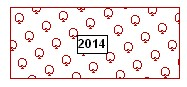|- Condicionantes|
|74|**Povoamento de Azevinho**|Polígono|Traço contínuo|0.20|0;182;0|─|Preenchimento com linhas constituídas por trevos inclinadas a 75 graus; Dimensão dos trevos de 1,75 mm; Espaçamento em x: 3,00 mm; Espaçamento em y: 3,00 mm; Cor: 0;182;0.|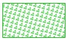|- Condicionantes|
|75|**Regime Florestal Total**|Polígono|Traço contínuo|0.20|0;182;0|157;221;180 (com transparência a 40%)|Preenchimento com linhas constituídas por pinheiros, inclinadas a 75 graus; Dimensão dos pinheiros: 3,5 mm; Espaçamento em x: 7,00 mm; Espaçamento em y: 7,00 mm; Cor: 0;182;0.|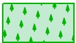|- Condicionantes|
|76|**Regime Florestal Parcial**|Polígono|Traço contínuo|0.20|0;182;0|─|Preenchimento com linhas constituídas por pinheiros, inclinadas a 75 graus; Dimensão dos pinheiros: 3,5 mm; Espaçamento em x: 7,00 mm; Espaçamento em y: 7,00 mm; Cor: 0;182;0.|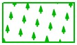|- Condicionantes|
|77|**Povoamento Florestal Percorrido por Incêndio**|Polígono|Traço contínuo|0.20|103;43;31|─|Preenchimento com linhas constituídas por pinheiros, inclinadas a 45 graus; Dimensão das árvores de 3,5 mm; Espaçamento em x: 7,00 mm; Espaçamento em y: 7,00 mm; Cor: 103;43;31.  Caixa de texto: Espessura: 0,53 mm; Fonte: Arial a negrito; Tamanho letra: 3,5 mm; Letra ao centro da célula; Espaçamento da letra ao contorno: 0,40 mm; Espessura do contorno; Cor de preenchimento: 255;255;255.|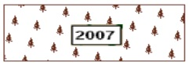|- Condicionantes|
|78|**Classe de Risco de Incêndio (alta ou muito alta)**|Polígono|Traço contínuo|0.20|138;35;0|─|Preenchimento com linhas cruzadas, inclinadas a 45 graus; Espessura: 0,20 mm; Espaçamento entre linha: 4,00 mm; Cor: 138;35;0.|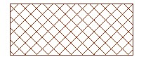|- Condicionantes|
|79|**Zona crítica**|Polígono|Traço contínuo|0.20|255;98;21|─|Preenchimento com triângulos. Dimensão dos triângulos: 1,75 mm; Espaçamento em x: 5,0 mm; Espaçamento em y: 5,0 mm; Cor: 255;98;21|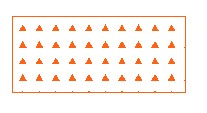|- Condicionantes|
|80|**Redes de Faixas de Gestão de Combustível (rede primária e secundária)**|Polígono|Traço contínuo|0.20|138;35;0|─|Preenchimento com linhas verticais espaçadas de 3,5 mm; Espessura do traço: 0,20mm; Cor: 138;35;0 com 45% de transparência|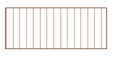|- Condicionantes|
|80|**Redes de Faixas de Gestão de Combustível (rede primária e secundária)**|Linha|Traço descontínuo|0.53|138;35;0|─|Traço longo: 8,0 mm; Espaçamento: 1,0 mm; Traço curto: 1,0 mm; Espaçamento: 1,0 mm (sequência de 2 traços curtos)|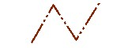|- Condicionantes|
|81|**Árvore ou Arvoredo de Interesse Público**|Polígono|Traço contínuo|─|0;182;0|0;182;0 (30% transparente)|Preenchimento com símbolos de árvores: cor: 255;255;255; Dimensão da árvore: 4.2 mm; Espaçamento entre árvores na horizontal e vertical: 8.0 mm||- Condicionantes|
|81|**Árvore ou Arvoredo de Interesse Público**|Ponto|Traço contínuo|0.53|0;182;0|255;255;255|Composição de símbolos: Quadrado - Dimensão: 6,3 mm; Árvore - Centrada no quadrado - Cor: 0;182;0||- Condicionantes|
|82|**Área Excluída da Reserva Ecológica Nacional**|Polígono|Traço contínuo|0.20|130;54;40|100% transparente|Preenchimento com linhas descontínuas horizontais espaçadas de 1,0 mm; Traço longo: 4,0 mm; Traço curto: 1,0 mm; Espaçamento: 1,0 mm; Espessura do traço: 0,20 mm; Cor: 130;54;40|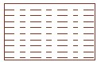|- Condicionantes|
|83|**Parque Nacional**|Polígono|Linha composta|─|0;235;0|254;250;168 (50% transparente)|Composição da linha: Traço contínuo - Cor: 0;235;0; Espessura: 0,10 mm; Traço descontínuo justaposto para o interior - Cor: 0;235;0; Espessura: 1,00 mm; Traço: 12,0 mm; Espaçamento: 9,0 mm||- Condicionantes|
|84|**Parque Natural**|Polígono|Linha composta|─|0;235;0|254;250;168 (50% transparente)|Composição da linha: Traço contínuo - Cor: 0;235;0; Espessura: 0,10 mm; Traço descontínuo justaposto para o interior - Cor: 0;235;0; Espessura: 1,00 mm; Traço longo: 8,0 mm; Espaçamento: 10,0 mm; Traço curto: 2,0 mm||- Condicionantes|
|85|**Reserva Natural**|Polígono|Linha composta|─|0;235;0|254;250;168 (com transparência a 50%)|Composição da linha: Traço contínuo e conjunto de círculos com preenchimento; descentrados para dentro da linha. - Espessura do traço: 0,10 mm - Dimensão do ponto: 1,2 mm; Espaçamento entre pontos: 4,0 mm; Círculo tangente ao traço (para dentro).||- Condicionantes|
|86|**Monumento Natural**|Polígono|Traço contínuo|0.10|0;109;109|254;250;168 (com transparência a 45%)|Preenchimento com linhas constituídas por letra V, inclinadas a 45 graus; Fonte: Arial; Dimensão: 2,1 mm; Espaçamento em x: 1,25 mm; Espaçamento em y: 1,25 mm; Cor: 0;109;0|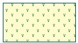|- Condicionantes|
|86|**Monumento Natural**|Ponto|Traço contínuo|0.53|0;182;0|255;255;255|Composição de símbolos: Quadrado - Dimensão: 6,3 mm; Casa centrada no quadrado - Cor: 0;182;0||- Condicionantes|
|87|**Paisagem Protegida (de interesse regional ou local)**|Polígono|Traço contínuo|0.10|0;109;0|245;196;25 (com transparência a 45%)|Preenchimento com linhas constituídas por letra V invertida, inclinadas a 45 graus; Fonte: Arial; Dimensão: 2,8 mm; Espaçamento em x: 1,25 mm; Espaçamento em y: 1,25 mm; Cor: 0;109;0|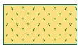|- Condicionantes|
|87|**Paisagem Protegida (de interesse regional ou local)**|Ponto|─|─|─|0;182;0 / 255;255;255|Composição de símbolos: Quadrado - Cor: 0;182;0; Dimensão: 6,3 mm; Letra P centrada no quadrado - Cor: 255;255;255; Fonte: Arial a negrito||- Condicionantes|
|88|**Sítio da Lista Nacional**|Polígono|─|0.20|182;0;182|245;172;202 (com transparência a 50%)|Composição da linha: Traço contínuo e conjunto de Triângulos com preenchimento, descentrados para dentro da linha. - Espessura do traço: 0,20 mm; - Dimensão do Triângulo: 1,75 mm; Espaçamento entre triângulos: 18,0 mm; Ponto tangente ao traço (para dentro)|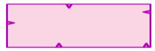|- Condicionantes|
|89|**Zona Especial de Conservação (ZEC)**|Polígono|─|0.20|182;0;182|245;172;202 (com transparência a 50%)|Composição da linha: Traço contínuo e conjunto de pontos com preenchimento, descentrados para dentro da linha. - Espessura do traço: 0,20 mm; - Dimensão do ponto: 1,75 mm; Espaçamento entre pontos: 18,0 mm; Ponto tangente ao traço (para dentro)|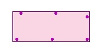|- Condicionantes|
|90|**Zona de Proteção Especial (ZPE)**|Polígono|─|0.20|182;0;182|245;172;202 (com transparência a 50%)|Composição da linha: Traço contínuo e conjunto de quadrados com preenchimento, descentrados para dentro da linha. - Espessura do traço: 0,20 mm; - Dimensão do quadrado: 1,75 mm; Espaçamento entre quadrados: 18,0 mm; Quadrado tangente ao traço (para dentro)||- Condicionantes|
|91|**Monumento Nacional**|Polígono|Traço contínuo|0.20|0;0;0|161;31;131|Fonte: Arial a negrito Tamanho letra: 3,5 mm Cor: 0;0;0||- Condicionantes|
|91|**Monumento Nacional**|Ponto|Traço contínuo|0.35|0;0;0|161;31;131|Retângulo Fonte: Arial a negrito centrado Cor: 0;0;0 Tamanho letra: 3,5 mm Espaçamento: 1,5 mm||- Condicionantes|
|92|**Imóvel de Interesse Público**|Polígono|Traço contínuo|0.20|0;0;0|161;31;131|Fonte: Arial a negrito Tamanho letra: 3,5 mm Cor: 0;0;0||- Condicionantes|
|92|**Imóvel de Interesse Público**|Ponto|Traço contínuo|0.35|0;0;0|161;31;131|Retângulo Fonte: Arial a negrito centrado Cor: 0;0;0 Tamanho letra: 3,5 mm Espaçamento: 1,5 mm||- Condicionantes|
|93|**Imóvel de Interesse Municipal**|Polígono|Traço contínuo|0.20|0;0;0|161;31;131|Fonte: Arial a negrito Tamanho letra: 3,5 mm Cor: 0;0;0||- Condicionantes|
|93|**Imóvel de Interesse Municipal**|Ponto|Traço contínuo|0.35|0;0;0|161;31;131|Retângulo Fonte: Arial a negrito centrado Cor: 0;0;0 Tamanho letra: 3,5 mm Espaçamento: 1,5 mm||- Condicionantes|
|94|**Imóvel em Vias De Classificação**|Polígono|Traço contínuo|0.20|0;0;0|161;31;131|Fonte: Arial a negrito Tamanho letra: 3,5 mm Cor: 0;0;0||- Condicionantes|
|94|**Imóvel em Vias De Classificação**|Ponto|Traço contínuo|0.35|0;0;0|161;31;131|Retângulo Fonte: Arial a negrito centrado Cor: 0;0;0 Tamanho letra: 3,5 mm Espaçamento: 1,5 mm||- Condicionantes|
|95|**Zona Geral de Proteção**|Polígono|Traço contínuo|0.70|161;31;131|100% transparente|-||- Condicionantes|
|96|**Zona Especial de Proteção Provisória**|Polígono|Traço contínuo|0.20|161;31;131|-|Preenchimento com linhas a 60 graus, espaçadas de 1,25 mm; Espessura do traço: 0,10 mm, Cor: 161;31;131||- Condicionantes|
|97|**Zona Especial de Proteção**|Polígono|Traço contínuo|0.20|161;31;131|─|Preenchimento com linhas a 30 graus, espaçadas de 1,25 mm; Espessura do traço: 0,10 mm, Cor: 0;0;0||- Condicionantes|
|98|**Zona de Proteção de Edifício Público ou de Outra Construção**|Polígono|Traço contínuo|0.20|0;0;0|─|Preenchimento com linhas verticais, espaçadas de 1,5 mm; Espessura do traço: 0,10 mm, Cor: 0;0;0||- Condicionantes|
|99|**Zona de Proteção de Estabelecimento Prisional ou Tutelar de Menores**|Polígono|Traço contínuo|0.20|77;77;77|─|Preenchimento com linhas descontínuas verticais, espaçadas de 1,5 mm; Traço: 1,0 mm; Espaçamento: 0,5 mm; Espessura do traço: 0,10 mm, Cor: 77;77;77||- Condicionantes|
|100|**Área de Jurisdição de Alfândega**|Polígono|Traço contínuo|0.20|77;77;77|─|Preenchimento com linhas descontínuas inclinadas a 45 graus, espaçadas de 1,00 mm; Traço: 1,0 mm; Espaçamento: 0,5 mm; Espessura do traço: 0,10 mm; Cor: 77;77;77||- Condicionantes|
|101|**Zona de Servidão Militar**|Polígono|Traço contínuo|0.20|0;0;0|─|Preenchimento com linhas descontínuas horizontais, espaçadas de 1,00 mm; Traço: 3,0 mm; Espaçamento: 0,5 mm; Espessura do traço: 0,10 mm; Cor: 0;0;0||- Condicionantes|
|102|**Zona de Servidão de Abastecimento de Água**|Polígono|Traço contínuo|0.20|113;244;244|─|Preenchimento com linhas verticais, espaçadas de 0,7 mm; Espessura do traço: 0,10 mm; Cor: 113;244;244||- Condicionantes|
|103|**Zona de Servidão de Drenagem de Águas Residuais**|Polígono|Traço contínuo|0.20|131;6;255|─|Preenchimento com linhas descontínuas verticais, espaçadas de 0,7 mm; Traço: 0,5 mm; Espessura do traço: 0,10 mm; Espaçamento: 0,5 mm; Cor: 131;6;255||- Condicionantes|
|104|**Zona de Servidão de Rede Elétrica**|Polígono|Traço contínuo|0.20|191;0;0|─|Preenchimento com linhas horizontais, espaçadas de 1,0 mm; Espessura do traço: 0,10 mm; Cor: 191;0;0||- Condicionantes|
|105|**Zona de Servidão de Gasodutos e Oleodutos**|Polígono|Traço contínuo|0.20|77;77;77|─|Preenchimento com linhas cruzadas, inclinadas a 45 graus; Espessura: 0,20 mm; Espaçamento entre linhas: 2,0 mm; Cor: 118;118;118||- Condicionantes|
|106|**Itinerário Principal**|Linha|Traço contínuo|1.40|255;0;0|─|─||- Condicionantes|
|107|Itinerário Principal Autoestrada|Linha|Linha composta|─|255;0;0|255;255;255|Composição da linha: Traço contínuo - Cor: 255;0;0, Espessura: 1,22 mm; Traço contínuo sobreposto - Cor: 255;255;255; Espessura: 0,53 mm||- Condicionantes|
|108|**Itinerário Complementar**|Linha|Traço contínuo|1.00|255;0;0|─|─||- Condicionantes|
|109|**Itinerário Complementar Autoestrada**|Linha|Linha composta|─|255;0;0|255;0;0 / 255;255;255|Composição da linha: Traço contínuo - Cor: 255;0;0, Espessura: 1,0 mm; Traço descontínuo sobreposto - Cor: 255;255;255; Espessura: 0,53 mm; Traço: 10,0 mm; Espaçamento: 6,0 mm||- Condicionantes|
|110|**Estrada Nacional**|Linha|Traço contínuo|0.70|255;0;0|─|─||- Condicionantes|
|111|**Estrada Regional**|Linha|Traço descontínuo|0.70|255;0;0|─|Traço: 25,0 mm; Espaçamento: 2,0 mm||- Condicionantes|
|112|**Zona de Servidão de Estrada do Plano Rodoviário Nacional**|Polígono|Traço contínuo|0.20|128;0;0|─|Preenchimento com linhas a 45 graus, espaçadas de 0,70 mm; Espessura do traço: 0,20 mm; Cor: 128;0;0||- Condicionantes|
|113|**Estradas Nacionais Desclassificadas**|Linha|Traço descontínuo|0.88|164;0;82|─|Traço longo: 10,0 mm; Espaçamento: 1,0 mm; Traço curto: 2,0 mm; Espaçamento: 1,0 mm||- Condicionantes|
|114|**Zona de Servidão de Estrada Nacional Desclassificada**|Polígono|Traço contínuo|0.20|237;96;173|─|Preenchimento com linhas a 45 graus, espaçadas de 0,70 mm; Espessura do traço: 0,20 mm; Cor: 237;96;173||- Condicionantes|
|115|**Estrada Municipal**|Linha|Traço descontínuo|0.79|0;0;0|─|Traço longo: 8,0 mm; Espaçamento: 4,0 mm Traço curto: 2,0 mm; Espaçamento: 4,0 mm||- Condicionantes|
|116|**Caminho Municipal**|Linha|Traço descontínuo|0.26|0;0;0|─|Traço: 1,0 mm; Espaçamento: 0,5 mm||- Condicionantes|
|117|**Zona de Servidão de Estrada ou Caminho Municipal**|Polígono|Traço contínuo|0.20|77;77;77|─|Preenchimento com linhas a 60 graus, espaçadas de 0,70 mm; Espessura do traço: 0,20 mm; Cor: 165;165;165||- Condicionantes|
|118|**Zona de Servidão de Via-Férrea**|Polígono|Traço contínuo|0.20|0;0;0|─|Preenchimento com linha ponteada, inclinada a 45 graus. Dimensão dos pontos: 0,7 mm; Espaçamento entre pontos: 1,50 mm; Espaçamento entre linhas: 1,50 mm; Cor: 0;0;109||- Condicionantes|
|119|**Zona de Servidão Aeronáutica**|Polígono|Linha composta|─|0;0;0 / 253;249;126|118;118;118 (com transparência a 50%)|Composição da linha: - Traço contínuo - Cor: 0;0;0, Espessura: 0,10 mm - Traço descontínuo justaposto para o interior; Cor: 253,249,126; Espessura: 0,7 mm; Traço: 6,0 mm, Espaçamento: 3.0 mm; Distância entre traço contínuo e descontínuo: 0.5 mm.||- Condicionantes|
|120|**Zona de Servidão Radioelétrica**|Polígono|Traço contínuo|0.09|0;0;255|─|Preenchimento com losangos Tamanho do Losango 0,9 mm Espaçamento em x : 1,75 mm Espaçamento em y: 1,75 mm Cor: 0;0;255||- Condicionantes|
|121|**Farol ou Outro Sinal Marítimo**|Ponto|─|─|─|0;0;182|Farol Dimensão: 7,0 mm||- Condicionantes|
|122|**Zona de Servidão de Sinalização Marítima**|Polígono|Traço contínuo|0.53|0;0;182|100% transparente|─||- Condicionantes|
|123|**Zona de Proteção da Rede Geodésica**|Polígono|Traço contínuo|0.53|0;0;0|100% transparente|─||- Condicionantes|
|124|**Marco Geodésico**|Ponto|Traço contínuo|0.53|0;0;0|255;255;255|Composição de símbolos: Triângulo - Dimensão: 5,0 mm; Ponto - Centrado no triângulo - Espessura: 0,67 mm; Cor: 0;0;0||- Condicionantes|
|125|**Estabelecimento com Produtos Explosivos**|Ponto|Traço contínuo|0.53|138;35;0|255;255;255|Composição de símbolos: Quadrado - Dimensão: 6,3 mm; Estrela - Centrada no quadrado - Cor: 138;35;0||- Condicionantes|
|126|**Zona de Segurança de Estabelecimento com Produtos Explosivos**|Polígono|Traço contínuo|0.20|138;35;0|─|Preenchimento com estrelas Tamanho da estrela: 0,7 mm; Espaçamento em x: 1,75 mm; Espaçamento em y: 1,75 mm; Cor: 138;35;0||- Condicionantes|
|127|**Estabelecimento com Substâncias Perigosas**|Ponto|Traço contínuo|0.53|255;0;0|255;0;0 / 255;255;255|Círculo com preenchimento 2 x 25% a Cor: 255;0;0 e 2 x 25% a Cor: 255;255;255 Dimensão: 6,3 mm||- Condicionantes|
|128|**Zona de Segurança de Estabelecimento com Substâncias Perigosas**|Polígono|Traço contínuo|0.20|183;0;0|─|Preenchimento com círculos sem preenchimento Diâmetro do círculo: 0,7 mm; Espessura: 0,10 mm; Espaçamento em x: 3,0 mm; Espaçamento em y: 3,0 mm; Cor: 255;0;0||- Condicionantes|
|129|**Área de Jurisdição do Porto**|Polígono|Traço contínuo|0.53|240;147;50|100% transparente|Fonte: Arial a negrito; Tamanho letra: 3,5 mm; Cor: 240;147;50||- Ordenamento|
|130|**Área de Intervenção de Programa Setorial**|Polígono|Linha composta|─|105;65;20|100% transparente|Composição da linha: Traço contínuo e conjunto de círculos com preenchimento, descentrados para dentro da linha. - Espessura do traço: 0,44 mm; - Dimensão ponto: 1,75 mm; Espaçamento entre pontos: 4,0 mm; Ponto tangente ao traço (para dentro).  Fonte: Arial a negrito; Tamanho letra: 3,5 mm; Cor: 105;65;20||- Ordenamento|
|131|**Área de Intervenção de Programa Intermunicipal**|Polígono|Linha composta|─|0;0;182|100% transparente|Composição da linha: Traço contínuo e conjunto de círculos com preenchimento, descentrados para dentro da linha. - Espessura do traço: 0,44 mm; - Dimensão ponto: 1,75 mm; Espaçamento entre pontos: 4,0 mm; Ponto tangente ao traço (para dentro).  Fonte: Arial a negrito; Tamanho letra: 3,5 mm; Cor: 0;0;182||- Ordenamento|
|132|**Área de Intervenção de Plano Territorial Intermunicipal (PUI, PPI)**|Polígono|Linha composta|─|0;0;182|100% transparente|Composição da linha: Traço descontínuo e conjunto de círculos com preenchimento, descentrados para dentro da linha. Traço: 10,0 mm; Espaçamento: 6,00 mm; - Espessura do traço: 0,44 mm; - Dimensão ponto: 1,75 mm; Espaçamento entre pontos: 12,0 mm; Ponto tangente ao traço (para dentro).  Fonte: Arial a negrito; Tamanho letra: 3,5 mm; Cor: 0;0;182||- Ordenamento|
|133|**Área de Risco**|Polígono|Traço contínuo|0.20|255;0;0|─|Preenchimento com círculos preenchidos. Diâmetro do círculo: 1,00 mm; Espaçamento em x: 5,0 mm; Espaçamento em y: 5,0 mm; Cor: 255;0;0  Fonte: Arial a negrito; Tamanho letra: 3,5 mm; Cor: 0;0;0||- Ordenamento|
|134|**Área de Perigosidade**|Polígono|Traço contínuo|0.35|109;0;0|─|Preenchimento com a letra X Dimensão: 2,65 mm Espaçamento em x: 5,0 mm Espaçamento em y: 5,0 mm Cor: 109;0;0  Fonte: Arial a negrito Tamanho letra: 3,5 mm Cor: 0;0;0||- Ordenamento|
|135|**Área Urbana de Génese Ilegal (AUGI)**|Polígono|Linha composta|─|109;78;10|100% transparente|Composição da linha: Traço contínuo e conjunto de triângulos com preenchimento, descentrados para dentro da linha. Espessura do traço: 0,44 mm Dimensão do Triângulo: 2,45 mm Espaçamento entre triângulos: 8,0 mm  Fonte: Arial a negrito Tamanho letra: 3,5 mm Cor: 0;0;0||- Ordenamento|
|136|**Área de Reabilitação Urbana (ARU)**|Polígono|Linha composta|─|0;0;182|100% transparente|Composição da linha: Traço contínuo e conjunto de triângulos com preenchimento, descentrados para dentro da linha. Espessura do traço: 0,44 mm Dimensão do Triângulo: 1,75 mm Espaçamento entre triângulos: 4,8 mm  Fonte: Arial a negrito Tamanho letra: 3,5 mm Cor: 0;0;182||- Ordenamento|
|137|**Infraestrutura Associada a Gasoduto ou Oleoduto**|Ponto|Traço contínuo|0.53|0;0;0|255;255;255 / 0;0;0|Retângulo com preenchimento de 50% em Cor: 0;0;0 e 50% em Cor: 255;255;255 Dimensão: 12,6 X 6,3 mm||- Condicionantes|
|138|**Unidade de Execução**|Polígono|Traço contínuo|0.70|94;94;94|─|Preenchimento com linhas a 45 graus, espaçadas de 5,00 mm; Espessura do traço: 0,30 mm; Cor: 94;94;94||- Ordenamento|
|139|**Zona Sensível ao Ruído**|Polígono|Traço contínuo|0.20|182;0;0|─|Preenchimento com triângulos preenchidos. Dimensão do triângulo: 1,8 mm; Espaçamento em x: 3,0 mm; Espaçamento em y: 3,0 mm; Cor: 182;0;0||- Ordenamento|
|140|**Zona Mista ao Ruído**|Polígono|Traço contínuo|0.20|182;0;1|─|Preenchimento com triângulos preenchidos. Dimensão do triângulo: 2,0 mm; Espaçamento em x: 6,0 mm; Espaçamento em y: 6,0 mm; Cor: 182;0;1||- Ordenamento|
|141|**Parque Arqueológico**|Polígono|Traço contínuo|0.20|0;0;0|161;31;131|Fonte: Arial a negrito Tamanho letra: 3,5 mm Cor: 0;0;0||- Condicionantes|
|141|**Parque Arqueológico**|Ponto|Traço contínuo|0.35|0;0;0|161;31;131|Retângulo Fonte: Arial a negrito centrado Cor: 0;0;0, Tamanho letra: 3,5 mm Espaçamento da letra ao contorno: 1,5 mm||- Condicionantes|
|142|**Área de Servidão de Recurso Geológico**|Polígono|Traço contínuo|0.20|255;100;23|─|Preenchimento com pontos. Dimensão do ponto: 0,9 mm; Espaçamento entre pontos: 2,5 mm; Ângulo de rotação do ponto: 30 graus; Cor: 255;100;23||- Condicionantes|
|143|**Estrada em Projeto**|Linha|Traço descontínuo|0.80|255;0;0|-|Traço: 6,0 mm; Espaçamento: 3,0 mm||- Condicionantes|
|144|**Zona de Respeito de Estrada do Plano Rodoviário Nacional**|Polígono|Traço contínuo|0.20|128:0;0|-|Preenchimento com linhas a 45 graus, espaçadas de 2,0 mm; Espessura do traço: 0,20 mm; Cor: 128;0;0||- Condicionantes|
|145|**Zona de proteção e de salvaguarda dos recursos e valores naturais**|Polígono|Traço contínuo|0.70|210;210;0|100% transparente|Fonte: Arial a negrito Tamanho letra: 3,5 mm Cor 210;210;0||- Ordenamento|
|146|**Estacionamento**|Ponto|Traço contínuo|-|218;50;206|218;50;206|Quadrado - Dimensão: 3,5 mm||- Ordenamento|
|147|**Estacionamento Previsto**|Ponto|Traço contínuo|0.53|218;50;206|255;255;255|Quadrado - Dimensão: 3,5 mm||- Ordenamento|
|148|**Reserva Ecológica Nacional**|Polígono|Traço contínuo|_|84;163;221|198;249;254 (com transparência a 30%)|Preenchimento com linhas horizontais espaçadas de 1,0 mm; Espessura do traço: 0;20 mm, Cor: 0;0;0||- Condicionantes|
|149|**Geossítio**|Polígono|Traço contínuo|0.20|173;123;16|-|Preenchimento com estrelas Tamanho da estrela: 0,7 mm Espaçamento em x : 1,75 mm Espaçamento em y: 1,75 mm Cor: 173;123;16||- Ordenamento|
|150|**Imóvel inventariado**|Ponto|Traço contínuo|0.53|0;0;0|100% transparente|Símbolos: Estrela Fonte: Arial a negrito Tamanho letra: 3,5 mm Cor: 0;0;0||- Ordenamento|
|151|**Espaço de uso especial – infraestrutura estruturante**|Polígono|Traço contínuo|0.10|83;21;0|229;222;161 (com transparência a 30%)|Fonte: Arial a negrito Tamanho letra: 3,5 mm Cor: 0;0;0| |- Ordenamento|
|152|**Espaço de uso especial – equipamento**|Polígono|Traço contínuo|0.10|83;21;0|229;222;161 (com transparência a 30%)|Fonte: Arial a negrito Tamanho letra: 3,5 mm Cor: 0;0;0| |- Ordenamento|