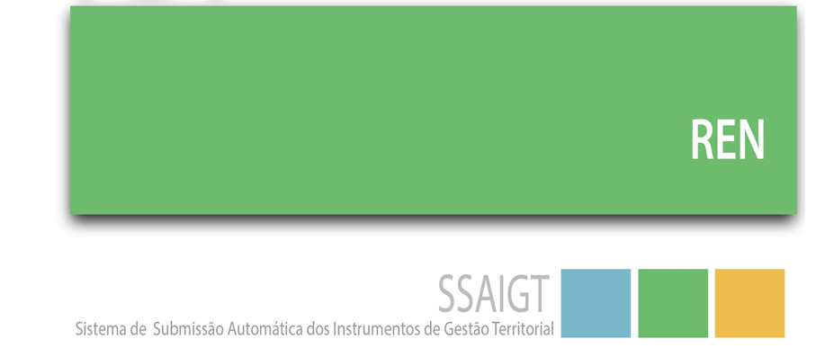

# **SSAIGT - REN Manual do utilizador**

    Direção de Serviços de Ordenamento do Território
    Divisão de Informação e Gestão Territorial
    Autores: Ana Sofia Rizzone e Isabel Martins
    Direção-Geral do Território
    Rua da Artilharia Um, 107
    1099-052 Lisboa
    outubro de 2024

# Índice

1. [Enquadramento](#1-enquadramento)

2. [Entrada na componente REN da Plataforma SSAIGT e submissão de um processo](#2-entrada-na-componente-ren-da-plataforma-ssaigt-e-submissão-de-um-processo)

3. [Continuar, Consultar, Corrigir ou Anular Processos](#3-continuar-consultar-corrigir-ou-anular-processos)

    1. [Continuar um processo](#3_1-continuar-um-processo)

    2. [Consultar um processo](#3_2-consultar-um-processo)

    3. [Corrigir um Processo](#3_3-corrigir-um-processo)

    4. [Anular um processo](#3_4-anular-um-processo)

4. [Elementos instrutórios para efeito de publicação e depósito](#4-elementos-instrutórios-para-efeito-de-publicação-e-depósito)

    1. [Identificação e descrição](#4_1-identificação-e-descrição)

    2. [Preparação da informação geográfica a submeter para publicação e depósito de processo REN](#4_2-preparação-da-informação-geográfica-a-submeter-para-publicação-e-depósito-de-processo-ren)

    3. [Boas práticas na produção da carta de delimitação da ren e pormenorizações](#3-boas-práticas-na-produção-da-carta-de-delimitação-da-ren-e-pormenorizações)

    4. [Regras aplicáveis ao conteúdo dos elementos instrutórios para publicação](#4-regras-aplicáveis-ao-conteúdo-dos-elementos-instrutórios-para-publicação)

5. [Regras aplicáveis aos ficheiros a submeter na plataforma](#5-regras-aplicáveis-aos-ficheiros-a-submeter-na-plataforma)

    1. [Formatos dos ficheiros que integram os elementos instrutórios](#5_1-formatos-dos-ficheiros-que-integram-os-elementos-instrutórios)

    2. [Denominação dos ficheiros](#5_2-denominação-dos-ficheiros)

    3. [Regras para a criação dos ficheiros ZIP](#5_3-regras-para-a-criação-dos-ficheiros-zip)

Anexo I - [Códigos da divisão administrativa do Instituto Nacional de Estatística](#anexo-i---códigos-da-divisão-administrativa-do-instituto-nacional-de-estatística)

****

# 1 Enquadramento

Com a entrada em vigor da Portaria 343/2016, de 30 de dezembro, a
publicação e o depósito das cartas de delimitação da REN, passou a
efetuar-se por via eletrónica através da plataforma Sistema de Submissão
Automática de Instrumentos de Gestão Territorial (SSAIGT), criada pela
Portaria n.º 245/2011, de 22 de junho. A componente REN inserida nesta
plataforma entrou em vigor no início de janeiro de 2017 e foi resultado
da execução da medida "REN Digital", implementada no âmbito do Programa
nacional de simplificação administrativa Simplex 2016+.

O carregamento da informação na plataforma é efetuado pelas Comissões de
Coordenação e Desenvolvimento Regional que após a aprovação das cartas
de delimitação da REN dos municípios da sua área territorial, têm a
atribuição do seu envio para publicação no Diário da República e
depósito na Direção-Geral do Território (DGT).

O depósito das cartas da REN e da respetiva memória descritiva, bem como
de eventuais correções materiais e retificações efetuadas nos termos da
lei cabe à DGT, entidade igualmente responsável pela gestão da
plataforma.

Para apoiar o utilizador no processo de submissão na SSAIGT dos
elementos que devem ser publicados e depositados, foi elaborado o
presente Manual do Utilizador que explica as diferentes fases do
carregamento de um processo de dinâmica REN, define os elementos
instrutórios a submeter e estabelece as regras aplicáveis à informação e
aos ficheiros a submeter.

# 2 Entrada na componente REN da Plataforma SSAIGT e submissão de um processo

O acesso à plataforma SSAIGT é feito através do endereço:
<https://ssaigt.dgterritorio.pt/>

Para aceder à componente REN, o utilizador deve selecionar,
sequencialmente, as opções: "Servidões e Restrições de Utilidade
Pública" \> "Reserva Ecológica Nacional" \> "REN" e introduzir as
respetivas credenciais atribuídas pela INCM (figura 1).

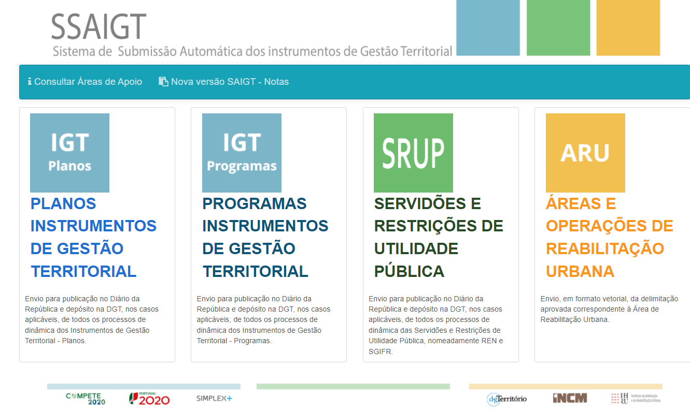

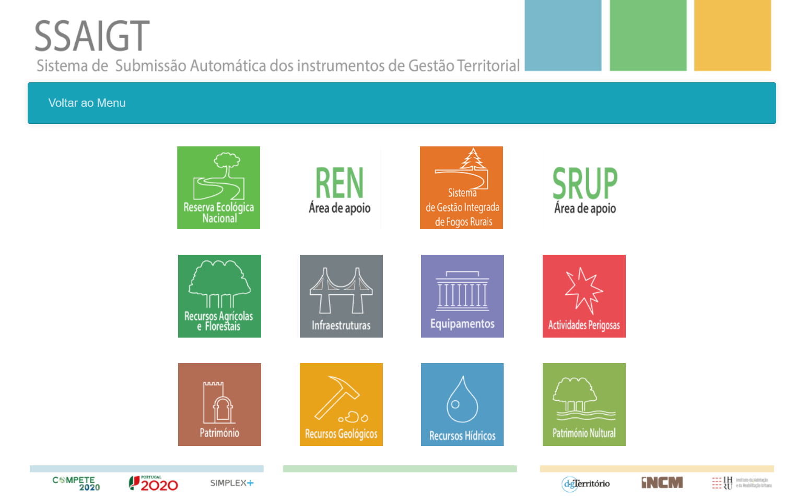

*Figura 1 - Entrada na plataforma*

A primeira página após a credenciação apresenta o "Menu Inicial" (figura
2), com as opções descritas no quadro 1.

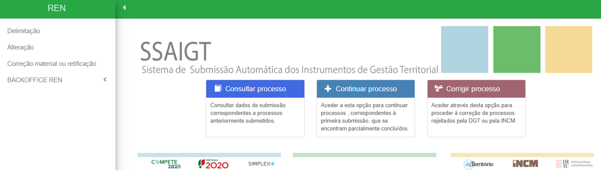

*Figura 2 - Menu inicial*

*Quadro 1 - Descrição do Menu Inicial*

|   |   |
|-------------------------|----------------------------------------|
| ***Iniciar processo***  |Permite a submissão de um novo processo.|
| ***Continuar processo***|Permite retomar o processo em instrução, no ponto em que procedeu à gravação.|
|***Consultar processo*** |Permite consultar a listagem de processos submetidos através da plataforma e saber o estado (ponto de situação) em que se encontram.|
| ***Corrigir processo*** | Permite corrigir e submeter novos ficheiros quando, na sequência da validação efetuada pela DGT ou pela INCM, tenha havido rejeição de ficheiros.|

***

### O início de um processo de dinâmica REN deve seguir os seguintes passos:

***[Passo 1 - Selecionar o tipo de processo de dinâmica REN]***

No "Menu Inicial", o utilizador deve começar por selecionar, o tipo de
dinâmica que pretende submeter (figura 3).

*Figura 3 - Dinâmicas REN na plataforma SSAIGT*

Estão previstas 3 dinâmicas cuja descrição é apresentada no quadro 2.

*Quadro 2 - Dinâmicas REN*

|   |   |
|-------------------------|----------------------------------------|
| ***Delimitação*** |Quando se pretende submeter uma delimitação da REN ao nível municipal, efetuada ou não em simultâneo com a elaboração, alteração ou revisão de PMOT.|
| ***Alteração*** |Quando se pretende submeter uma alteração da delimitação da REN, efetuada ou não em simultâneo com a elaboração, alteração ou revisão de PMOT, ou por uma alteração simplificada.|
| ***Correção material ou retificação*** |Quando se pretende submeter uma correção material ou uma retificação.|

***

***[Passo 2 - Preenchimento do formulário]***

A cada dinâmica REN está associado um formulário com campos específicos
que o utilizador deve preencher (exemplo na figura 4).

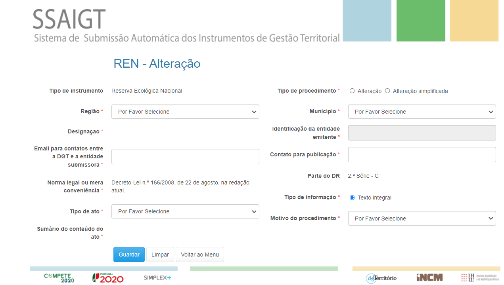

*Figura 4 - Formulário tipo para um processo de alteração*

Os campos do formulário assinalados como obrigatórios estão
identificados com um asterisco a vermelho. No quadro 3, são descritos
todos os campos que podem aparecer nos formulários.

*Quadro 3 - Campos dos formulários*

| Nome do campo           | Descrição                              |
|-------------------------|----------------------------------------|
| Tipo de instrumento     | Reserva Ecológica Nacional Preenchido automaticamente.|                         |
| Tipo de procedimento    | Tipo de dinâmica REN                   |
| Região                  | Nome da região. Preenchido automaticamente.|
| Município               | Nome do município.                     |
| Instrumento de Gestão Territorial | Instrumento de Gestão Territorial no âmbito do qual está a ser efetuada a delimitação ou alteração de REN. Este campo só está visível quando o utilizador seleciona a opção “SIM” no campo “Processo em simultâneo com a formação de PMOT”.|

<table>
<tr class="odd">
<td>Designação</td>
<td>
Nome do processo e do IGT, se aplicável.

Preenchido automaticamente
</td>
</tr>
<tr class="even">
<td>Identificação da entidade emitente</td>
<td>
Entidade que efetua a submissão.

Preenchido automaticamente.
</td>
</tr>
<tr class="odd">
<td>Email para contatos entre a DGT e a CCDR</td>
<td>Email para contatos entre a DGT e a CCDR.</td>
</tr>
<tr class="even">
<td>Contato para publicação</td>
<td>Contato telefónico ou email para contatos entre a CCDR e a INCM (o
mesmo que foi utilizado na acreditação na plataforma).</td>
</tr>
<tr class="odd">
<td>Norma legal ou mera conveniência</td>
<td>
Diploma do regime jurídico da REN.

Preenchido automaticamente
</td>
</tr>
<tr class="even">
<td>Parte do DR</td>
<td>
Parte do Diário da República onde é publicado o ato.

Preenchido automaticamente.
</td>
</tr>
<tr class="odd">
<td>Tipo de ato</td>
<td>Tipos de atos publicados na 2.ª série do Diário da República
aplicados a processos de dinâmica REN.</td>
</tr>
<tr class="even">
<td>Tipo de informação</td>
<td>
O texto do ato deve ser integral.

Preenchido automaticamente.
</td>
</tr>
<tr class="odd">
<td>Motivo do procedimento</td>
<td>Listagem de motivos que estiveram na génese da dinâmica da REN em
causa.</td>
</tr>
<tr class="even">
<td>Sumário do conteúdo do ato</td>
<td>
Resumo do conteúdo do ato a publicar.

Preenchido automaticamente.
</td>
</tr>
</tbody>
</table>

Desta ultima atualização da plataforma SAIGT-REN, foi introduzido mais
um campo de preenchimento obrigatório, que apresenta uma listagem de
possíveis motivos que estiveram na origem da dinâmica da REN em causa,
apresentados na figura 5. Possibilitando desta forma, estudos
estatísticos sobre a evolução das dinâmicas da REN, ao longo do tempo.

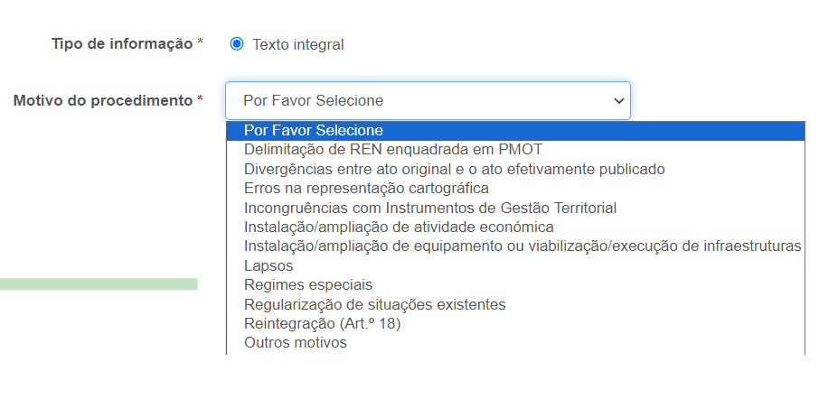

*Figura 5 - Tipificação de motivos de dinâmicas da REN*

***[Passo3 - Guardar o formulário]***

Após o preenchimento do formulário, o utilizador deve selecionar o botão
"Guardar".

Caso existam campos de preenchimento obrigatório vazios, o sistema
identificará a vermelho a necessidade de preenchimento com o texto
"Campo necessário". Quando o preenchimento do campo não segue as regras
de validação exigidas pela plataforma é emitida a vermelho uma mensagem
de alerta (figura 6).

*Figura 6 - Mensagens de alerta num formulário*

***[Passo 4 - Carregamento dos elementos instrutórios]***

Os elementos instrutórios que podem ser submetidos num processo de
dinâmica REN são identificados e descritos no capítulo 4 deste manual e
devem estar organizados em ficheiros que o utilizador deve criar
observando regras detalhadas no capítulo 5 deste manual.

Os elementos instrutórios a submeter em cada processo dependem da
dinâmica REN (quadro 4) e obedecem às seguintes regras:

1. O texto do ato é de submissão obrigatória em todos os processos;

2. A carta da REN deve ser sempre acompanhada de uma Memória descritiva (ou nota explicativa, no caso de correções materiais);

3.  A carta de delimitação de REN pode ser acompanhada de Pormenorizações, caso seja necessário detalhar a REN numa parte do território municipal;

4. A carta de delimitação da REN ou a Pormenorização devem ser acompanhadas de um Cartograma quando a carta ou pormenorização são compostas por mais do que uma folha.

5. Há REN municipais que não têm exclusões e neste caso não é obrigatória a submissão do quadro anexo.

6. Qualquer elemento que seja submetido para publicação deverá também ser submetido para depósito.

Quadro 4 - Elementos instrutórios de submissão obrigatória

| Processo | Elemento instrutório | Submissão obrigatória |          |
|----------|----------------------|-----------------------|----------|
|          |                      | Publicação            | Depósito |
| Delimitação da REN ao nível municipal | Texto do ato | SIM | SIM   |
|          |Carta de delimitação da REN | SIM             | SIM      |
|          | Memória descritiva         | NÃO             | SIM      |
|          | Quadro anexo               | SIM             | SIM      |
|          | Cartograma                 | SIM[^1]()       | SIM[^1]()|
|          | Outros documentos          | NÃO             | NÃO      |
| Alteração| Texto do ato               | SIM             | SIM      |
|          | Carta de delimitação da REN| SIM             | SIM      |
|          | Memória descritiva         | NÃO             | SIM      |
|          | Quadro anexo               | SIM             | SIM      |
|          | Cartograma                 | SIM[^1]()       | SIM[^1]()|
|          | Outros documentos          | NÃO             | NÃO      |
| Correção material | Texto do ato      | SIM             | SIM      |
|          | Carta de delimitação da REN| SIM             | SIM      |
|          | Nota explicativa           | NÃO             | SIM      |
|          | Quadro anexo               | NÃO             | NÃO      |
|          | Cartograma                 | SIM[^1]()       | SIM[^1]()|
|          | Outros documentos          | NÃO             | NÃO      |
| Retificação | Texto do ato            | SIM             | SIM      |
|          | Carta de delimitação da REN| NÃO             | NÃO      |
|          | Nota explicativa           | NÃO             | SIM      |
|          | Quadro anexo               | NÃO             | NÃO      |
|          | Cartograma                 | SIM^1^          | SIM^1^   |
|          | Outros documentos          | NÃO             | NÃO      |

Na plataforma, as caixas que identificam se os elementos instrutórios
vão para publicação e/ou depósito estão automaticamente selecionadas
(ver figura 7), devendo o utilizador desseleccionar as opções não
aplicáveis.

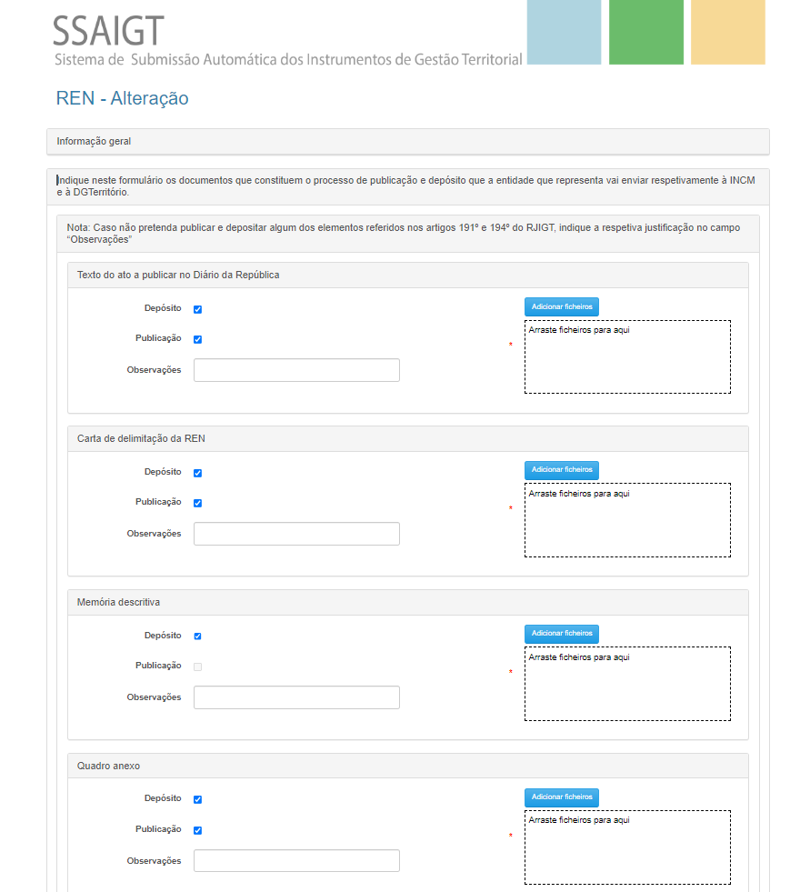

Figura 7 - Carregamento dos elementos instrutórios num formulário

Caso pretendido, podem ser submetidos "Outros documentos", devendo ser
selecionadas as caixas relativas à publicação e/ou depósito.

Os cartogramas têm agora um separador próprio para submissão. O ficheiro
deverá ser sempre PDF.

Para todos os itens em que não foram carregados ficheiros, na caixa de
observações tem que estar a indicação que não é aplicável, por exemplo
com o texto \"NA\".

Os ficheiros que contêm os elementos instrutórios podem ser inseridos na
plataforma a partir da diretoria onde se encontram guardados - "Arraste
ficheiros para aqui" - ou ser adicionados - "Anexar zip".

O sistema só procederá ao carregamento dos ficheiros após a seleção do
botão "Guardar". Caso continue com a ação \"Guardar\" e todas as
condições exigidas não estejam garantidas, os últimos ficheiros
introduzidos serão removidos e terão que ser carregados novamente.

***[Passo 5 - Preenchimento da ficha de metadados]***

A existência de elementos gráficos requer o preenchimento de um
formulário de metadados para cada Conjunto de Dados Geográficos (CDG)
conforme a figura 8.

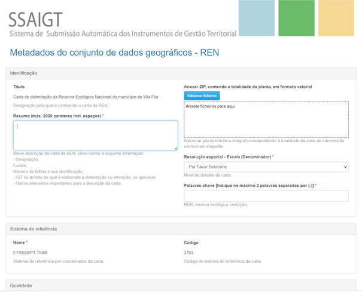

Figura 8 - Formulário para carregamento dos metadados

Dentro do formulário de metadados, no canto inferior direito de cada
caixa é disponibilizada uma ajuda para o preenchimento do metadado. O
formulário contém os campos descritos no quadro 5 e cumpre as normas
legais e regulamentares, nacionais e internacionais em vigor

O utilizador começa por preencher a ficha de metadados relativos à carta
de delimitação da REN.

Quadro 5 - Campos do formulário dos metadados

<table>
<colgroup>
<col style="width: 24%" />
<col style="width: 24%" />
<col style="width: 51%" />
</colgroup>
<thead>
<tr class="header">
<th>Campo</th>
<th>Descrição</th>
<th>Observações ao preenchimento do campo</th>
</tr>
</thead>
<tbody>
<tr class="odd">
<td colspan="2"><strong>Identificação</strong></td>
<td></td>
</tr>
<tr class="even">
<td>Título</td>
<td>Designação pela qual é conhecido o CDG.</td>
<td>Preenchido automaticamente pelo sistema</td>
</tr>
<tr class="odd">
<td>Planta Temática Integral</td>
<td>Anexar o ficheiro zip com a informação vetorial das tipologias da
Carta da REN referente a todo o município.</td>
<td>
A informação vetorial das tipologias REN é referente à área de
todo do município e em formatos:

OGC Geopackage (GPKG),Shapefile (SHP) ou GDB.
</td>
</tr>
<tr class="even">
<td>Resumo</td>
<td>Breve descrição do conteúdo do CDG.</td>
<td>
Deve conter a seguinte informação:

<ul>
<li>
Designação que consta da carta ou pormenorização;
</li>
<li>
Escala;
</li>
<li>
Número de folhas e sua identificação;
</li>
<li>
IGT no âmbito do qual é elaborada a delimitação ou alteração, se
aplicável
</li>
<li>
Outros elementos importantes para a descrição da carta.
</li>
</ul>

<u>Exemplo 1</u>:

Título: “Delimitação da REN de Alcoutim”.

Escala: 1:25000.

Número de folhas: 6, numeradas de 1 a 6.

<u>Exemplo 2</u>:

Título: Alteração da delimitação da Reserva Ecológica Nacional de
Póvoa de Lanhoso.

Escala 1:25000.

Número de folhas: 6, numeradas de A a F.

Elaborada no âmbito da Revisão do PDM de Póvoa de Lanhoso.

<u>Exemplo 3</u>:

Título: Alteração da delimitação da REN de Santarém no âmbito da
Alteração do PDM - Delimitação dos aglomerados rurais.

Escala: 1:10000 (12 pormenorizações).
</td>
</tr>
<tr class="odd">
<td>Grupo de Palavras-Chave</td>
<td>Palavras que identificam o tema ou assunto relacionado com o
CDG.</td>
<td>Campo preenchido automaticamente pelo sistema com as palavras-chave
“REN”, “reserva ecológica” e “restrição”, podendo o utilizador inserir
mais duas palavras-chave.</td>
</tr>
<tr class="even">
<td>Resolução Espacial – Escala</td>
<td>Nível de detalhe do CDG.</td>
<td>Indicar o denominador da escala</td>
</tr>
<tr class="odd">
<td colspan="2"><strong>Sistema de Referência</strong></td>
<td></td>
</tr>
<tr class="even">
<td>Espaço de nomes</td>
<td>Sistema de referência por coordenadas do CDG.</td>
<td>
Em Portugal continental o sistema de referência da cartografia
temática é obrigatoriamente o EPSG: 3763 (ETRS89/PT-TM06).

Preenchido automaticamente pelo sistema
</td>
</tr>
<tr class="odd">
<td>Código do sistema</td>
<td>Código do sistema de referência do CDG.</td>
<td>Preenchido automaticamente pelo sistema</td>
</tr>
<tr class="even">
<td colspan="2"><strong>Qualidade</strong></td>
<td></td>
</tr>
<tr class="odd">
<td>Histórico - Declaração</td>
<td>Declaração com descrição geral sobre o conhecimento do produtor
sobre o histórico do CDG.</td>
<td></td>
</tr>
<tr class="even">
<td>Histórico - Cartografia de referência</td>
<td>Informação sobre os dados de base utilizados na construção do
CDG</td>
<td></td>
</tr>
<tr class="odd">
<td><ul>
<li>
Tipo
</li>
</ul></td>
<td></td>
<td>As opções de preenchimento são: cartografia oficial, cartografia
homologada ou outra</td>
</tr>
<tr class="even">
<td><ul>
<li>
Serie cartográfica oficial
</li>
</ul></td>
<td></td>
<td>
Este campo só está visível quando o utilizador seleciona a opção
“cartografia oficial” no campo “Tipo”.

Escolher a opção aplicável a partir de uma lista
</td>
</tr>
<tr class="odd">
<td><ul>
<li>
Entidade proprietária
</li>
</ul></td>
<td></td>
<td></td>
</tr>
<tr class="even">
<td><ul>
<li>
Entidade produtora
</li>
</ul></td>
<td></td>
<td></td>
</tr>
<tr class="odd">
<td><ul>
<li>
Data de edição
</li>
</ul></td>
<td></td>
<td>Formato: AAAAMMDD</td>
</tr>
<tr class="even">
<td><ul>
<li>
Data de homologação
</li>
</ul></td>
<td></td>
<td>Este campo só está visível quando o utilizador seleciona a opção
“cartografia homologada” no campo “Tipo”.</td>
</tr>
<tr class="odd">
<td><ul>
<li>
Número de homologação
</li>
</ul></td>
<td></td>
<td>Este campo só está visível quando o utilizador seleciona a opção
“cartografia homologada” no campo “Tipo”.</td>
</tr>
<tr class="even">
<td><ul>
<li>
Entidade responsável pela homologação
</li>
</ul></td>
<td></td>
<td>Preenchido automaticamente pelo sistema</td>
</tr>
<tr class="odd">
<td><ul>
<li>
Sistema de referência – nome
</li>
</ul></td>
<td></td>
<td>Escolher a opção aplicável a partir de uma lista</td>
</tr>
<tr class="even">
<td><ul>
<li>
Sistema de referência – código
</li>
</ul></td>
<td></td>
<td>Escolher a opção aplicável a partir de uma lista</td>
</tr>
<tr class="odd">
<td><ul>
<li>
Exatidão posicional
</li>
</ul></td>
<td></td>
<td></td>
</tr>
<tr class="even">
<td><ul>
<li>
Exatidão temática
</li>
</ul></td>
<td></td>
<td></td>
</tr>
</tbody>
</table>

Com os desenvolvimentos do Sistema Nacional de Informação Territorial -
SNIT, para além do Geoportal, este permite agora num acesso mais
simples, a consulta das cartas da REN em Vigor(1) e Histórico, assim
como permite o descarregamento da informação vetorial (2) enviada por
cada município, em <https://snit-sgt.dgterritorio.gov.pt/ren> ( figura
9).

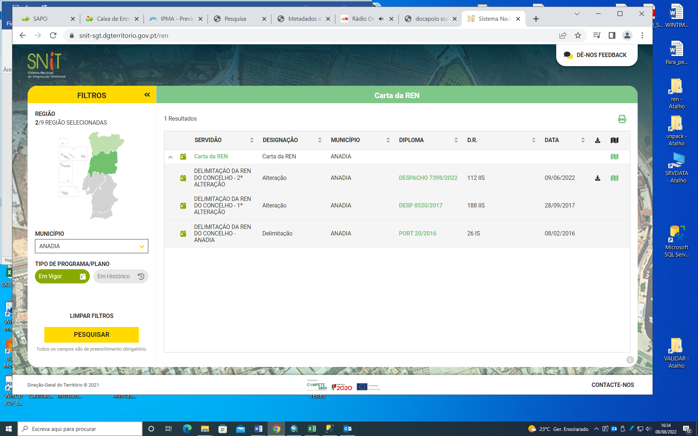

Figura 9 - Consulta da informação matricial e descarregamento da
informação vetorial da Carta da REN (SNIT)

Desta forma, dentro do formulário de Metadados do conjunto de dados
geográficos é necessário inserir a informação vetorial de todas as
tipologias REN existentes para toda a área do município, em formato
shapefile, no campo 'Planta Temática Integral', (figura 10).

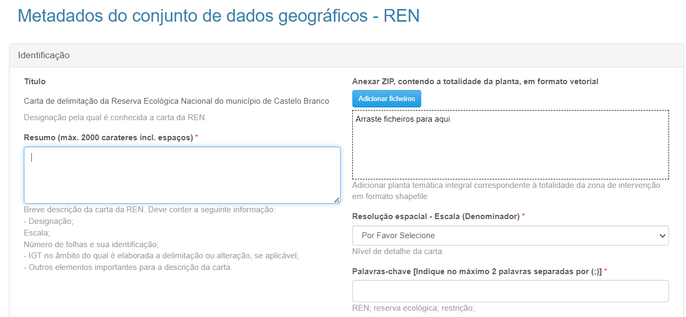

Figura 10 - Inserção da informação vetorial

No final da ficha de metadados é necessário a identificação da(s) folha
(s) que compõem a carta(s) da REN municipal (informação matricial).

Esta identificação consiste em criar um registo por folha, ou seja, para
cada registo é necessário preencher a seguinte informação (figura 11):

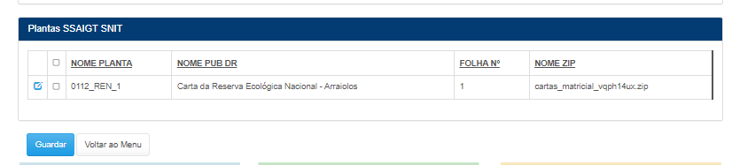

Figura 11 - Preenchimento dos dados da informação matricial submetida

- **NOME PLANTA:** designação da folha submetida (sem extensão, não deve
  conter a designação tif ou tiff) -- Preenchimento automático.

- **NOME PUB DR**: Carta da Reserva Ecológica Nacional -- *nome do
  Municipio* - Preenchimento automático.

- **FOLHA Nº** : designação que consta na folha, que deverá ser a mesma
  que consta na designação do ficheiro tif (número ou letra), ex:1,2..ou
  A,B\...

- **NOME DO ZIP ANEXADO** (sem extensão): Designação do zip submetido
  que contem a informação matricial - Preenchimento automático.

Após "Guardar", o sistema questiona se foram submetidas pormenorizações
(figura 12). Em caso afirmativo, o utilizador deve inserir o nome da
pormenorização e preencher os respetivos metadados, devendo ser
preenchida uma ficha de metadados por pormenorização. Quando não são
submetidos elementos gráficos não é necessário o preenchimento de
metadados e o sistema ultrapassa automaticamente esta etapa.

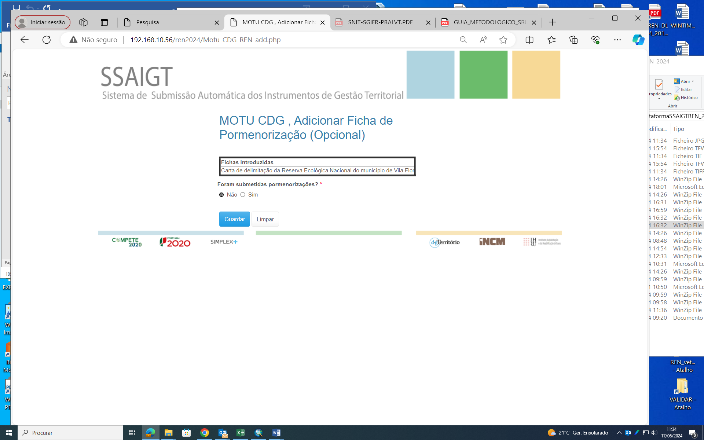

Figura 12 - Carregamento de metadados para as pormenorizações

***[Passo 6 -- Confirmar o processo e submeter]***

Na sequência da gravação efetuada no passo anterior é emitido um pedido
de confirmação, que o utilizador deve ativar na respetiva caixa e de
seguida "Guardar" (figura 13).

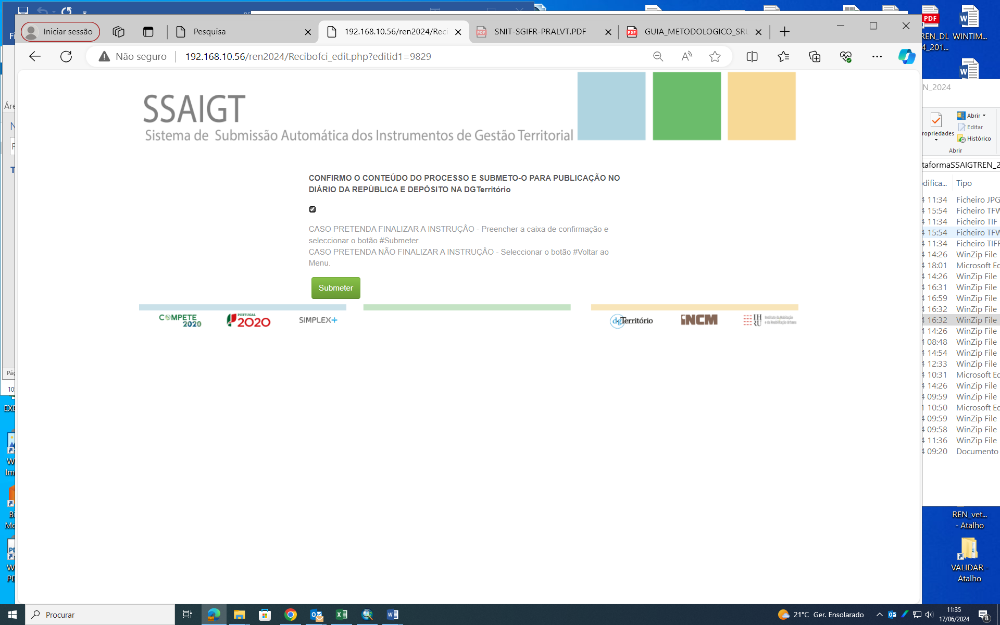

Figura 13 - Submissão do processo para publicação e depósito

No final do processo, a plataforma emite um recibo (figura 14) que serve
como comprovativo da conclusão, com sucesso, desta fase da submissão
para publicação no DR e depósito na DGT. Ainda é possível imprimir o
respetivo recibo, assim como 'Voltar ao Menu'.

Note-se que existe em todas as páginas do "Novo Procedimento", a
possibilidade de voltar à página do "Menu Inicial" através do botão
"Voltar ao Menu", até ao final do processo, mesmo antes da emissão do
recibo, da conclusão da submissão.

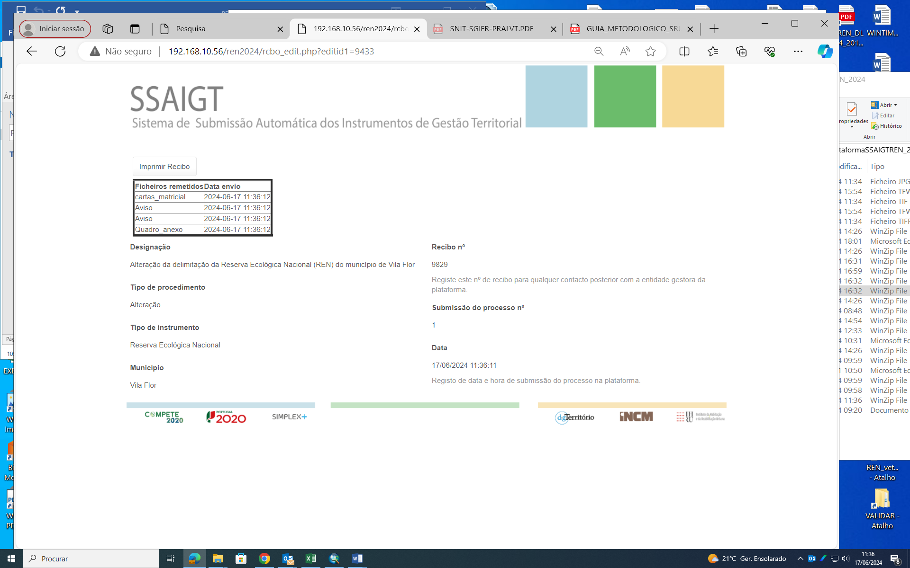

Figura 14 - Emissão do recibo

O processo de dinâmica REN submetido é validado pela DGT e não havendo
correções a fazer, é reencaminhado para a INCM, para publicação. A INCM
procede à respetiva validação e na ausência de necessidade de correções
(ver ponto 4.3), procede à publicação notificando a DGT desse facto. A
DGT envia um email à CCDR a comunicar a publicação/depósito da carta de
delimitação da REN.

# 3 Continuar, Consultar, Corrigir ou Anular Processos

## 3_1 Continuar um processo

Em qualquer momento pode ser retomado um processo de submissão de uma
dinâmica REN desde que o mesmo tenha sido guardado. No "Menu Inicial", o
utilizador deve selecionar a opção "Continuar Processo" para aceder à
listagem dos processos que se encontram em tramitação e selecionar
aquele que pretende continuar a submeter. Antes da retoma, o sistema
solicita a confirmação da seleção efetuada (figura 15).

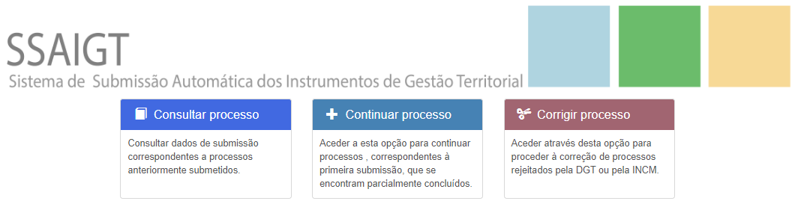

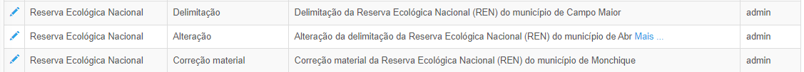

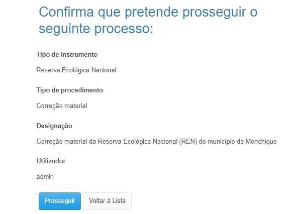

Figura 15 - Continuar a submissão de um processo iniciado e guardado na
plataforma

## 3_2 Consultar um Processo

A plataforma permite acompanhar e consultar todos os processos
submetidos.

No "Menu Inicial" o utilizador deve selecionar a opção "Consultar
Processo" (figura 16). Os estados possíveis são:

- Em validação pela DGT;

- Em validação pela INCM;

- Rejeitado pela DGT ou INCM;

- Publicado/Depositado.

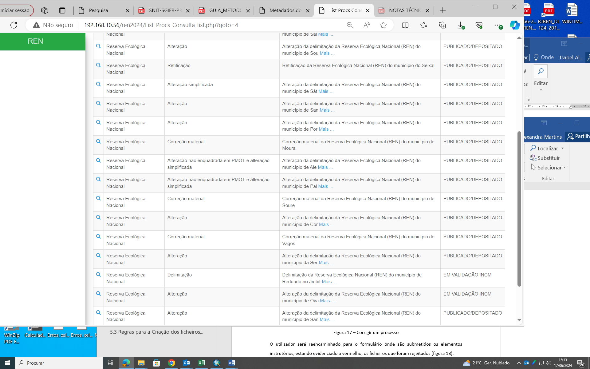

Figura 16 - Consultar o estado de um processo

O estado publicado/depositado permite ao utilizador consultar o ato
publicado e saber o nº de Depósito na DGT (figura 17), através da
seleção do botão "Mostrar".

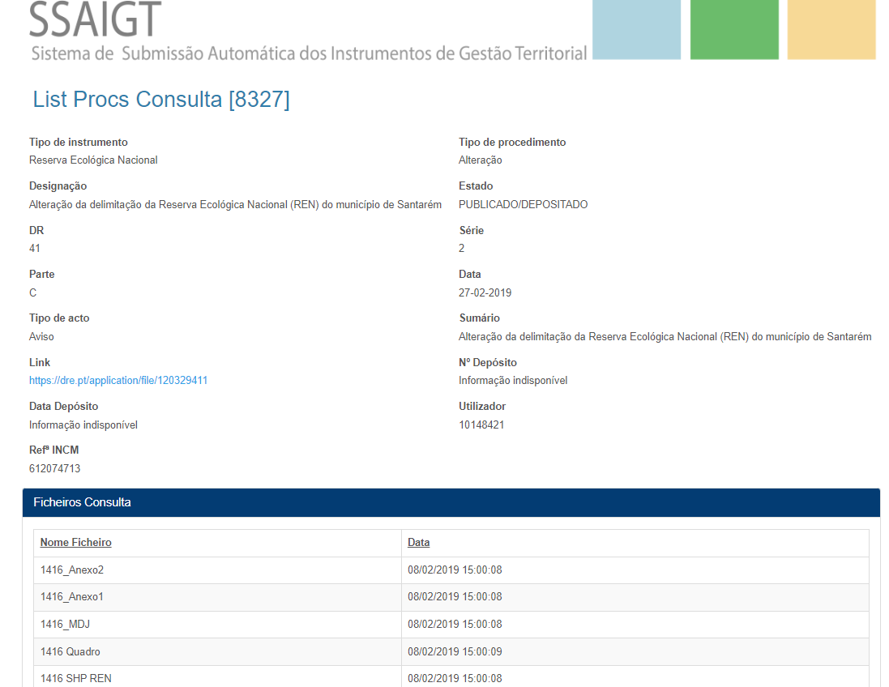

Figura 17 - Consultar ficha de um processo

## 3_3 Corrigir um Processo

Após a submissão do processo na plataforma, a DGT e a INCM procedem à
respetiva validação. Em caso de rejeição, estas entidades notificam a
CCDR para efetuar as devidas correções.

No "Menu Inicial", o utilizador deve selecionar a opção "Corrigir
Processo" e "Editar" o processo que pretende corrigir. Antes da
consulta, o sistema solicita a confirmação da seleção efetuada (figura
18).

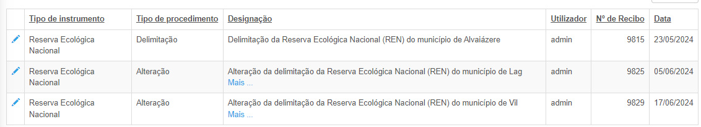

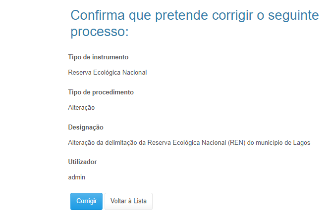

Figura 18 - Corrigir um processo

O utilizador será reencaminhado para o formulário onde são submetidos os
elementos instrutórios, estando evidenciado a vermelho, os ficheiros que
foram rejeitados (figura 19).

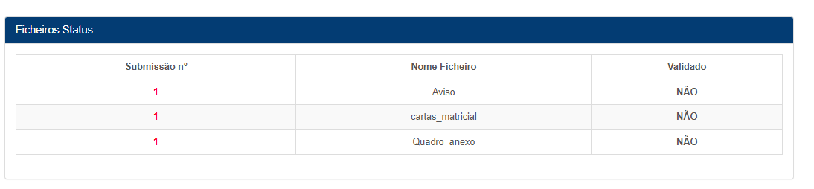

Figura 19 - Ficheiros rejeitados no processo de validação

Além desta informação, o utilizador visualiza o número de vezes que o
processo foi submetido.

O utilizador deve apagar os ficheiros existentes que foram rejeitados e
efetuar o carregamento dos ficheiros corrigidos e depois deve "Guardar"
o formulário.

Note-se que a opção "Corrigir Processo" só está ativa após a validação
da DGT ou INCM. Caso a CCDR necessite de retificar a sua submissão ainda
antes da validação da DGT, deverá contatar a DGT para que esta anule o
processo.

## 3_4 Anular um processo

Nas situações em que seja necessário o anulamento de um processo já
submetido, o utilizador deverá solicitá-lo à DGT através do email
<ssaigt-ren@dgterritorio.pt>.

# 4 Elementos Instrutórios para efeito de Publicação e Depósito

## 4_1 Identificação e descrição

A preparação da informação a submeter na plataforma é uma fase anterior
à submissão de um processo de dinâmica REN e deve ter em consideração
todas as regras a seguir especificadas.

No n.º 3 do Artigo.º 9 do RJREN é especificado que as cartas de
delimitação da REN a nível municipal são elaboradas à escala de 1:25 000
ou superior e acompanhadas da respetiva memória descritiva. Das
referidas cartas deve constar a delimitação das áreas incluídas na REN,
indicando as suas diferentes tipologias e as áreas a excluir da REN,
incluindo a sua fundamentação e a indicação do fim a que se destinam.

Para efeitos de aprovação e depósito da REN são identificados e
descritos no quadro 6 os elementos instrutórios que podem ser submetidos
num processo REN.

Quadro 6 -- Descrição dos elementos instrutórios a submeter em processos
REN

<table>
<colgroup>
<col style="width: 20%" />
<col style="width: 79%" />
</colgroup>
<thead>
<tr class="header">
<th>
<strong>Elementos</strong>

<strong>Instrutórios</strong>
</th>
<th><strong>Descrição</strong></th>
</tr>
</thead>
<tbody>
<tr class="odd">
<td>Texto do ato</td>
<td>Texto legal do ato que será publicado no Diário da República.</td>
</tr>
<tr class="even">
<td>Carta de delimitação da REN</td>
<td>
Carta abrangendo o território municipal, com a delimitação da REN
indicando as diferentes tipologias de áreas a integrar na REN e caso
existam, as áreas a excluir, numeradas e com o prefixo C ou E, conforme
se destinem a edificações legalmente licenciadas ou autorizadas ou se
destinem à satisfação de carência existentes em termos de habitação,
atividades económicas, equipamentos e infraestruturas.

Pormenorização

A carta de delimitação da REN municipal pode ser acompanhada de uma
Pormenorização, onde é detalhada uma parte do território
municipal.
</td>
</tr>
<tr class="odd">
<td>Cartograma</td>
<td>Elemento que acompanha a carta de delimitação da REN
municipal/pormenorização quando esta é formada por mais do que uma
folha. O Cartograma contem um esquema de seccionamento das folhas
devendo cada folha ser identificada com um número ou letra. Este esquema
visa facilitar a procura da localização das folhas que compõem a carta
da REN nos links que serão publicados no Diário da República.</td>
</tr>
<tr class="even">
<td>Memória descritiva</td>
<td>
Explicitação dos critérios de demarcação de cada uma das áreas a
incluir na REN e explicitação das áreas a excluir.

No caso de alteração da delimitação da REN em vigor, a memória
descritiva consiste na descrição da proposta de alteração e justificação
das opções tomadas.
</td>
</tr>
<tr class="odd">
<td>Nota informativa</td>
<td>Nota que fundamenta a correção material ou retificação.</td>
</tr>
<tr class="even">
<td>Quadro anexo</td>
<td>Quadro onde são identificadas as áreas a excluir, a sua
fundamentação e o fim a que se destinam.</td>
</tr>
<tr class="odd">
<td>Outros documentos</td>
<td>Outros documentos (pareceres, atas, etc.)</td>
</tr>
</tbody>
</table>

## 4_2 Preparação da informação geográfica a submeter para publicação e depósito de processo REN

Os elementos relativos à Carta de delimitação da REN ou Pormenorização a
submeter para publicação e depósito de um processo de dinâmica REN
dependem do suporte e formato da carta da REN em vigor e são os
especificados no quadro 7.

Quadro 7 -- informação geográfica a submeter para publicação e depósito

<table>
<colgroup>
<col style="width: 23%" />
<col style="width: 76%" />
</colgroup>
<thead>
<tr class="header">
<th><strong>Suporte da carta da REN em vigo</strong>r</th>
<th><strong>Elementos gráficos a submeter</strong></th>
</tr>
</thead>
<tbody>
<tr class="odd">
<td>Analógico</td>
<td><ul>
<li>
<u>Informação vetorial</u> abrangendo a área sujeita a alteração
ou correção material;
</li>
<li>
<u>Nova Carta da REN</u>, em formato matricial, resultante da
sobreposição da informação vetorial à carta da REN em vigor
georreferenciada, abrangendo todo o território municipal e seccionada de
acordo com o seccionamento da cartografia de base (uma ou mais
folhas).
</li>
</ul>

Caso a informação vetorial tenha sido produzida com base em
cartografia de referência de detalhe superior ao da carta da REN em
vigor submeter ainda:

<ul>
<li>
<u>Pormenorização</u> abrangendo a área sujeita a alteração ou
correção material seccionada de acordo com o seccionamento da
cartografia de base (uma ou mais folhas).
</li>
</ul></td>
</tr>
<tr class="even">
<td>Digital e formato matricial</td>
<td><ul>
<li>
<u>Informação vetorial</u> abrangendo a área sujeita a alteração
ou correção material;
</li>
<li>
Nova <u>Carta da REN</u>, em formato matricial, resultante da
sobreposição da informação vetorial à carta da REN em vigor
georreferenciada, abrangendo todo o território municipal e seccionada de
acordo com o seccionamento da cartografia de base (uma ou mais
folhas).
</li>
</ul>

Caso a informação vetorial tenha sido produzida com base em
cartografia de referência de detalhe superior ao da carta da REN em
vigor submeter ainda:

<ul>
<li>
<u>Pormenorização</u> abrangendo a área sujeita a alteração ou
correção material seccionada de acordo com o seccionamento da
cartografia de base (uma ou mais folhas).
</li>
</ul></td>
</tr>
<tr class="odd">
<td>Digital e formato vetorial</td>
<td><ul>
<li>
<u>Informação vetorial</u> abrangendo todo o território
municipal;
</li>
<li>
<u>Carta da REN em formato matricial</u>, gerada a partir da
informação vetorial, abrangendo todo o território municipal e seccionada
de acordo com o seccionamento da cartografia de base (uma ou mais
folhas).
</li>
</ul></td>
</tr>
</tbody>
</table>

a)  **Suporte da carta da REN em vigor em analógico**

Pretendendo submeter um processo de alteração ou correção material da
REN tendo como base de partida uma carta da REN em vigor que se encontra
em suporte analógico, deve seguir-se o procedimento técnico a seguir
apresentado (figura 20).

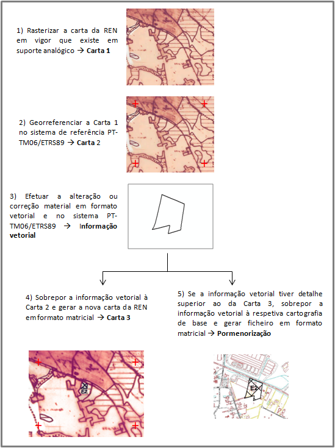{width="4.78125in" height="6.395833333333333in"}

Figura 20 - Preparação da informação gráfica

b)  **Suporte da carta da REN em vigor em** **digital e formato
    matricial**

Quando a carta da REN em vigor se encontra em suporte digital e formato
matricial, o procedimento inicia-se na alínea 3).

c)  **Suporte da carta da REN em vigor em** **digital e formato
    vetorial**

No caso de delimitação, alteração ou correção de REN **elaborada de
acordo com a "Norma Técnica para a Produção e Reprodução das Cartas de
Delimitação da REN**" (Modelo de dados da REN) publicado através do
Aviso n.º 9282/2021, de 17 de maio, a informação vetorial relativa à
Carta de delimitação da REN ou Pormenorização a submeter para publicação
e depósito é a especificada no quadro 8.

Quadro 8 -- informação geográfica a submeter para publicação e depósito

<table>
<colgroup>
<col style="width: 100%" />
</colgroup>
<thead>
<tr class="header">
<th>Elementos gráficos a submeter</th>
</tr>
</thead>
<tbody>
<tr class="odd">
<td><ul>
<li>
Ficheiro DTCC_TIP_P
</li>
<li>
Ficheiro DTCC_EXCL_P
</li>
</ul>

E ainda, caso existam elementos de geometria linear:

<ul>
<li>
Ficheiro DTCC_TIP_L
</li>
</ul></td>
</tr>
</tbody>
</table>

A estrutura mínima das tabelas de cada um dos elementos gráficos
referidos no quadro anterior é a prevista no Anexo IIA do Modelo de
dados da REN e deve ter em consideração as seguintes notas:

<table>
<colgroup>
<col style="width: 23%" />
<col style="width: 76%" />
</colgroup>
<thead>
<tr class="header">
<th>Nome da tabela</th>
<th>Notas</th>
</tr>
</thead>
<tbody>
<tr class="odd">
<td>DTCC_TIP_L</td>
<td><ul>
<li>
Contém os objetos com geometria linear - leitos dos cursos de
água, canalizados ou não. Exemplo: o objeto <em>Cursos de
água-Leito</em> (código 21) é composto por várias linhas, tantas quantos
os Rios, Ribeiros e afluentes ou outros considerados como REN, sendo que
cada uma dessas linhas corresponde a um registo da tabela.
</li>
<li>
Estes ficheiros não devem ser enviados quando o objeto <em>Cursos
de água-Leito</em>, no nível 21, tem geometria poligonal e está presente
no ficheiro de tipologias poligonais.
</li>
</ul></td>
</tr>
<tr class="even">
<td>DTCC_TIP_P</td>
<td><ul>
<li>
Contém os objetos com geometria poligonal que correspondem às
tipologias delimitadas na carta da REN antes de serem ponderadas as
exclusões (“REN Bruta”).
</li>
<li>
Cada linha da tabela corresponde a um objeto do catálogo sendo
que esse objeto é formado por um ou mais polígonos à um objeto por linha
da tabela. Exemplo: Na tabela DTCC_TIP_P, o objeto <em>Cursos de
água-Leitos</em> (código 21) é um único registo na tabela, não obstante
ser composta por vários polígonos, tantos quantos os Rios, Ribeiros e
afluentes ou outros considerados como REN.
</li>
<li>
Neste ficheiro não devem existir exclusões.
</li>
</ul></td>
</tr>
<tr class="odd">
<td>DTCC_EXCL_P</td>
<td><ul>
<li>
Contém os objetos com geometria poligonal que correspondem às
exclusões.
</li>
<li>
Cada linha da tabela corresponde a uma exclusão identificada pelo
tipo (C ou E) e n.º ordem (de 1 a n).
</li>
</ul>
<table>
<colgroup>
<col style="width: 17%" />
<col style="width: 15%" />
<col style="width: 15%" />
<col style="width: 16%" />
<col style="width: 20%" />
<col style="width: 13%" />
</colgroup>
<thead>
<tr class="header">
<th>ID_Excl_P</th>
<th>Exclusao</th>
<th>CodObje</th>
<th>Area_m2</th>
<th>Fundamento</th>
<th>FimDest</th>
</tr>
</thead>
<tbody>
<tr class="odd">
<td>1</td>
<td>C1</td>
<td>37</td>
<td>…</td>
<td>…</td>
<td>…</td>
</tr>
<tr class="even">
<td>2</td>
<td>C2</td>
<td>37</td>
<td>…</td>
<td>…</td>
<td>…</td>
</tr>
<tr class="odd">
<td>…</td>
<td>…</td>
<td>37</td>
<td>…</td>
<td>…</td>
<td>…</td>
</tr>
<tr class="even">
<td>…</td>
<td>E1</td>
<td>38</td>
<td>…</td>
<td>…</td>
<td>…</td>
</tr>
<tr class="odd">
<td>..</td>
<td>…</td>
<td>38</td>
<td>…</td>
<td>…</td>
<td>…</td>
</tr>
</tbody>
</table></td>
</tr>
</tbody>
</table>

## Boas práticas na produção da carta de delimitação da REN e pormenorizações

***[Representação]***

<table>
<colgroup>
<col style="width: 35%" />
<col style="width: 64%" />
</colgroup>
<thead>
<tr class="header">
<th>Boa prática</th>
<th>Exemplo de não aplicação da boa prática</th>
</tr>
</thead>
<tbody>
<tr class="odd">
<td>A cartografia de base deve estar visível</td>
<td>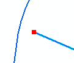</td>
</tr>
<tr class="even">
<td>Quando os objetos de geometria polígono/linha têm continuidade para
além do limite administrativo do município, devem ser “artificialmente
fechados”/“interrompidos” nos exatos limites que são definidos pela
CAOP.</td>
<td>
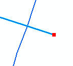

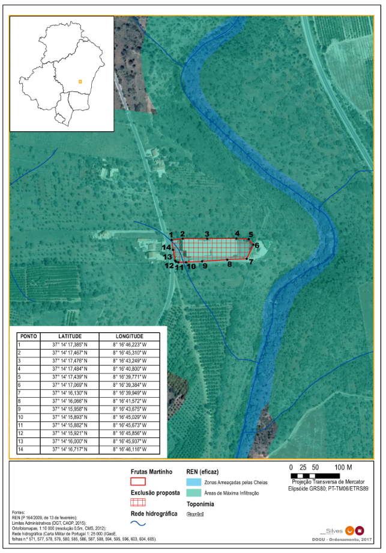

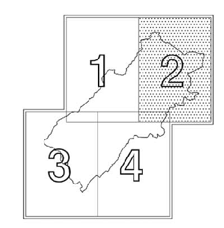
</td>
</tr>
<tr class="odd">
<td>Deve haver continuidade entre os objetos de geometria linha.</td>
<td></td>
</tr>
<tr class="even">
<td>O objeto de geometria linha é interrompido quando existe uma
interseção com outro objeto de geometria linha ou polígono.</td>
<td>

</td>
</tr>
</tbody>
</table>

***[Geometria]***

<table>
<colgroup>
<col style="width: 31%" />
<col style="width: 68%" />
</colgroup>
<thead>
<tr class="header">
<th>Boa prática</th>
<th>Exemplo de não aplicação da boa prática</th>
</tr>
</thead>
<tbody>
<tr class="odd">
<td>Corrigir conexões ausentes devido a undershoots ou overshoots</td>
<td>

<table>
<colgroup>
<col style="width: 50%" />
<col style="width: 50%" />
</colgroup>
<thead>
<tr class="header">
<th></th>
<th></th>
</tr>
</thead>
<tbody>
</tbody>
</table></td>
</tr>
<tr class="even">
<td>A linha que separa polígonos adjacentes deve ser a mesma</td>
<td>

</td>
</tr>
</tbody>
</table>

***[Classificação]***

<table>
<colgroup>
<col style="width: 31%" />
<col style="width: 68%" />
</colgroup>
<thead>
<tr class="header">
<th>Boa prática</th>
<th>Exemplo de não aplicação da boa prática</th>
</tr>
</thead>
<tbody>
<tr class="odd">
<td>Classificar todos os polígonos.</td>
<td><table>
<colgroup>
<col style="width: 100%" />
</colgroup>
<thead>
<tr class="header">
<th></th>
</tr>
</thead>
<tbody>
</tbody>
</table></td>
</tr>
<tr class="even">
<td>Polígonos adjacentes com a mesma tipologia devem ser fundidos.</td>
<td>

</td>
</tr>
</tbody>
</table>

***[Pormenorizações]***

| Boa prática                                                                                                                  | Exemplo de não aplicação da boa prática                                 |
|------------------------------------------------------------------------------------------------------------------------------|-------------------------------------------------------------------------|
| A Pormenorização deve ser uma carta autónoma da carta municipal de delimitação da REN e ser elaborada a uma escala superior. |                                                   |
| Devem ser representadas e indicadas as diferentes tipologias de áreas a integrar na REN e caso existam, as áreas a excluir   |                                                   |
| A pormenorização deve conter um sistema de coordenadas (quadrícula e coordenadas) e conter uma escala.                       | {width="2.7395833333333335in" height="3.90625in"} |

## Regras aplicáveis ao conteúdo dos elementos instrutórios para publicação

***[Regras gerais]***

- Respeitar o Regulamento de Publicação de Atos no Diário da República
  (Despacho Normativo n.º 13/2009 de 1 de abril, Série II);

<!-- -->

- Respeitar o Acordo Ortográfico (Resolução do Conselho de Ministros n.º
  8/2011. D.R. n.º 17, Série I de 25 de janeiro).

***[texto do ato a publicar no Diário da República]***

- Não pode ter dados manuscritos;

- Não pode conter cabeçalhos, rodapés, notas, logotipos ou brasões;

- Não pode conter índice;

- Não pode estar redigido em dupla grafia;

- Não pode conter imagens;

- No Título do ato deve referir-se "município de...", em vez de
  "concelho de....";

- Deve conter a data em que o ato foi praticado, bem como o cargo e o
  nome do responsável pelo ato.

***[reprodução da Carta de delimitação da REN municipal e
pormenorizações]***

- A carta ou pormenorização deve conter a seguinte informação:

  i.  tipologias e exclusões, sendo visíveis as tipologias subpostas às
      exclusões;

  ii. a cartografia de base;

  iii. o limite do município;

  iv. o sistema de coordenadas em ETRS89/PT-TM06

  v.  a legenda rótulo;

  vi. a legenda da simbologia.

- A legenda rótulo deve conter a seguinte informação:

  i.  Designação da carta (municipal ou pormenorização);

  ii. Data de edição;

  iii. Indicação da escala de representação;

  iv. Identificação da entidade pública responsável pela carta da REN ou
      pormenorização;

  v.  Identificação da cartografia de base utilizada na elaboração da
      carta base,

  vi. Cartograma, caso a carta seja seccionada;

<!-- -->

- A legenda da simbologia deve conter todos os símbolos utilizados na
  carta da REN.

***[Cartograma]***

Quando a carta de delimitação da REN municipal ou a Pormenorização são
formadas por mais do que uma folha, deve ser produzido um Cartograma
contendo o esquema de seccionamento das folhas, devendo cada folha ser
identificada com um número ou letra conforme exemplo a seguir
apresentado (figura 21).

{width="1.9375in" height="1.96875in"}

Figura 21 - Exemplo de cartograma

***[Quadro anexo]***

O quadro anexo deve identificar as áreas a excluir da REN (figura 22),
referindo para cada uma o seguinte:

- O tipo de exclusão (tipo C - áreas com edificações legalmente
  licenciadas ou autorizadas ou tipo E - áreas destinadas à satisfação
  das carências existentes em termos de habitação atividades económicas,
  equipamentos e infraestruturas) e o número de ordem;

- a superfície abrangida;

- a tipologia ou tipologias REN que circunscreve;

- o fim a que se destina;

- a respetiva fundamentação.

<table>
<colgroup>
<col style="width: 12%" />
<col style="width: 16%" />
<col style="width: 39%" />
<col style="width: 12%" />
<col style="width: 18%" />
</colgroup>
<thead>
<tr class="header">
<th colspan="5">Quadro anexo</th>
</tr>
<tr class="odd">
<th colspan="5">Delimitação da Reserva Ecológica Nacional do município
de [nome do município]</th>
</tr>
<tr class="header">
<th colspan="5"></th>
</tr>
<tr class="odd">
<th>
Exclusão

(tipo e número de ordem)
</th>
<th>Superfície (m2)</th>
<th>Tipologia(s) REN</th>
<th>Fim a que se destina</th>
<th>Síntese da fundamentação</th>
</tr>
</thead>
<tbody>
<tr class="odd">
<td>C1</td>
<td>47,05</td>
<td>Zonas ameaçadas pelo mar; Praias</td>
<td></td>
<td></td>
</tr>
<tr class="even">
<td>…</td>
<td></td>
<td></td>
<td></td>
<td></td>
</tr>
<tr class="odd">
<td>E1</td>
<td></td>
<td></td>
<td></td>
<td></td>
</tr>
<tr class="even">
<td>..</td>
<td></td>
<td></td>
<td></td>
<td></td>
</tr>
<tr class="odd">
<td>Total</td>
<td>(soma)</td>
<td></td>
<td></td>
<td></td>
</tr>
</tbody>
</table>

Figura 22 - Modelo do Quadro anexo

# 5 Regras aplicáveis aos ficheiros a submeter na plataforma

## 5_1 Formatos dos ficheiros que integram os elementos instrutórios

Com exceção da memória descritiva, nota explicativa e cartograma, que
apenas são enviados em formato PDF não editável (PDF trancado), os
restantes elementos instrutórios devem ser enviados cumulativamente num
dos formatos indicados no quadro 9.

*Quadro 9 - Formatos admitidos para os elementos instrutórios*

<table>
<colgroup>
<col style="width: 24%" />
<col style="width: 75%" />
</colgroup>
<thead>
<tr class="header">
<th>Elemento instrutório</th>
<th>Formatos dos ficheiros</th>
</tr>
</thead>
<tbody>
<tr class="odd">
<td>Texto do ato</td>
<td><ol type="1">
<li>
DOC/DOCX/RTF/ODF/ODT/PDF editável
</li>
<li>
PDF não editável (documento original)
</li>
</ol></td>
</tr>
<tr class="even">
<td>Carta de delimitação da REN/Pormenorização</td>
<td><ol type="1">
<li>
Formato vetorial: OGC Geopackage (GPKG). Outros formatos que
podem ser utilizados: SHP ou GDB
</li>
<li>
Formato matricial: tiff, tif -resolução a 300dpi, resolução
espectral RGB e resolução radiométrica de 8 bits (256 tons) por cada
banda espectral e respetivo TFW
</li>
</ol></td>
</tr>
<tr class="odd">
<td>Cartograma</td>
<td><ol type="1">
<li>
PDF
</li>
</ol></td>
</tr>
<tr class="even">
<td>Memória descritiva</td>
<td><ol type="1">
<li>
PDF não editável
</li>
</ol></td>
</tr>
<tr class="odd">
<td>Nota explicativa</td>
<td><ol type="1">
<li>
PDF não editável
</li>
</ol></td>
</tr>
<tr class="even">
<td>Quadro anexo</td>
<td><ol type="1">
<li>
XLS/XLSX/ODS/DOC/DOCX/RTF/ODF/ODT/PDF editável
</li>
<li>
PDF não editável (gerado a partir do ficheiro editável)
</li>
</ol></td>
</tr>
<tr class="odd">
<td>Outros</td>
<td><ol type="1">
<li>
XLS/XLSX/ODS/DOC/DOCX/RTF/ODF/ODT/PDF editável
</li>
<li>
PDF não editável
</li>
</ol></td>
</tr>
</tbody>
</table>

Cada elemento instrutório deve submetido em ficheiro zip individual,
sendo que na carta de delimitação da REN os ficheiros matriciais e
vetoriais devem ainda estar ainda em ficheiros zip autónomos.

## 5_2 Denominação dos ficheiros

- Têm no máximo 20 carateres, incluindo a extensão.

- Contém apenas números, letras de A a Z (maiúsculas e minúsculas) e underscores, não permitindo espaços, hífens e outros carateres especiais.

- Começam pelos Códigos da Divisão Administrativa do Instituto Nacional de Estatística, designadamente os códigos do Distrito e do Concelho (DTCC) (ver Anexo I) seguidos de explicativo da natureza/conteúdo do documento que se está a submeter.

| Exemplos de denominação            |
|------------------------------------|
| 1401_Aviso.pdf (para o aviso)      |
| 1401_REN.tif (para a carta da REN) |
| 1401_QA.pdf (para o quadro anexo)  |

***

- Quando a Carta de delimitação da REN ou Pormenorização são compostas
  por mais do que uma folha, os ficheiros TIFF e TFW relativos a cada
  folha, devem ter a designação especificada no quadro 10.

*Quadro 10 - Denominação dos ficheiros TIF e TFW*

|             |                      |
|-------------|----------------------|
| Carta de delimitação da REN municipal | DTCC_REN_[número ou letra que identifica a folha no cartograma da carta de delimitação da REN].[formato do ficheiro] Exemplo de denominação da folha: 1401_REN_1.tif (para a folha 1 da carta da REN) |
| Pormenorização | DTCC_Porm[nome da pormenorização]_[número ou letra que identifica a folha no cartograma da Pormenorização].[formato do ficheiro] Exemplo de denominação da folha: 1401_PormBaronia_1.tif (para a folha 1 da pormenorização do aglomerado de Baronia) |

***

## 5_3 Regras para a criação dos ficheiros ZIP

Na criação dos ficheiros ZIP devem ser observadas as regras
especificadas no quadro 10.

*Quadro 10 - Regras para a criação dos ficheiros ZIP*

|   |   |
|---|---|
|Regras gerais| - Devem ser criados a partir do conjunto de ficheiros que se pretende submeter - Não podem conter ficheiros com extensão ZIP - Não podem conter pastas - A designação do ficheiro [nome] não pode conter caracteres especiais - A designação do ficheiro [nome] não pode conter espaços - A designação do ficheiro [nome] não pode conter mais que 20 caracteres|
|Tamanho| - Cada ficheiro ZIP pode ter no máximo 500 MB - Por cada elemento instrutório podem ser submetidos até 10 ficheiros ZIP - O tamanho máximo submetido por elemento instrutório não pode ultrapassar os 2 GB - A informação total submetida por dinâmica REN não pode ultrapassar os 5 GB|
|Denominação| - A denominação do ficheiro ZIP deve obedecer às Regras de denominação dos ficheiros descritas no ponto anterior |

Para a criação dos ficheiros ZIP pode ser usado qualquer software de
compressão que origine ficheiros com a extensão ZIP, nomeadamente
*Winzip* ou *Tugzip*.

## Anexo I - Códigos da divisão administrativa do Instituto Nacional de Estatística

| **Município**               | **Código** |
|-----------------------------|------------|
| Abrantes                    | 1401       |
| Águeda                      | 0101       |
| Aguiar da Beira             | 0901       |
| Alandroal                   | 0701       |
| Albergaria-a-Velha          | 0102       |
| Albufeira                   | 0801       |
| Alcácer do Sal              | 1501       |
| Alcanena                    | 1402       |
| Alcobaça                    | 1001       |
| Alcochete                   | 1502       |
| Alcoutim                    | 0802       |
| Alenquer                    | 1101       |
| Alfândega da Fé             | 0401       |
| Alijó                       | 1701       |
| Aljezur                     | 0803       |
| Aljustrel                   | 0201       |
| Almada                      | 1503       |
| Almeida                     | 0902       |
| Almeirim                    | 1403       |
| Almodôvar                   | 0202       |
| Alpiarça                    | 1404       |
| Alter do Chão               | 1201       |
| Alvaiázere                  | 1002       |
| Alvito                      | 0203       |
| Amadora                     | 1115       |
| Amarante                    | 1301       |
| Amares                      | 0301       |
| Anadia                      | 0103       |
| Ansião                      | 1003       |
| Arcos de Valdevez           | 1601       |
| Arganil                     | 0601       |
| Armamar                     | 1801       |
| Arouca                      | 0104       |
| Arraiolos                   | 0702       |
| Arronches                   | 1202       |
| Arruda dos Vinhos           | 1102       |
| Aveiro                      | 0105       |
| Avis                        | 1203       |
| Azambuja                    | 1103       |
| Baião                       | 1302       |
| Barcelos                    | 0302       |
| Barrancos                   | 0204       |
| Barreiro                    | 1504       |
| Batalha                     | 1004       |
| Beja                        | 0205       |
| Belmonte                    | 0501       |
| Benavente                   | 1405       |
| Bombarral                   | 1005       |
| Borba                       | 0703       |
| Boticas                     | 1702       |
| Braga                       | 0303       |
| Bragança                    | 0402       |
| Cabeceiras de Basto         | 0304       |
| Cadaval                     | 1104       |
| Caldas da Rainha            | 1006       |
| Caminha                     | 1602       |
| Campo Maior                 | 1204       |
| Cantanhede                  | 0602       |
| Carrazeda de Ansiães        | 0403       |
| Carregal do Sal             | 1802       |
| Cartaxo                     | 1406       |
| Cascais                     | 1105       |
| Castanheira de Pêra         | 1007       |
| Castelo Branco              | 0502       |
| Castelo de Paiva            | 0106       |
| Castelo de Vide             | 1205       |
| Castro Daire                | 1803       |
| Castro Marim                | 0804       |
| Castro Verde                | 0206       |
| Celorico da Beira           | 0903       |
| Celorico de Basto           | 0305       |
| Chamusca                    | 1407       |
| Chaves                      | 1703       |
| Cinfães                     | 1804       |
| Coimbra                     | 0603       |
| Condeixa-a-Nova             | 0604       |
| Constância                  | 1408       |
| Coruche                     | 1409       |
| Covilhã                     | 0503       |
| Crato                       | 1206       |
| Cuba                        | 0207       |
| Elvas                       | 1207       |
| Entroncamento               | 1410       |
| Espinho                     | 0107       |
| Esposende                   | 0306       |
| Estarreja                   | 0108       |
| Estremoz                    | 0704       |
| Évora                       | 0705       |
| Fafe                        | 0307       |
| Faro                        | 0805       |
| Felgueiras                  | 1303       |
| Ferreira do Alentejo        | 0208       |
| Ferreira do Zêzere          | 1411       |
| Figueira da Foz             | 0605       |
| Figueira de Castelo Rodrigo | 0904       |
| Figueiró dos Vinhos         | 1008       |
| Fornos de Algodres          | 0905       |
| Freixo de Espada à Cinta    | 0404       |
| Fronteira                   | 1208       |
| Fundão                      | 0504       |
| Gavião                      | 1209       |
| Góis                        | 0606       |
| Golegã                      | 1412       |
| Gondomar                    | 1304       |
| Gouveia                     | 0906       |
| Grândola                    | 1505       |
| Guarda                      | 0907       |
| Guimarães                   | 0308       |
| Idanha-a-Nova               | 0505       |
| Ílhavo                      | 0110       |
| Lagoa                       | 0806       |
| Lagos                       | 0807       |
| Lamego                      | 1805       |
| Leiria                      | 1009       |
| Lisboa                      | 1106       |
| Loulé                       | 0808       |
| Loures                      | 1107       |
| Lourinhã                    | 1108       |
| Lousã                       | 0607       |
| Lousada                     | 1305       |
| Mação                       | 1413       |
| Macedo de Cavaleiros        | 0405       |
| Mafra                       | 1109       |
| Maia                        | 1306       |
| Mangualde                   | 1806       |
| Manteigas                   | 0908       |
| Marco de Canaveses          | 1307       |
| Marinha Grande              | 1010       |
| Marvão                      | 1210       |
| Matosinhos                  | 1308       |
| Mealhada                    | 0111       |
| Meda                        | 0909       |
| Melgaço                     | 1603       |
| Mértola                     | 0209       |
| Mesão Frio                  | 1704       |
| Mira                        | 0608       |
| Miranda do Corvo            | 0609       |
| Miranda do Douro            | 0406       |
| Mirandela                   | 0407       |
| Mogadouro                   | 0408       |
| Moimenta da Beira           | 1807       |
| Moita                       | 1506       |
| Monção                      | 1604       |
| Monchique                   | 0809       |
| Mondim de Basto             | 1705       |
| Monforte                    | 1211       |
| Montalegre                  | 1706       |
| Montemor-o-Novo             | 0706       |
| Montemor-o-Velho            | 0610       |
| Montijo                     | 1507       |
| Mora                        | 0707       |
| Mortágua                    | 1808       |
| Moura                       | 0210       |
| Mourão                      | 0708       |
| Murça                       | 1707       |
| Murtosa                     | 0112       |
| Nazaré                      | 1011       |
| Nelas                       | 1809       |
| Nisa                        | 1212       |
| Óbidos                      | 1012       |
| Odemira                     | 0211       |
| Odivelas                    | 1116       |
| Oeiras                      | 1110       |
| Oleiros                     | 0506       |
| Olhão                       | 0810       |
| Oliveira de Azeméis         | 0113       |
| Oliveira de Frades          | 1810       |
| Oliveira do Bairro          | 0114       |
| Oliveira do Hospital        | 0611       |
| Ourém                       | 1421       |
| Ourique                     | 0212       |
| Ovar                        | 0115       |
| Paços de Ferreira           | 1309       |
| Palmela                     | 1508       |
| Pampilhosa da Serra         | 0612       |
| Paredes                     | 1310       |
| Paredes de Coura            | 1605       |
| Pedrógão Grande             | 1013       |
| Penacova                    | 0613       |
| Penafiel                    | 1311       |
| Penalva do Castelo          | 1811       |
| Penamacor                   | 0507       |
| Penedono                    | 1812       |
| Penela                      | 0614       |
| Peniche                     | 1014       |
| Peso da Régua               | 1708       |
| Pinhel                      | 0910       |
| Pombal                      | 1015       |
| Ponte da Barca              | 1606       |
| Ponte de Lima               | 1607       |
| Ponte de sor                | 1213       |
| Portalegre                  | 1214       |
| Portel                      | 0709       |
| Portimão                    | 0811       |
| Porto                       | 1312       |
| Porto de Mós                | 1016       |
| Póvoa de Lanhoso            | 0309       |
| Póvoa de Varzim             | 1313       |
| Proença-a-Nova              | 0508       |
| Redondo                     | 0710       |
| Reguengos de Monsaraz       | 0711       |
| Resende                     | 1813       |
| Ribeira de Pena             | 1709       |
| Rio Maior                   | 1414       |
| Sabrosa                     | 1710       |
| Sabugal                     | 0911       |
| Salvaterra de Magos         | 1415       |
| Santa Comba Dão             | 1814       |
| Santa Maria da Feira        | 0109       |
| Santa Marta de Penaguião    | 1711       |
| Santarém                    | 1416       |
| Santiago do Cacém           | 1509       |
| Santo Tirso                 | 1314       |
| São Brás de Alportel        | 0812       |
| São João da Madeira         | 0116       |
| São João da Pesqueira       | 1815       |
| São Pedro do Sul            | 1816       |
| Sardoal                     | 1417       |
| Sátão                       | 1817       |
| Seia                        | 0912       |
| Seixal                      | 1510       |
| Sernancelhe                 | 1818       |
| Serpa                       | 0213       |
| Sertã                       | 0509       |
| Sesimbra                    | 1511       |
| Setúbal                     | 1512       |
| Sever do Vouga              | 0117       |
| Silves                      | 0813       |
| Sines                       | 1513       |
| Sintra                      | 1111       |
| Sobral de Monte Agraço      | 1112       |
| Soure                       | 0615       |
| Sousel                      | 1215       |
| Tábua                       | 0616       |
| Tabuaço                     | 1819       |
| Tarouca                     | 1820       |
| Tavira                      | 0814       |
| Terras de Bouro             | 0310       |
| Tomar                       | 1418       |
| Tondela                     | 1821       |
| Torre de Moncorvo           | 0409       |
| Torres Novas                | 1419       |
| Torres Vedras               | 1113       |
| Trancoso                    | 0913       |
| Trofa                       | 1318       |
| Vagos                       | 0118       |
| Vale de Cambra              | 0119       |
| Valença                     | 1608       |
| Valongo                     | 1315       |
| Valpaços                    | 1712       |
| Vendas Novas                | 0712       |
| Viana do Alentejo           | 0713       |
| Viana do Castelo            | 1609       |
| Vidigueira                  | 0214       |
| Vieira do Minho             | 0311       |
| Vila de Rei                 | 0510       |
| Vila do Bispo               | 0815       |
| Vila do Conde               | 1316       |
| Vila Flor                   | 0410       |
| Vila Franca de Xira         | 1114       |
| Vila Nova da Barquinha      | 1420       |
| Vila Nova de Cerveira       | 1610       |
| Vila nova de Famalicão      | 0312       |
| Vila Nova de Foz Côa        | 0914       |
| Vila Nova de Gaia           | 1317       |
| Vila Nova de Paiva          | 1822       |
| Vila Nova de Poiares        | 0617       |
| Vila Pouca de Aguiar        | 1713       |
| Vila real                   | 1714       |
| Vila Real de Santo António  | 0816       |
| Vila velha de Ródão         | 0511       |
| Vila verde                  | 0313       |
| Vila viçosa                 | 0714       |
| Vimioso                     | 0411       |
| Vinhais                     | 0412       |
| Viseu                       | 1823       |
| Vizela                      | 0314       |
| Vouzela                     | 1824       |

[^1]: Apenas necessário se a carta da REN for formada por mais de uma
    folha.
