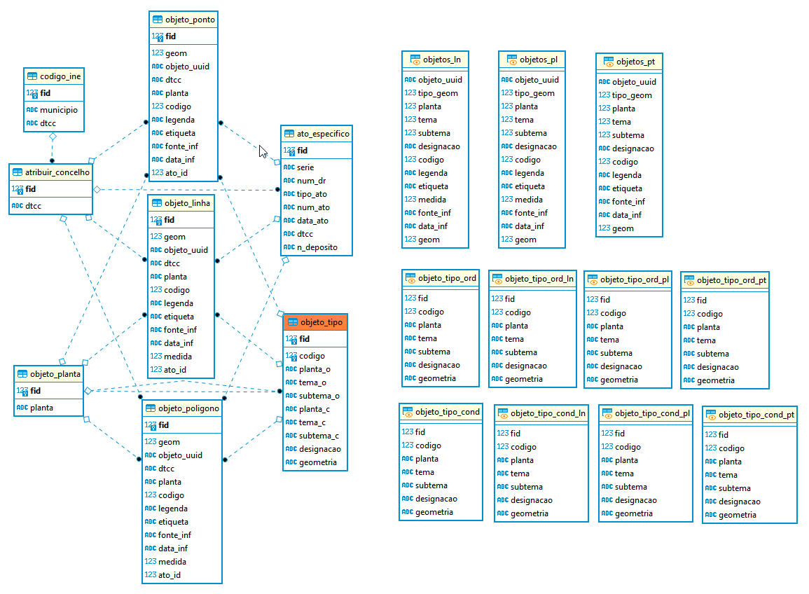

# Estrutura do GeoPackage para o PDM (Em Atualização)

Para apoio à criação e configuração da base de dados do PDM a Direção-Geral do Território desenvolveu um modelo de dados (MD) no formato aberto da OGC, [GeoPackage](https://www.geopackage.org/) (GPKG), que se encontra disponível para descarregamento neste repositório.

Este repositório contém as pastas e ficheiros seguintes:

* `estilos` > diversos ficheiros com a simbologia dos objetos

* estilos > `PDM_Estilos_QGIS.zip` > Contem um projeto QGIS e um Modelo com os estilos da PDM

* `exemplos` > vários ficheiros com exemplos de cartas de delimitação do PDM estruturados de acordo com a nova proposta de MD

* `media` > pasta de imagens associadas README.md 

* modelo > `PDM_modelo.qgs` > projeto modelo para criação da base de dados

* modelo > `pdm_modelo_gpkg.gpkg` > modelo da base de dados em GeoPackage

* plugin_qgis > `pdm_importar_md.zip` > plugin para converter os dados de origem para o modelo

* sql > `pdm_modelo_gpkg.gpkg.sql` > contém a estrutura da base de dados modelo, descrevendo as tabelas, vistas e triggers para cálculo automático de áreas e comprimentos

* sql > `pdm_modelo_postgres.sql` > versão preliminar da estrutura da base de dados modelo para postegresql

* `LICENSE` > Licença de utilização de software livre GNU AGPLv3

* `README.md` > Explicação do conteúdo da página Proposta de melhoria do Modelo de Dedos do PDM em GeoPackage

---

## [**Plugin QGIS para carregar dados para Modelo de Dados do PDM**](plugin_qgis)

Para apoio aos utilizadores na criação de ficheiros Geopackage de acordo com o Modelo de Dados do PDM proposto, é disponibilizado gratuitamente pela Direção-Geral do Território um plugin para o sofwate livre QGIS. [Clique aqui](plugin_qgis).

---

## [**Exemplos de PDM de municípios convertidos para o Modelo de Dados proposto**](exemplos)

Para efeitos de exemplificação de uso do modelo de PDM proposto, são apresentados numa pasta vários exemplos de PDM já submetidos e publicados em DR, convertidos no modelo proposto em formato Geopackage. [Clique aqui](exemplos).

---

## Estrutura da Base de Dados

### Tabelas
- `codigo_ine`  
   Lista os municípios e respetivos códigos DTCC (código oficial do INE).
- `atribuir_concelho`  
   Faz a ligação entre o código DTCC e a estrutura do GeoPackage, para facilitar a inserção dos dados.
- `objeto_planta`  
   Define os planos disponíveis (`Condicionantes`, `Ordenamento`).
- `objeto_tipo`  
   Define os tipos de objetos, incluindo código, tema, subtema, designação e geometria.
- `objeto_ponto`  
   Objetos espaciais do tipo **ponto**, com trigger para gerar automaticamente o UUID.
- `objeto_linha`  
   Objetos espaciais do tipo **linha**, com triggers para:
  - gerar UUID;
  - calcular automaticamente o comprimento (`medida`) em quilômetros.
- `objeto_poligono`  
   Objetos espaciais do tipo **polígono**, com triggers para:
  - gerar UUID;
  - calcular automaticamente a área (`medida`) em hectares.
- `ato_especifico`  
   Regista atos administrativos associados a determinada geometria.



> [Abrir correspondência de campos entre modelo de dados em vigor e proposta de melhoria](info/compara_modelo_dados_pdm.md).

---

### Vistas

Foram criadas **vistas auxiliares** para facilitar consultas:

- `objeto_tipo_ord` **/** `objeto_tipo_cond`: objetos classificados por planta.
- `objeto_tipo_ord_pt/ln/pl` **e objeto_tipo_cond_pt/ln/pl**: objetos filtrados por geometria (ponto, linha, polígono).
- `objetos_pt` **/** `objetos_ln` **/** `objetos_pl`: consolidação de geometrias com atributos descritivos.
- Atualização automática em caso de atualização da geometria.

---

### Triggers de Cálculo Automático

- **Áreas (**`medida`**)**: calculadas automaticamente em todas as tabelas com geometrias poligonais.
- **Comprimentos (**`medida`**)**: calculados automaticamente em tabelas com geometrias lineares.
- **Atualização automática** em caso de atualização da geometria.

---

## Observações Técnicas

- **Codificação de texto:** UTF-8.
- **UUIDs:** gerados automaticamente nas tabelas geométricas.
- **Medidas automáticas:**
  - `objeto_linha`: comprimento armazenado em km;
  - `objeto_poligono`: área armazenada em ha.

> Algumas funcionalidades (como colunas `GENERATED ALWAYS`) requerem **SQLite ≥ 3.31**.

---

## Uso/teste de `pdm_modelo_gpkg.gpkg.sql` - pré-requisitos

Antes de executar o script, é necessário:

```sql
.load mod_spatialite
SELECT InitSpatialMetadata();
```

Recomenda-se a utilização do **ogrinfo (GDAL/OGR)** para gerir e verificar o GeoPackage ou o **db manager** do QGIS.

---

### Fluxo de Utilização

1. Criar o GeoPackage vazio.
2. Ativar o SpatiaLite e inicializar metadados (`InitSpatialMetadata()`).
3. Executar o script SQL para criar a estrutura.
4. Inserir objetos espaciais conforme necessário.
