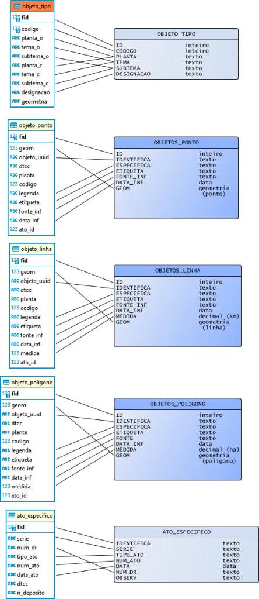

## PDM - Correspondência de campos entre modelo de dados em vigor e proposta de melhoria

Os campos sem correspondência estão como `NULL`.

---

### Tabela: OBJETOS_TIPO

| **Proposta objeto_tipo** | **Relação** | **OBJETOS_TIPO** |
|----------------------|:-------:|--------------|
| fid                  |    ≠    | ID           |
| codigo               |    =    | CODIGO       |
| planta_o             |    ≠    | PLANTA       |
| tema_o               |    ≠    | TEMA         |
| subtema_o            |    ≠    | SUBTEMA      |
| planta_c             |    ≠    | PLANTA       |
| tema_c               |    ≠    | TEMA         |
| subtema_c            |    ≠    | SUBTEMA      |
| designacao           |    =    | DESIGNACAO   |
| geometria            |    ≠    | `NULL`       |

---

### Tabela: OBJETOS_PONTO

| **Proposta objeto_ponto** | **Relação** | **OBJETOS_PONTO** |
|-----------------------|---------|---------------|
| fid                   | ≠       | ID            |
| geom                  | =       | GEOM          |
| objeto_uuid           | ≠       | IDENTIFICA    |
| dtcc                  | ≠       | `NULL`        |
| planta                | ≠       | `NULL`        |
| codigo                | ≠       | `NULL`        |
| legenda               | ≠       | ESPECIFICA    |
| etiqueta              | =       | ETIQUETA      |
| fonte_inf             | =       | FONTE_INF     |
| data_inf              | =       | DATA_INF      |
| ato_id                | ≠       | `NULL`        |

---

### Tabela: OBJETO_LINHA

| **Proposta objeto_linha** | **Relação** | **OBJETO_LINHA** |
|-----------------------|---------|--------------|
| fid                   | ≠       | ID           |
| geom                  | =       | GEOM         |
| objeto_uuid           | ≠       | IDENTIFICA   |
| dtcc                  | ≠       | `NULL`       |
| planta                | ≠       | `NULL`       |
| codigo                | ≠       | `NULL`       |
| legenda               | ≠       | ESPECIFICA   |
| etiqueta              | =       | ETIQUETA     |
| fonte_inf             | =       | FONTE_INF    |
| data_inf              | =       | DATA_INF     |
| medida                | =       | MEDIDA       |
| ato_id                | ≠       | `NULL`       |

---

### Tabela: OBJETO_POLIGONO

| **Proposta objeto_poligono** | **Relação** | **OBJETO_LINHA** |
|--------------------------|---------|--------------|
| fid                      | ≠       | ID           |
| geom                     | =       | GEOM         |
| objeto_uuid              | ≠       | IDENTIFICA   |
| dtcc                     | ≠       | `NULL`       |
| planta                   | ≠       | `NULL`       |
| codigo                   | ≠       | `NULL`       |
| legenda                  | ≠       | ESPECIFICA   |
| etiqueta                 | =       | ETIQUETA     |
| fonte_inf                | ≠       | FONTE        |
| data_inf                 | =       | DATA_INF     |
| medida                   | =       | MEDIDA       |
| ato_id                   | ≠       | `NULL`       |

---

### Tabela: ATO_ESPECIFICO

| **Proposta ato_especifico** | **Relação** | **ATO_ESPECIFICO** |
|-------------------------|:-------:|----------------|
| fid                     |    ≠    | IDENTIFICA     |
| serie                   |    =    | SERIE          |
| num_dr                  |    =    | NUM_DR         |
| tipo_ato                |    =    | TIPO_ATO       |
| num_ato                 |    =    | NUM_ATO        |
| data_ato                |    =    | DATA           |
| dtcc                    |    ≠    | `NULL`         |
| n_deposito              |    ≠    | `NULL`         |
| `NULL`                  |    ≠    | OBSERV         |
|                         |         |                |

## Relação visual

