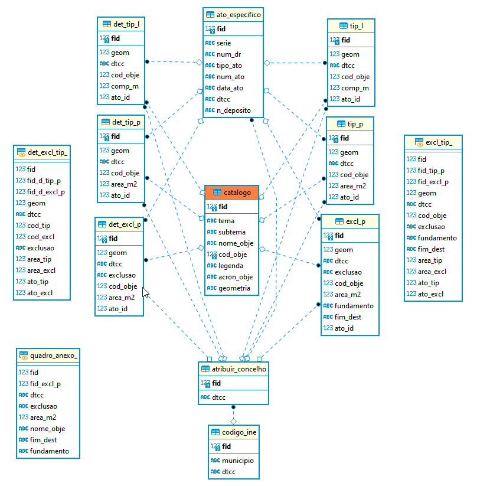

# Proposta de melhoria do Modelo de Dados da REN em GeoPackage (Em Atualização)

Para apoio à criação e configuração da base de dados da REN a Direção-Geral do Território desenvolveu um modelo de dados (MD) no formato aberto da OGC, [GeoPackage](https://www.geopackage.org/) (GPKG), que se encontra disponível para descarregamento neste repositório.

Descrição do conteúdo das pastas e ficheiros do repositório:

* estilos > `ren_qgis_symbols.xml` - ficheiro onde é definida a simbologia dos objetos

* estilos > `REN_Estilos_QGIS.zip` - contem um projeto em QGIS e um Modelo com os estilos da REN

* `exemplos` - exemplos de cartas de delimitação da REN estruturadas de acordo com a nova proposta de MD

* `media` - pasta de imagens associadas README.md 

* modelo > `REN_modelo.qgs` - projeto modelo para criação da base de dados

* modelo > `ren_modelo_gpkg.gpkg` - modelo da base de dados em GeoPackage

* plugin_qgis > `ren_importar_md.zip` - plugin para converter os dados de origem para o modelo

* sql > `ren_modelo_gpkg.gpkg.sql` - contém a estrutura da base de dados modelo, descrevendo as tabelas, vistas e triggers para cálculo automático de áreas e comprimentos

* sql > `ren_modelo_postgres.sql` - versão preliminar do modelo da base de dados em Postgres/Postgis

* `LICENSE` - Licença de utilização de software livre GNU AGPLv3

* `README.md` - Explicação do conteúdo da página Proposta de melhoria do Modelo de Dados da REN em GeoPackage

---

## [**Plugin QGIS para carregar dados para Modelo de Dados da REN**](plugin_qgis)

Para apoio aos utilizadores na criação de ficheiros Geopackage de acordo com o Modelo de Dados da REN proposto, é disponibilizado gratuitamente pela Direção-Geral do Território um plugin para o sofwate livre QGIS. [Clique aqui](plugin_qgis).

---

## [**Exemplos de REN de municípios convertidos para o Modelo de Dados proposto**](exemplos)

Para efeitos de exemplificação de uso do modelo de REN proposto, são apresentados numa pasta vários exemplos de REN já submetidos e publicados em DR convertidos no modelo proposto em formato Geopackage. [Clique aqui](exemplos).

---

## **Estrutura da Base de Dados**

### Tabelas

- `codigo_ine`
   Lista os municípios e respetivos códigos da divisão administrativa do Instituto Nacional de Estatística (DTCC).
- `atribuir_concelho`
   Faz a ligação entre o código DTCC e a estrutura do GeoPackage.
- `catalogo`
   Contém a lista de objetos e organização previstos no catálogo de objetos da carta da REN.
- `tip_l` e `det_tip_l`
   Contém os objetos com **geometria linear** (MULTILINESTRING), com triggers para cálculo automático de comprimento.
- `tip_p` e `det_tip_p`
   Contém os objetos com  **geometria poligonal** que correspondem às tipologias antes de serem ponderadas as exclusões (MULTIPOLYGON), com triggers para cálculo automático de área.
- `excl_p` e `det_excl_p`
   Contém os objetos com geometria poligonal que correspondem às áreas de **exclusão**, com triggers automáticos para cálculo de áreas.
- `ato_especifico`
   Regista os atos administrativos de publicação de cada dinâmica de REN.

---

### Vistas

Permitem a análise e consulta dos dados do catálogo de objetos e do quadro anexo à carta de delimitação da REN:

- `excl_tip`  
   Interseção entre polígonos de tipologias e polígonos de exclusão.
- `det_excl_tip`  
   Interseção entre detalhes de tipologias e detalhes de exclusões.
- `catalogo_l`  
   Lista os objetos com geometria linear.
- `catalogo_p`  
   Lista os objetos com geometria poligonal que correspondem às tipologias.
- `catalogo_excl`  
   Lista os objetos com geometria poligonal que correspondem às exclusões.
- `quadro_anexo`  
   Quadro com informação descritiva sobre as exclusões da REN.

Diagrama da Base de dados



---

### Triggers de Cálculo Automático

- **Áreas (**`area_m2`**)**: calculadas automaticamente em todas as tabelas com geometrias poligonais.
- **Comprimentos (**`comp_m`**)**: calculados automaticamente em tabelas com geometrias lineares.
- **Atualização automática** em caso de atualização da geometria.

---

## Observações Técnicas

- **Codificação:** UTF-8.
- **Integridade referencial:** garantida por chaves estrangeiras com `ON DELETE CASCADE` e `ON UPDATE CASCADE`.
- **Área:** armazenada em **m²**.
- **Comprimento:** armazenado em **metros**.

> Algumas funcionalidades (como colunas `GENERATED ALWAYS`) requerem **SQLite ≥ 3.31**.

---

## Uso/teste de `ren_modelo_gpkg.gpkg.sql` - pré-requisitos

Antes de executar o script é necessário:

```sql
.load mod_spatialite
SELECT InitSpatialMetadata();
```

> Recomenda-se a utilização do **ogrinfo (GDAL/OGR)** para gerir e verificar o GeoPackage ou o **db manager** do QGIS.

---

### Fluxo de Utilização

1. Criar o GeoPackage vazio.
2. Ativar o SpatiaLite e inicializar metadados (`InitSpatialMetadata()`).
3. Executar o script SQL para criar a estrutura.
4. Inserir objetos espaciais conforme necessário.
