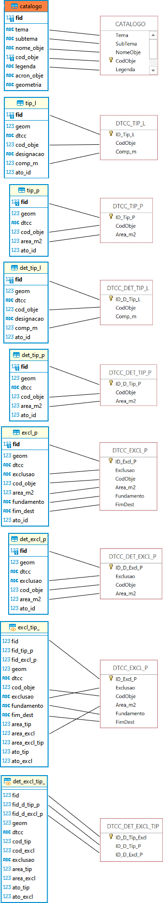

## REN - Correspondência de campos entre modelo de dados em vigor e proposta de melhoria

### Simbologia

Explicação da simbologia presente nas tabelas comparativas.

| Símbolo | Significado                                                                                 |
|---------|---------------------------------------------------------------------------------------------|
| **=**   | O campo manteve o nome no modelo em vigor.                                                  |
| **≠**   | O campo apresenta nome ou tipo diferente entre os modelos.                                  |
| `NULL`  | Os campos acrescentados ou retirados na proposta sem correspondência com a versão em vigor. |

---

### **Tabela: CATALOGO**

| **Campos da proposta [catalogo]** | **Relação** | **Campos em vigor [CATALOGO]** |
|-------------------------------|:-------:|----------------------------|
| fid                           |    ≠    | `NULL`                     |
| tema                          |    =    | Tema                       |
| subtema                       |    =    | Subtema                    |
| nome_obje                     |    ≠    | NomeObje                   |
| cod_obje                      |    ≠    | CodObje                    |
| legenda                       |    =    | Legenda                    |
| acron_obje                    |    ≠    | `NULL`                     |
| geometria                     |    ≠    | `NULL`                     |

---

### **Tabela: TIP_L**

| **Campos da proposta [tip_l]** | **Relação** | **Campos em vigor [DTCC_TIP_L]** |
|----------------------------|:-------:|------------------------------|
| fid                        |    ≠    | ID_Tip_L                     |
| geom                       |    ≠    | `NULL`                       |
| dtcc                       |    ≠    | `NULL`                       |
| cod_obje                   |    ≠    | CodObje                      |
| designacao                 |    ≠    | `NULL`                       |
| comp_m                     |    =    | Comp_m                       |
| ato_id                     |    ≠    | `NULL`                       |

---

### **Tabela: TIP_P**

| **Campos da proposta [tip_p]** | **Relação** | **Campos em vigor [DTCC_TIP_P]** |
|----------------------------|:-------:|------------------------------|
| fid                        |    ≠    | ID_Tip_P                     |
| geom                       |    ≠    | `NULL`                       |
| dtcc                       |    ≠    | `NULL`                       |
| cod_obje                   |    ≠    | CodObje                      |
| area_m2                    |    =    | Area_m2                      |
| ato_id                     |    ≠    | `NULL`                       |

---

### **Tabela: DET_TIP_L**

| **Campos da proposta [det_tip_l]** | **Relação** | **Campos em vigor [DTCC_DET_TIP_L]** |
|--------------------------------|:-------:|----------------------------------|
| fid                            |    ≠    | ID_D_Tip_L                       |
| geom                           |    ≠    | `NULL`                           |
| dtcc                           |    ≠    | `NULL`                           |
| cod_obje                       |    ≠    | CodObje                          |
| designacao                     |    ≠    | `NULL`                           |
| comp_m                         |    =    | Comp_m                           |
| ato_id                         |    ≠    | `NULL`                           |

---

### **Tabela: DET_TIP_P**

| **Campos da proposta [det_tip_p]** | **Relação** | **Campos em vigor [DTCC_DET_TIP_P]** |
|--------------------------------|:-------:|----------------------------------|
| fid                            |    ≠    | ID_D_Tip_P                       |
| geom                           |    ≠    | `NULL`                           |
| dtcc                           |    ≠    | `NULL`                           |
| cod_obje                       |    ≠    | CodObje                          |
| area_m2                        |    =    | Area_m2                          |
| ato_id                         |    ≠    | `NULL`                           |

---

### **Tabela: EXCL_P**

| **Campos da proposta [excl_p]** | **Relação** | **Campos em vigor [DTCC_EXCL_P]** |
|-----------------------------|:-------:|-------------------------------|
| fid                         |    ≠    | ID_Excl_P                     |
| geom                        |    ≠    | `NULL`                        |
| dtcc                        |    ≠    | `NULL`                        |
| exclusao                    |    ≠    | Exclusao                      |
| cod_obje                    |    =    | CodObje                       |
| area_m2                     |    ≠    | Area_m2                       |
| fundamento                  |    =    | Fundamento                    |
| fim_dest                    |    ≠    | FimDest                       |
| ato_id                      |    ≠    | `NULL`                        |

---

### **Tabela: DET_EXCL_P**

| **Campos da proposta [det_excl_p]** | **Relação** | **Campos em vigor [DTCC_DET_EXCL_P]** |
|---------------------------------|:-------:|-----------------------------------|
| fid                             |    ≠    | ID_D_Excl_P                       |
| geom                            |    ≠    | `NULL`                            |
| dtcc                            |    ≠    | `NULL`                            |
| exclusao                        |    =    | Exclusao                          |
| cod_obje                        |    ≠    | CodObje                           |
| area_m2                         |    =    | Area_m2                           |
| ato_id                          |    ≠    | `NULL`                            |

---

### **Tabela: EXCL_TIP**

| **Campos da proposta [excl_tip]** | **Relação** | **Campos em vigor [DTCC_EXCL_TIP]** |
|-------------------------------|:-------:|---------------------------------|
| fid                           |    ≠    | ID_Excl_Tip                     |
| fid_tip_p                     |    ≠    | `NULL`                          |
| fid_excl_p                    |    ≠    | `NULL`                          |
| geom                          |    ≠    | `NULL`                          |
| dtcc                          |    ≠    | `NULL`                          |
| cod_obje                      |    ≠    | CodObje                         |
| exclusao                      |    =    | Exclusao                        |
| fundamento                    |    =    | Fundamento                      |
| fim_dest                      |    ≠    | FimDest                         |
| area_tip                      |    ≠    | `NULL`                          |
| area_excl                     |    ≠    | Area_m2                         |
| area_excl_tip                 |    ≠    | `NULL`                          |
| ato_tip                       |    ≠    | `NULL`                          |
| ato_excl                      |    ≠    | `NULL`                          |

---

### **Tabela: DET_EXCL_TIP**

| **Campos da proposta [det_excl_tip]** | **Relação** | **Campos em vigor [DTCC_DET_EXCL_TIP]** |
|-----------------------------------|:-------:|-------------------------------------|
| fid                               |    ≠    | ID_D_Tip_Excl                       |
| fid_d_tip_p                       |    =    | ID_D_Tip_P                          |
| fid_d_excl_p                      |    =    | ID_D_Excl_P                         |
| geom                              |    ≠    | `NULL`                              |
| dtcc                              |    ≠    | `NULL`                              |
| cod_tip                           |    ≠    | `NULL`                              |
| cod_excl                          |    ≠    | `NULL`                              |
| exclusao                          |    ≠    | `NULL`                              |
| area_tip                          |    ≠    | `NULL`                              |
| area_excl                         |    ≠    | `NULL`                              |
| ato_tid                           |    ≠    | `NULL`                              |
| ato_excl                          |    ≠    | `NULL`                              |

---

## Relação visual

