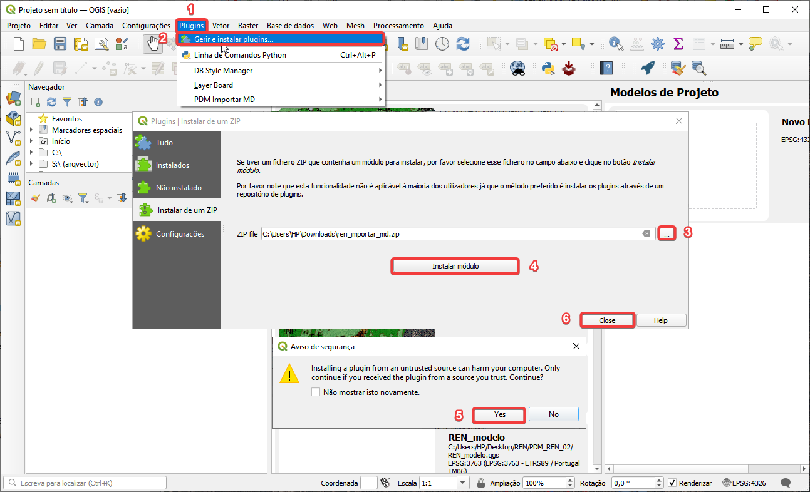
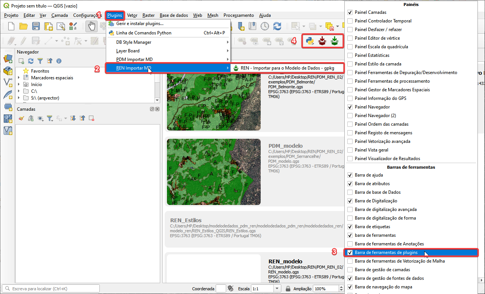
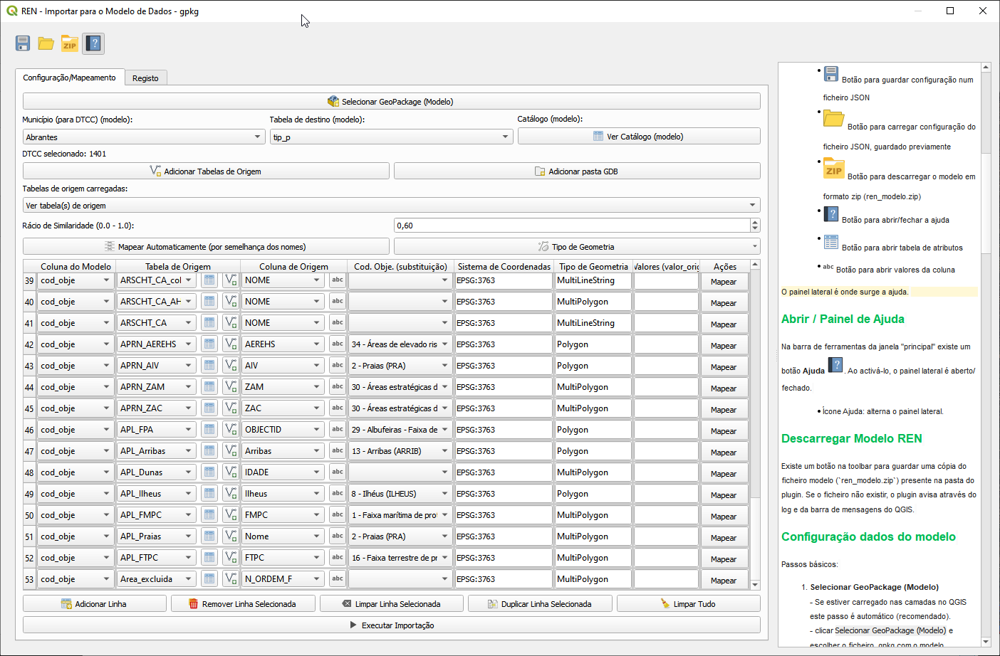

# Plugin QGIS para auxiliar o carregamento de dados no Modelo de Dados da REN em GeoPackage (Em Atualização)

Para apoio aos utilizadores na criação de ficheiros Geopackage de acordo com o Modelo de Dados da REN proposto, é disponibilizado gratuitamente pela Direção-Geral do Território um plugin para o sofwate livre [QGIS](https://qgis.org/) .

Este plugin permite auxiliar o utilizador a estruturar e carregar de forma interativa os seus dados geográficos existentes noutros formatos e com diferentes estruturas de informação para um ficheiro geopackage com toda a informação da REN em conformidade com o modelo de dados proposto.

---

## Instalar o Plugin QGIS

1. Descarregar e guardar no computador o plugin clicando no link: [ren_importar_md.zip](ren_importar_md.zip)

2. Abrir o QGIS (recomendamos uma versão igual ou superior 3.40.11)

3. Instalar o plugin descarregado - `ren_importar_md.zip`

   - Seguir os passos da seguinte imagem

   - O plugin fica disponivel no separador `Plugins` e `Barra de ferramentas de plugins`

Aspeto da interface do plugin

## Utilização do Plugin QGIS

> Antes de mapear os objetos, deve verificar inicialmente no mapa se a informação está devidamente georreferenciada no sistema de coordenadas oficial - EPSG:3763 - ETRS89 / Portugal TM06.

O procedimento para a conversão de uma base de dados de origem para a base de dados modelo é o seguinte:

1. Descarregar o ZIP clicando no botão  do plugin  ou descarregar do repositório a pasta `modelo` para o computador e abrir o projeto REN_modelo.qgs

2. Ativar o PlugIn

3. Executar o PlugIn e analisar os resultados 

[**Vídeo**](media/plugin.mp4)

4. Gerar a sobreposição das tipologias com as exclusões (ativar o excl_tip)

5. Visualizar o Quadro Anexo (ativar o quadro_anexo)

6. Visualizar o Ato de Publicação (ativar o ato_especifico)
